= 形变 - 让物体弯曲
:toc: left
:toclevels: 3
:sectnums:
:stylesheet: myAdocCss.css

'''

== "简单形变" 修改器

image:img/0430.png[,]

image:img/0431.png[,]

image:img/0432.png[,]

image:img/0433.png[,]

image:img/0434.png[,]

image:img/0435.png[,]

image:img/0436.png[,]

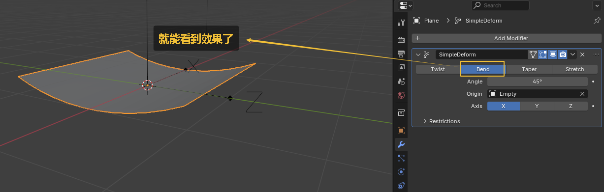

image:img/0438.png[,]

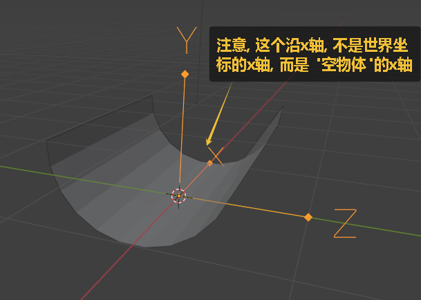

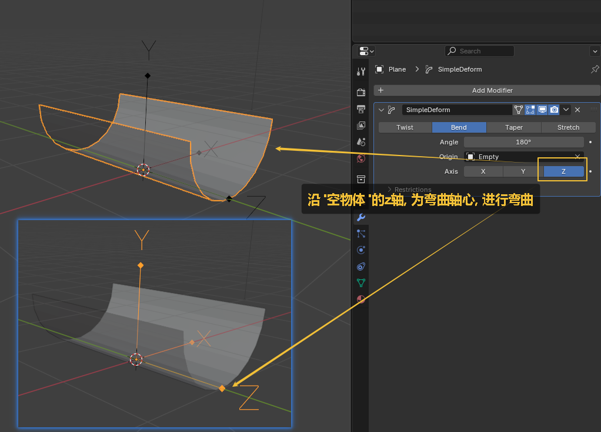

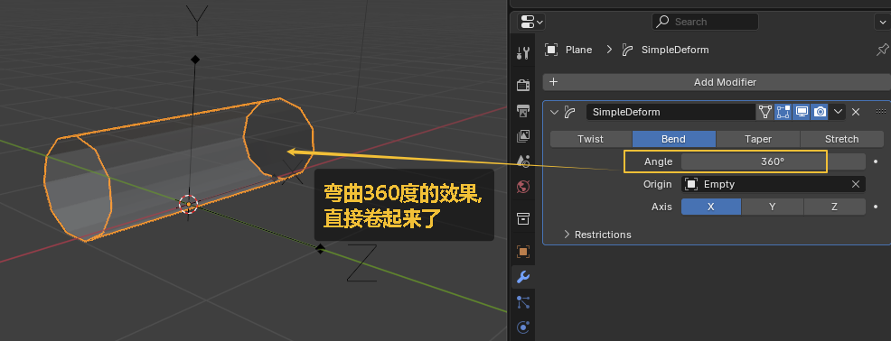

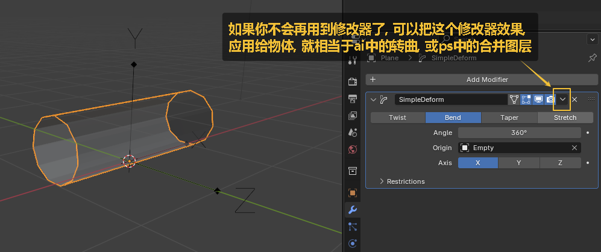

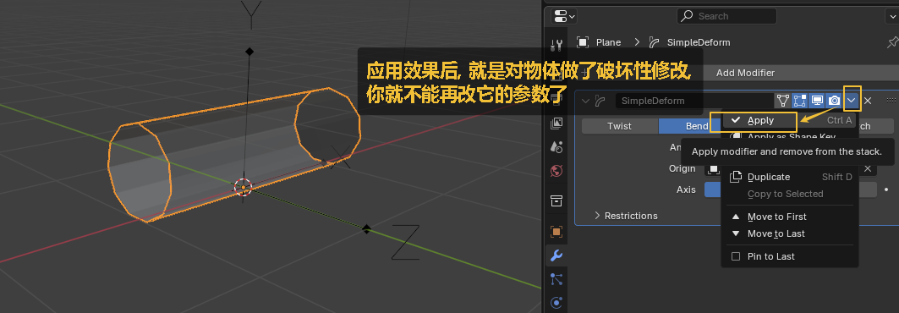

'''

== 方法1: 添加 "简单形变" 修改器

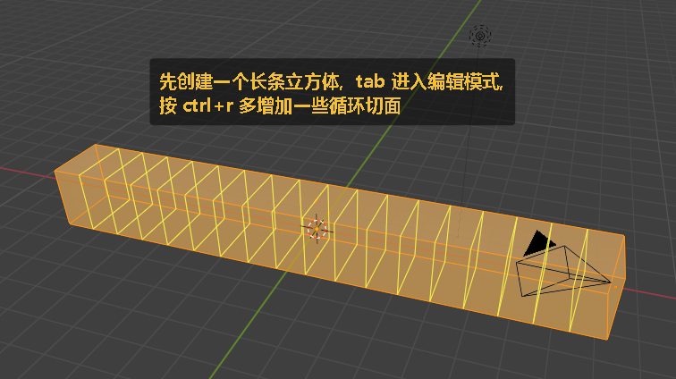

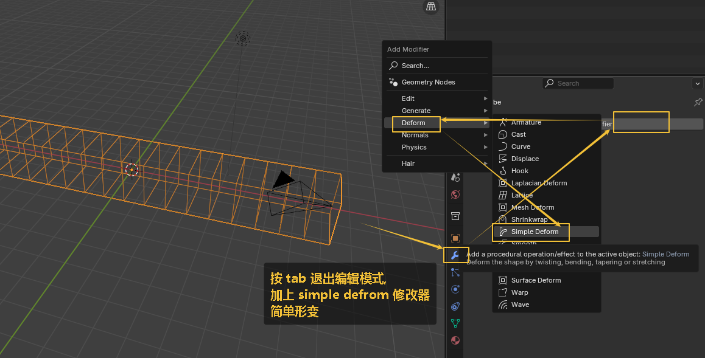

image:img/0418.png[,]

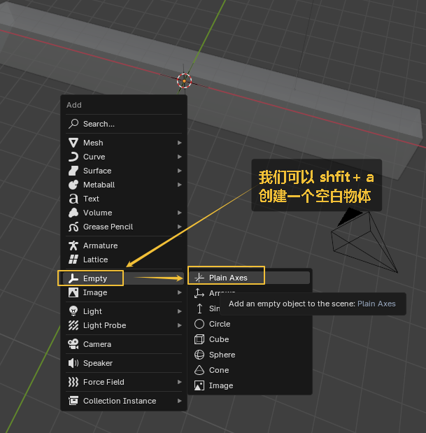

image:img/0420.png[,]

image:img/0421.png[,]

image:img/0422.png[,]

'''

== 方法2: shift + w (wind) 弯曲

image:img/0423.png[,]

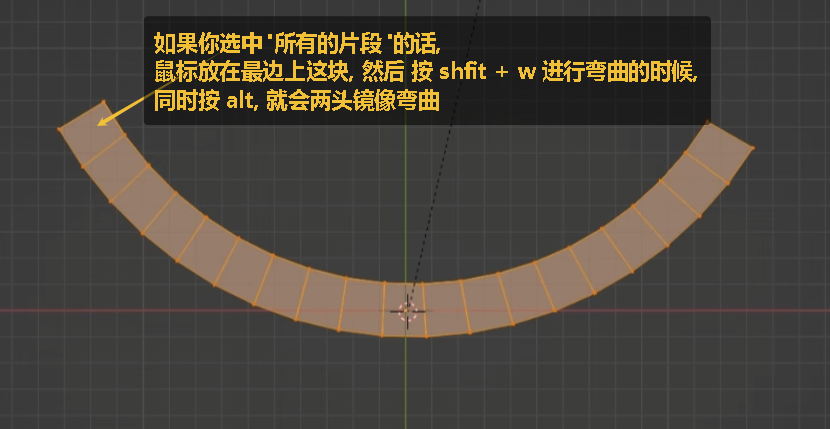

'''

== 方法3: 用曲线修改器, 进行弯曲 -> 即(沿路径弯曲) 让物体, 沿着曲线, 来进行弯曲.

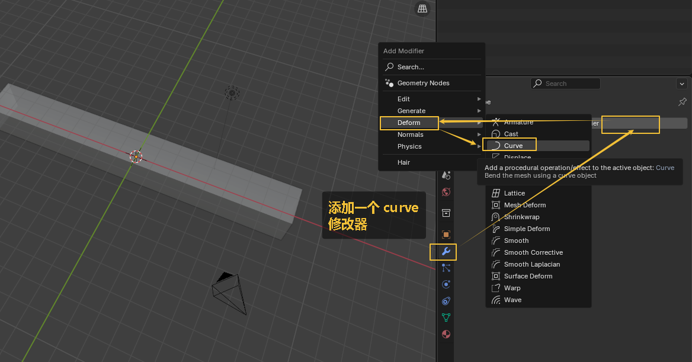

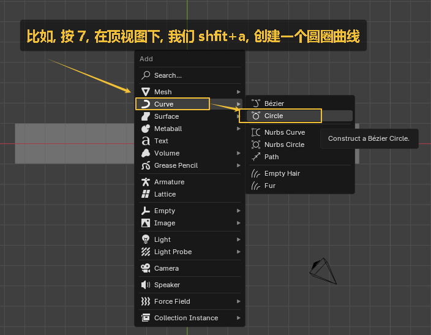

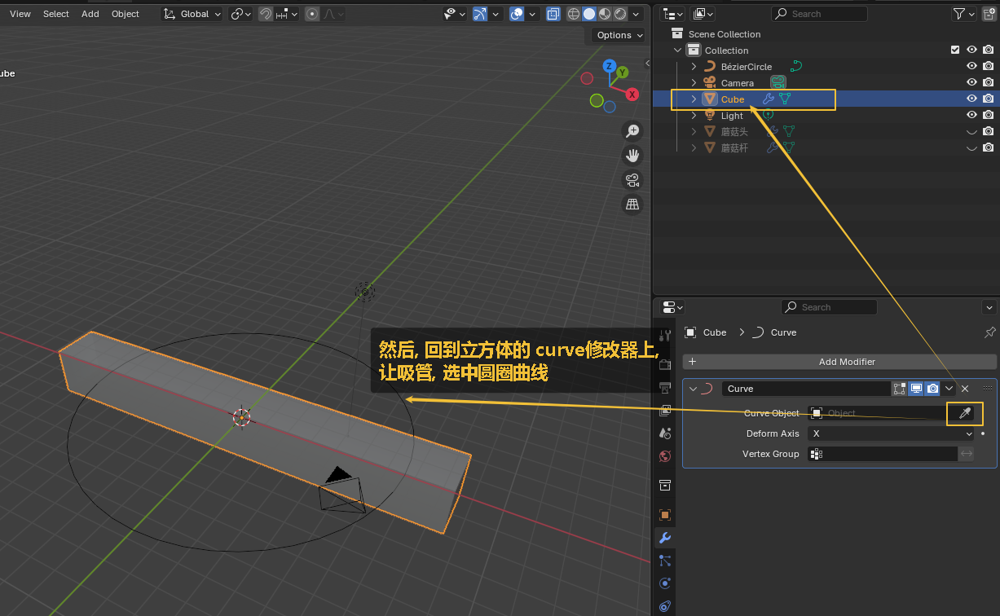

image:img/0428.png[,]

