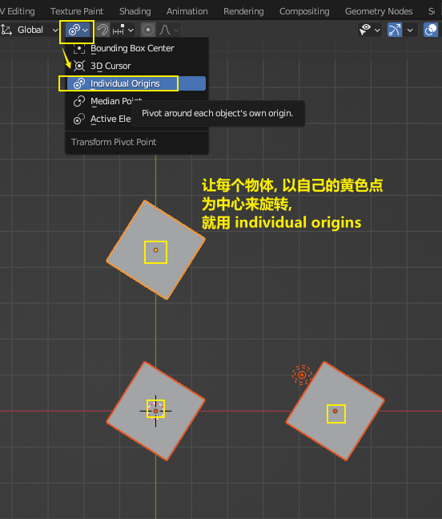

= 物体 旋转
:toc: left
:toclevels: 3
:sectnums:
:stylesheet: myAdocCss.css

'''

== 旋转 -> 旋转物体 : 按 R

要撤销旋转到刚婴儿诞生的状态(而非上一步), 就按 alt+r

image:img/0013.png[,]

image:img/0014.png[,]

== ★ 旋转 -> 多个物体, 以你最后选中的那个物体为旋转中心, 来旋转

image:img/0021.png[,45%]
image:img/0022.png[,45%]

== ★ 旋转 -> 多个物体, 每个都以自己的黄色小圆点为中心, 来旋转

'''