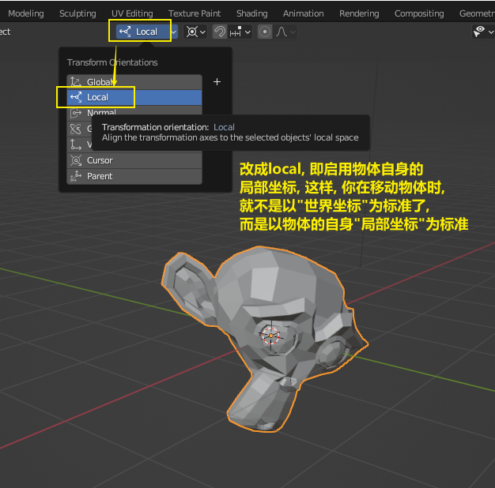
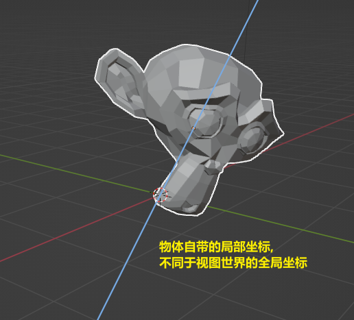

= 物体 移动 g
:toc: left
:toclevels: 3
:sectnums:
:stylesheet: myAdocCss.css

'''

== 移动 ->  移动物体: 按 G (go)

image:img/0002.png[,]

按住x, 就能让物体只沿着x轴移动, +
在移动物体的同时, 按住y, 就能让物体只沿着y轴移动, +
在移动物体的同时, 按住z, 就能让物体只沿着z轴移动, +

*用 g 移动时, 再按住ctrl, 就能让物体吸附网格进行一个个的移动.*

要撤销移动(即回到初始新建的位置), 就按 alt+g

==== 移动 -> 以物体自身的"局部坐标"为标准, 来移动

image:img/0254.png[,45%]

*在世界坐标, 和局部坐标之间切换的快捷键: 按g移动物体的同时, 可以按两下z, 来切换坐标系. 事实上, 可以连按两下x, 或连按两下y, 都可以.*

'''