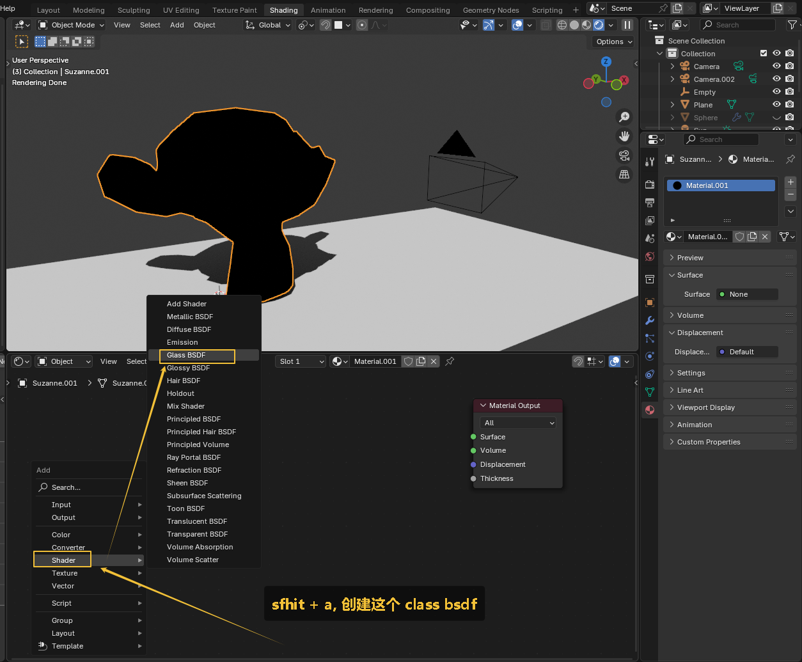
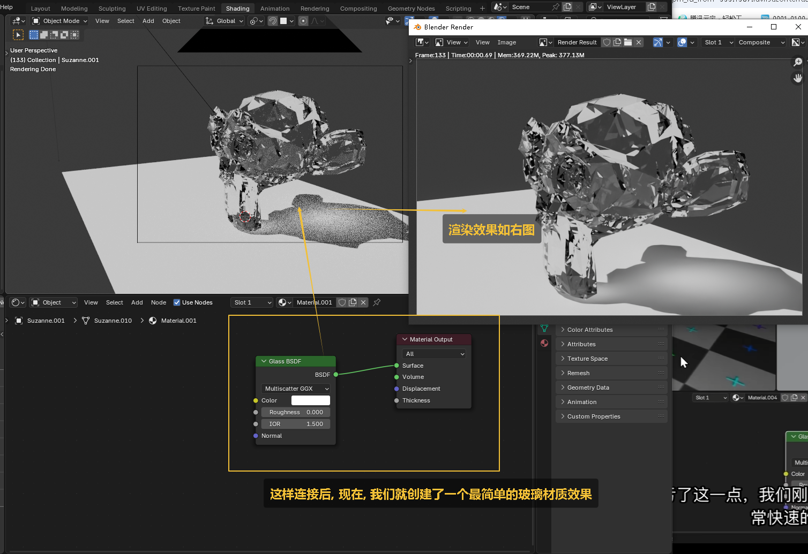
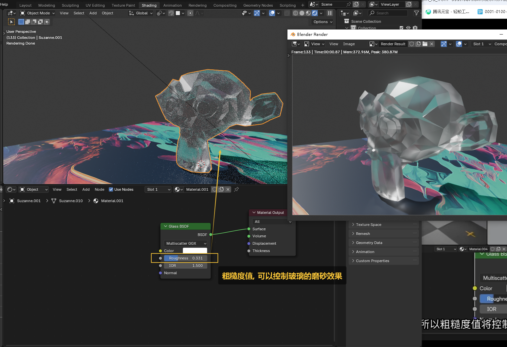
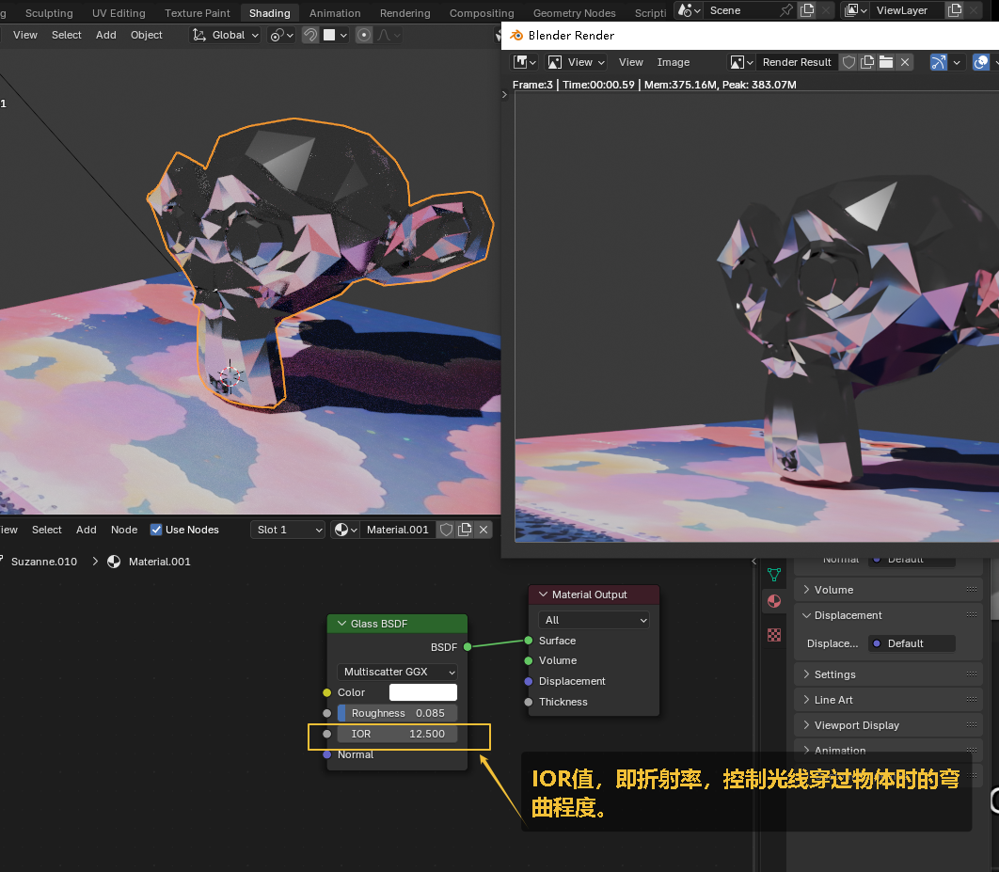
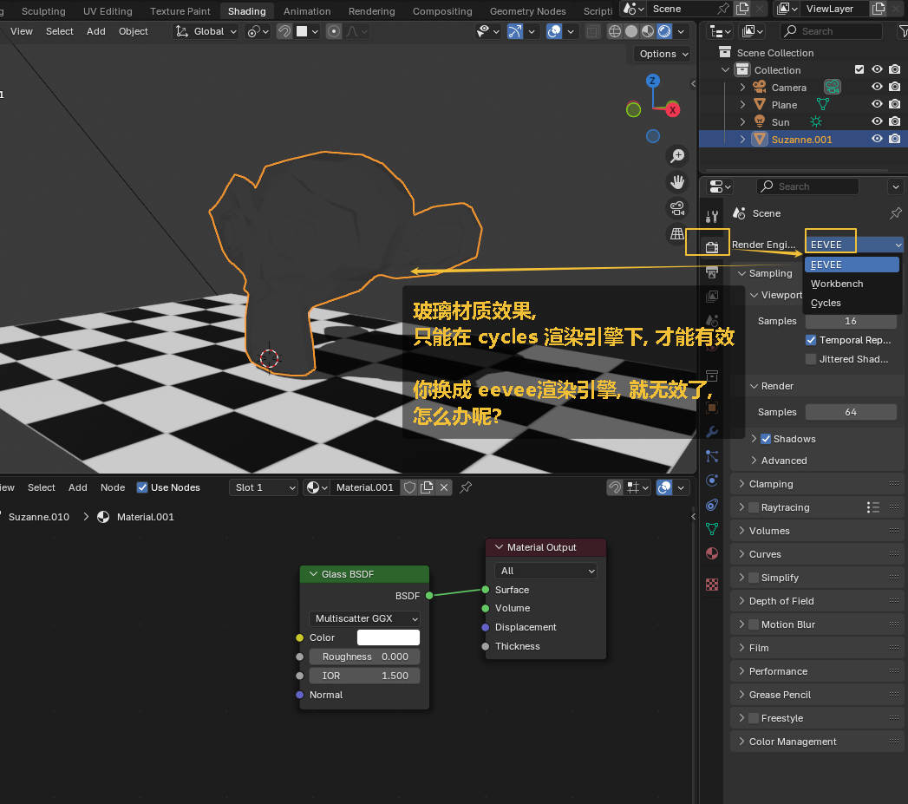
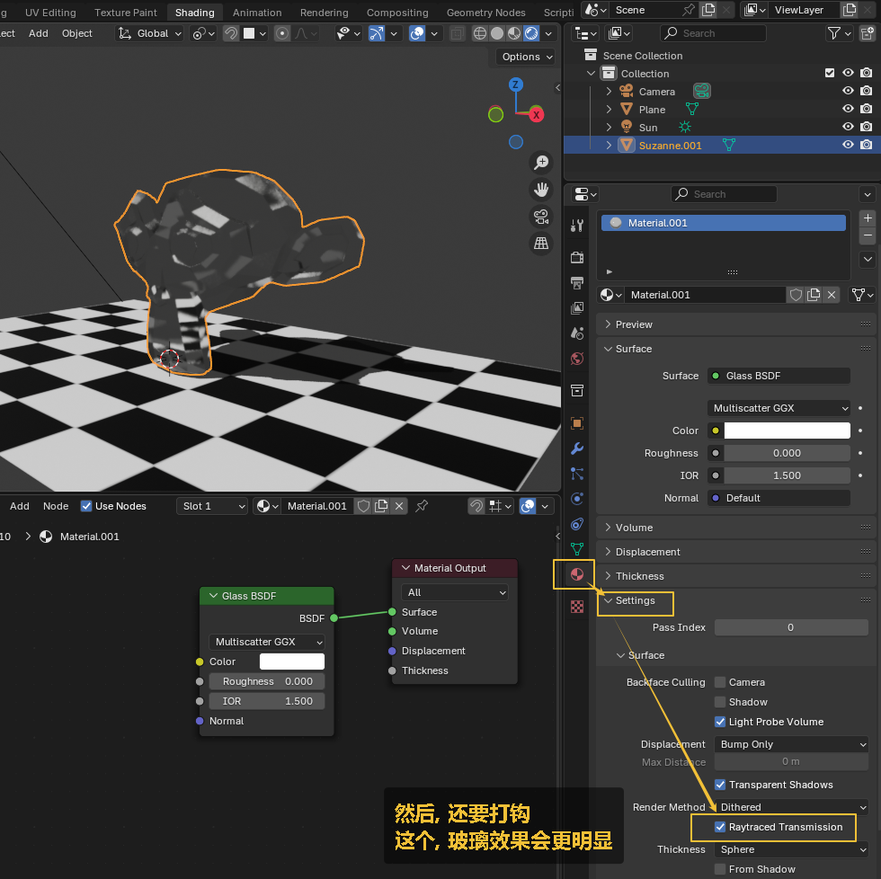
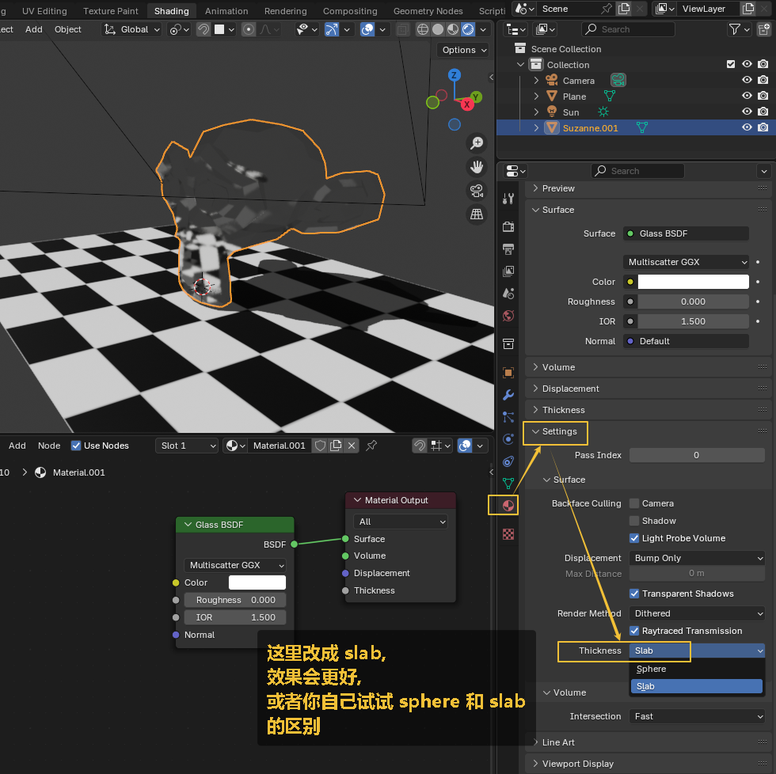
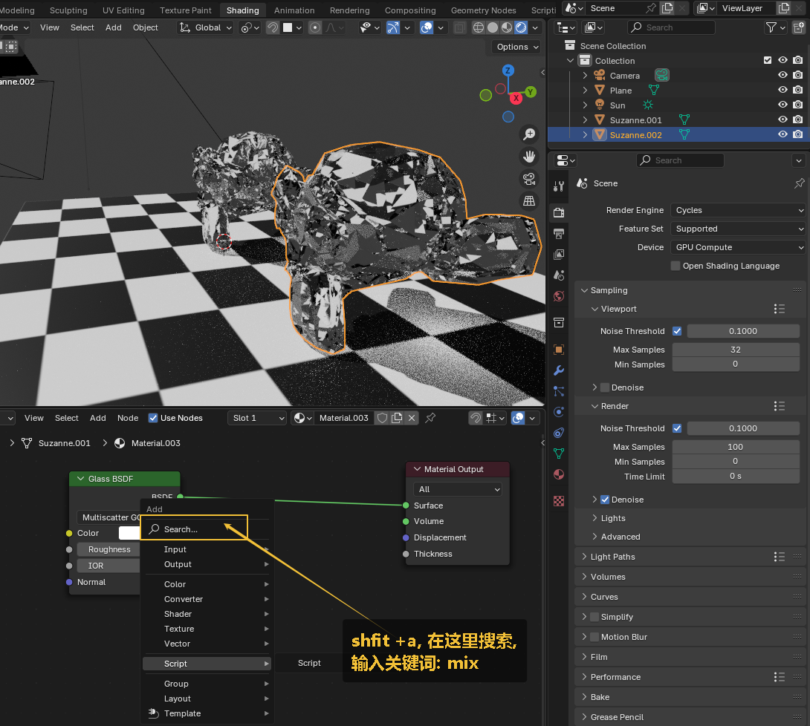
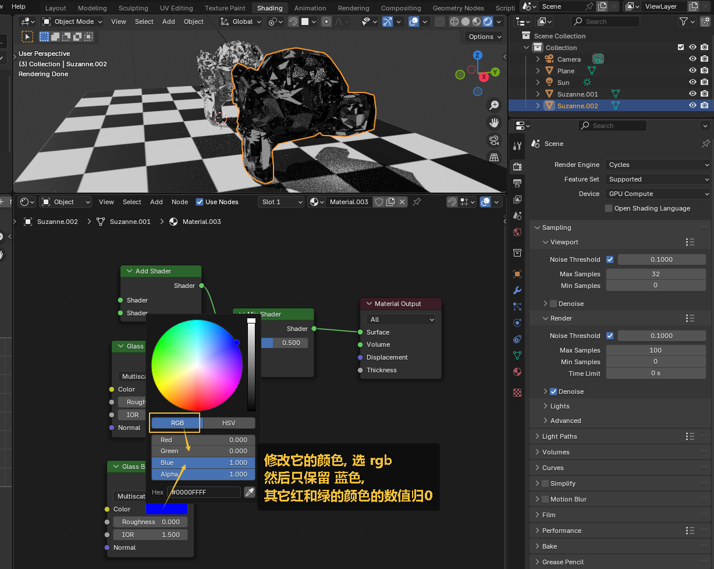

= 材质 - 玻璃
:toc: left
:toclevels: 3
:sectnums:
:stylesheet: myAdocCss.css

'''

== 玻璃材质效果

image:img/0714.png[,]

image:img/0715.png[,]

image:img/0720.png[,]

'''

== 让在 eevee 渲染引擎下,也能看到  玻璃材质 效果

image:img/0722.png[,]

'''

== 让玻璃有色散效果

image:img/0727.png[,]

image:img/0729.png[,]

image:img/0730.png[,]

image:img/0731.png[,]

image:img/0742.png[,]

'''