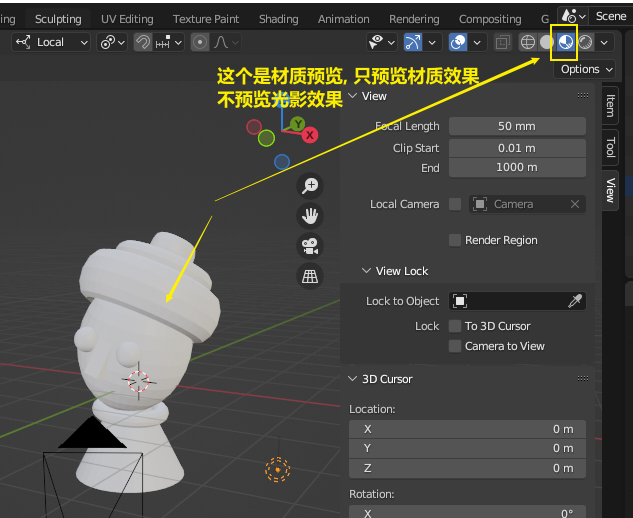
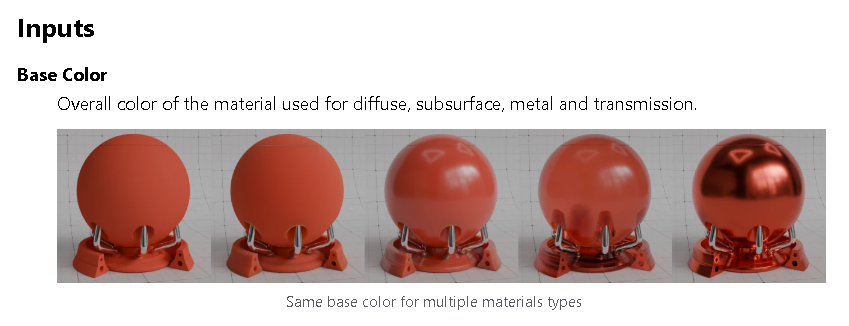
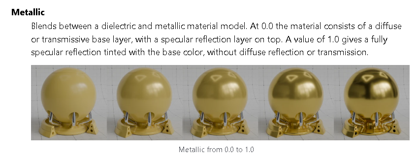
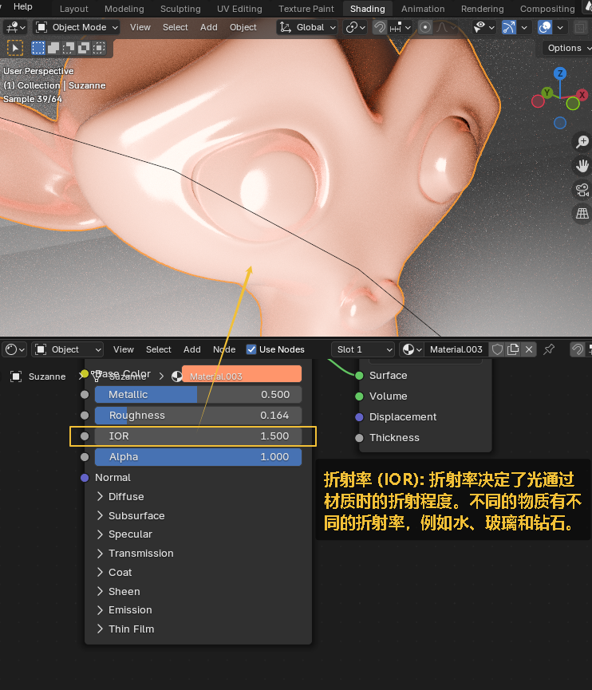

= 材质
:toc: left
:toclevels: 3
:sectnums:
:stylesheet: myAdocCss.css

'''

官网文档, 见 +
https://docs.blender.org/manual/en/latest/render/shader_nodes/shader/principled.html

image:img/0551.png[,]

image:img/0552.png[,]

image:img/0553.png[,]

[.small]
[options="autowidth" cols="1a,1a"]
|===
|Header 1 |Header 2

|基本底色
|image:img/0554.png[,]

|金属
|image:img/0555.png[,]

|粗糙度
|image:img/0556.png[,]

image:img/0557.png[,]

image:img/0561.png[,]

|光线折射率
|

image:img/0559.png[,]

image:img/0563.png[,]

|上漆
|image:img/0565.png[,]

image:img/0566.png[,]

|透光
|image:img/0567.png[,]

image:img/0568.png[,]

|自发光
|

|透明度 alpha
|image:img/0573.png[,]

image:img/0564.png[,]

|===

