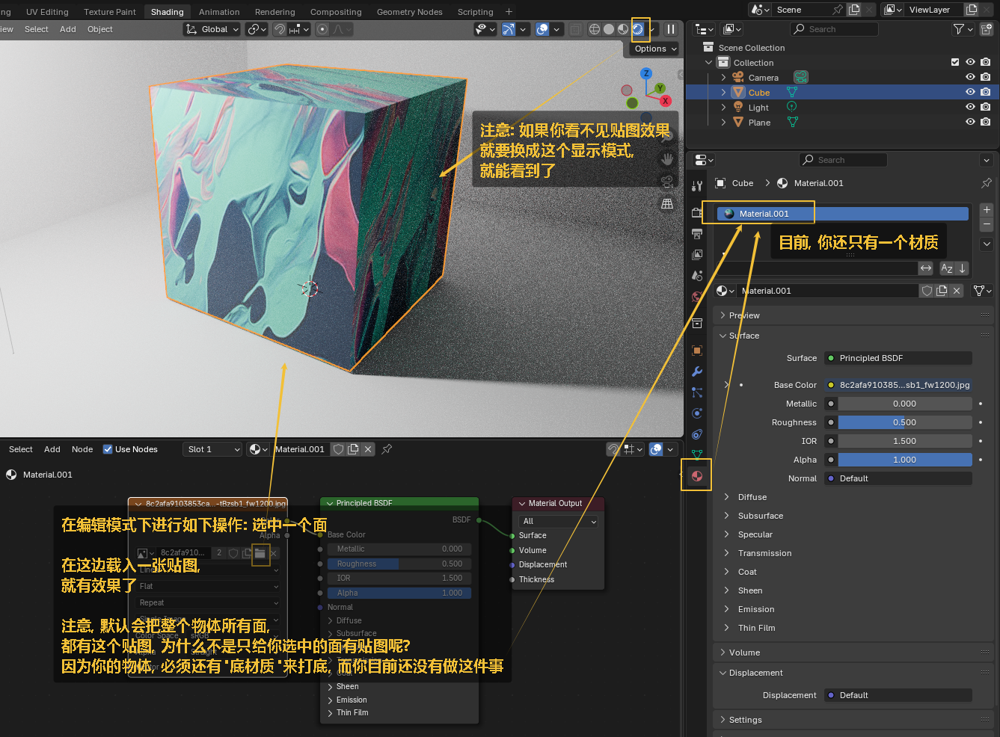
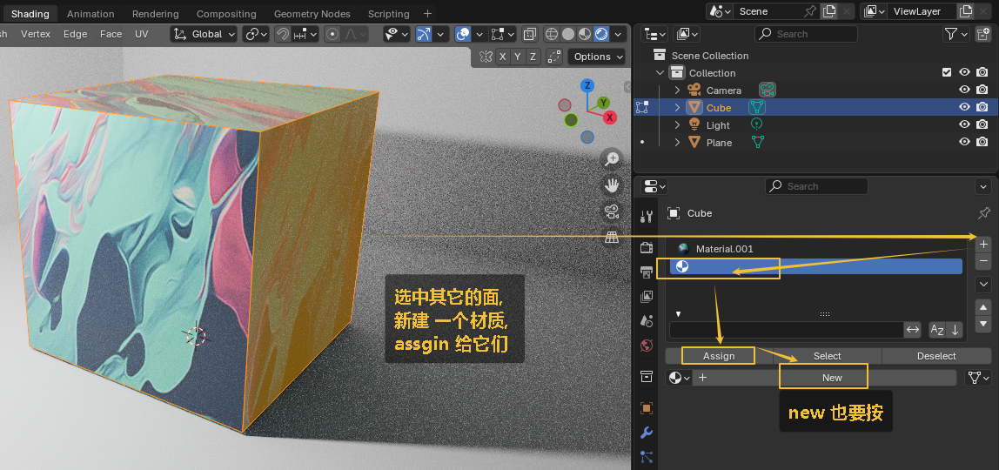

= 贴图
:toc: left
:toclevels: 3
:sectnums:
:stylesheet: myAdocCss.css

'''

- GLOSS 贴图。光泽反射
- BUMP 贴图。凹凸贴图
- COL 贴图。颜色与漫射
- DISP 贴图。置换
- NRM 贴图。法线贴图

https://www.bilibili.com/video/BV1aF411w7qs?spm_id_from=333.788.videopod.episodes&vd_source=52c6cb2c1143f8e222795afbab2ab1b5&p=3

== 预备工作, 打开插件

image:img/0574.png[,]

开启了 node wrangler插件后， 就能用下面的方法, 来快速添加贴图并自动连线:

image:img/0593.png[,]

== 贴图 : 方法1

image:img/0575.png[,]

image:img/0578.png[,]

image:img/0579.png[,]

image:img/0580.png[,]

== 调节贴图的明暗度

image:img/0581.png[,]

官方文档: +
https://docs.blender.org/manual/en/latest/render/shader_nodes/color/gamma.html

== 贴图 : 方法2

image:img/0582.png[,]

image:img/0583.png[,]
