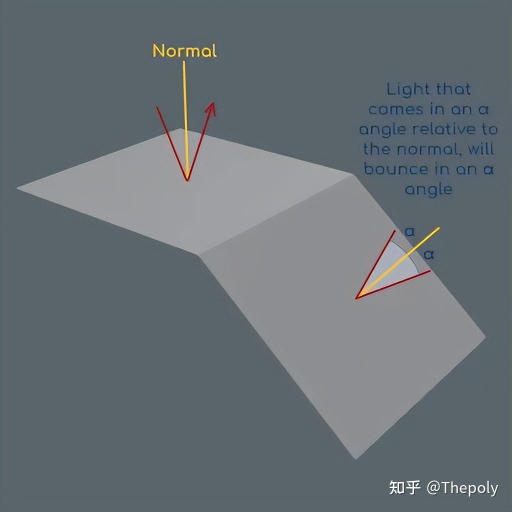

= Normal Mapping 法线贴图
:toc: left
:toclevels: 3
:sectnums:
:stylesheet: myAdocCss.css

'''

官网文档 +
https://docs.blender.org/manual/en/latest/render/shader_nodes/vector/normal_map.html

== 什么是法线（Normals）贴图

从一个多边形的中心画一条线，*完全垂直于它的表面。这一条线的名字, 就叫"法线"。 该"法线"的作用, 就是作为光线照射该物体并反弹出去的"中间线".*

