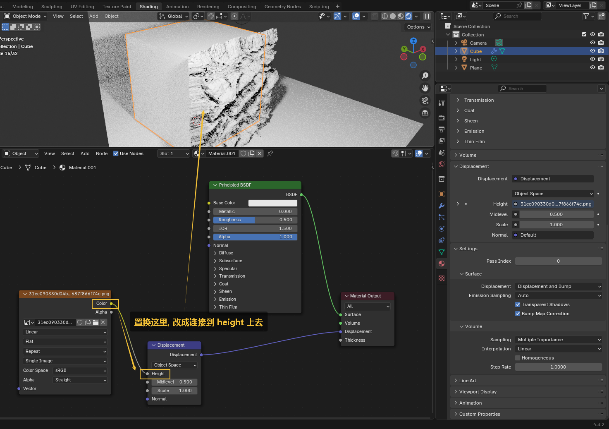

= 贴图 - 置换 (让一张贴图, 来让物体有真正的凹凸效果)
:toc: left
:toclevels: 3
:sectnums:
:stylesheet: myAdocCss.css

'''

官网手册 +
https://docs.blender.org/manual/en/latest/render/materials/components/displacement.html

[.small]
[options="autowidth" cols="1a,1a"]
|===
|Header 1 |Header 2

|第1步 : 新建置换节点
|image:img/0586.png[,]

image:img/0587.png[,]

|第2步: 给物体增加表面细分修改器, 细分数值, 比如可以改到 6.
|必须增加细分, 否则网格太少的话, 物体没法有凹凸立体感.

image:img/0588.png[,]

|第3步:
|image:img/0589.png[,]

|第4步
|

image:img/0591.png[,]
效果就有了

可以多个一起做, 也加上原始贴图, 能让物体的凹凸有原贴图上的颜色

image:img/0596.png[,]

image:img/0597.png[,]

image:img/0598.png[,]

image:img/0599.png[,]

image:img/0600.png[,]

|===

image:img/0592.png[,]

