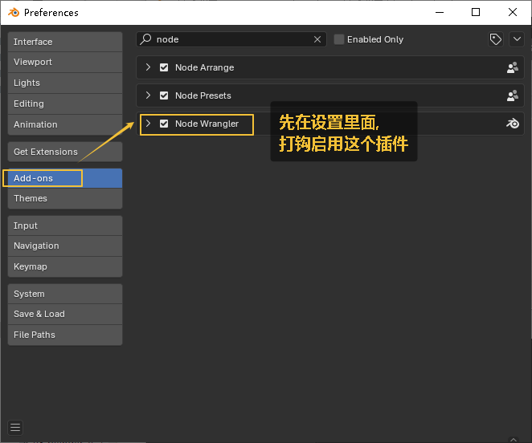
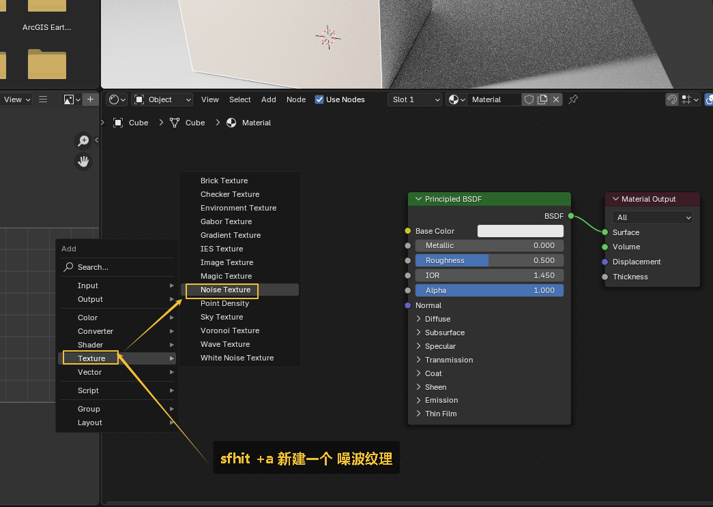
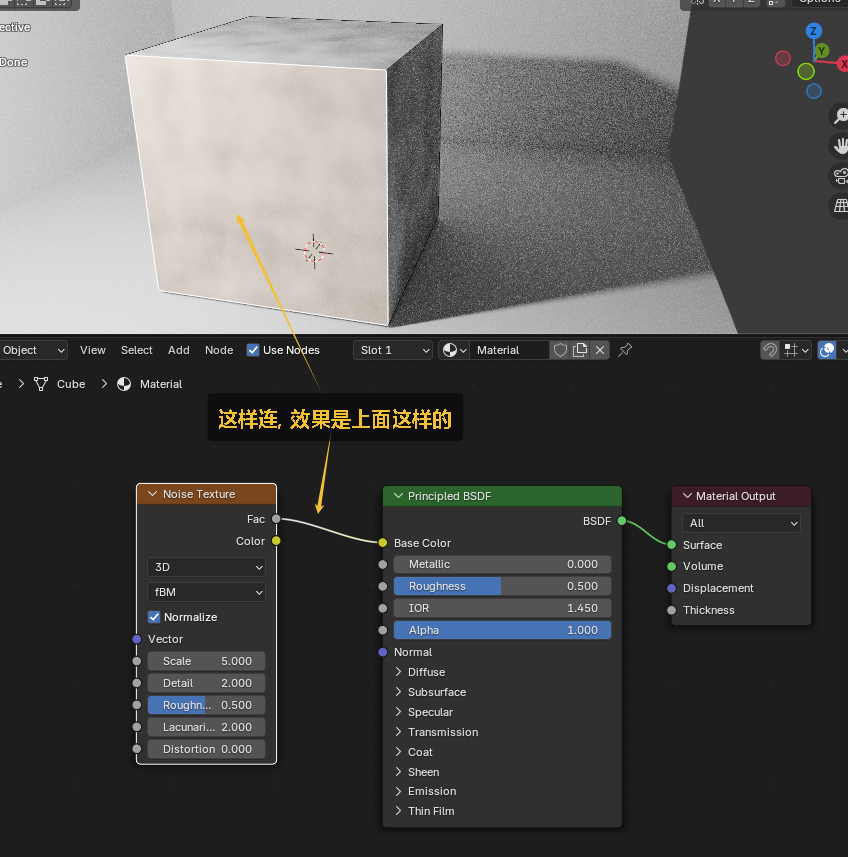
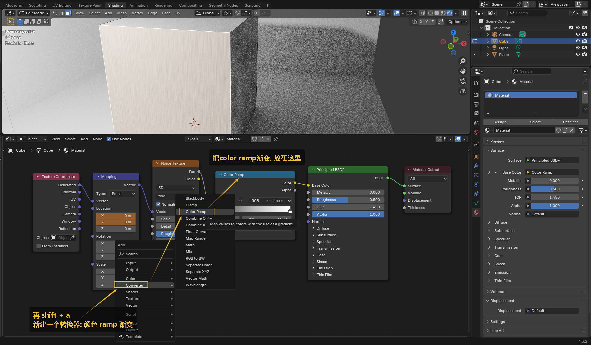
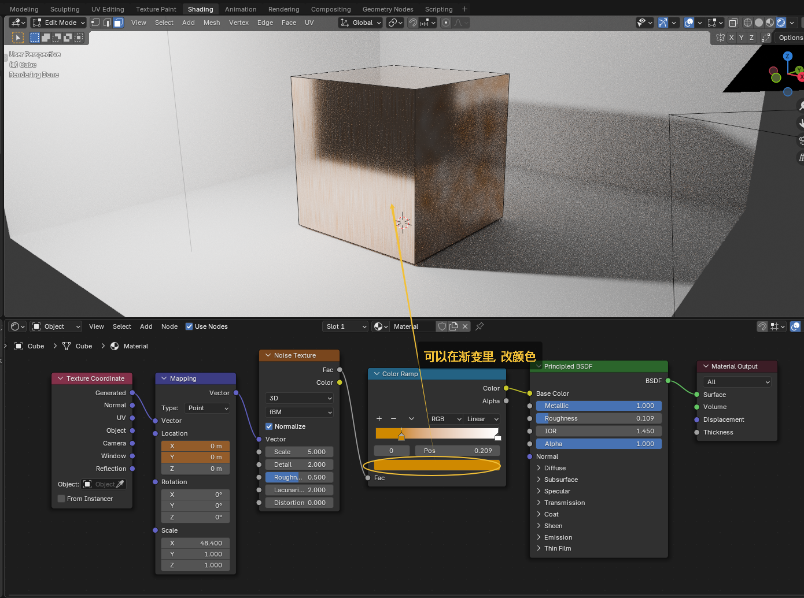

= 贴图 - 金属拉丝效果
:toc: left
:toclevels: 3
:sectnums:
:stylesheet: myAdocCss.css

'''

选中一个面, 给它添加一个材质, 然后如下操作:

image:img/0604.png[,]

image:img/0605.png[,]

image:img/0607.png[,]

image:img/0608.png[,]

