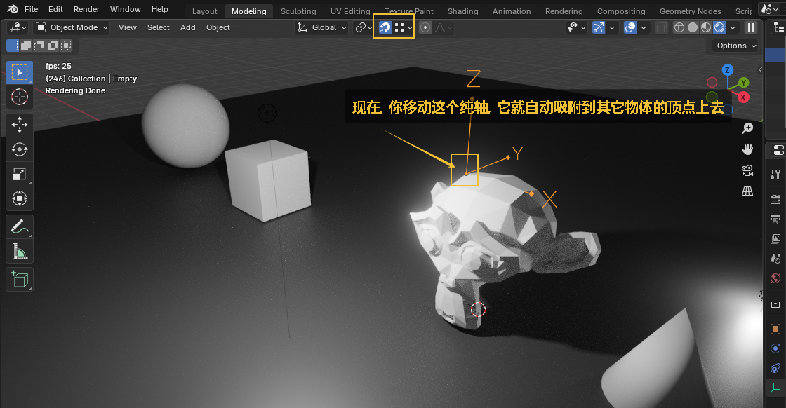

= 相机 - 景深
:toc: left
:toclevels: 3
:sectnums:
:stylesheet: myAdocCss.css

'''

== 景深

image:img/0628.png[,]

这样就已经有景深渲染效果了, 按 f12 渲染就看到了.

image:img/0629.png[,]

'''

== 将景深焦点, 捆绑到一个空轴物体上

image:img/0629.png[,]

image:img/0630.png[,]

image:img/0631.png[,]

image:img/0633.png[,]

image:img/0634.png[,]

'''

