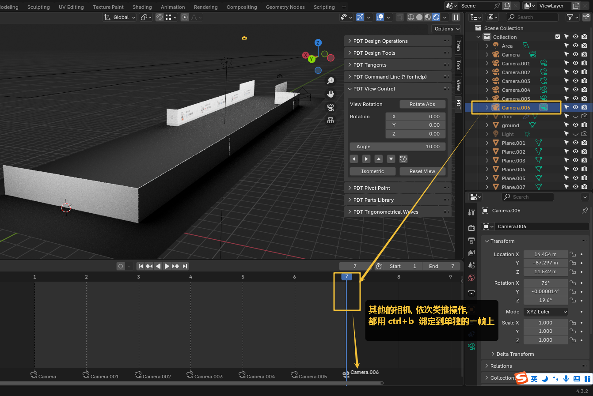
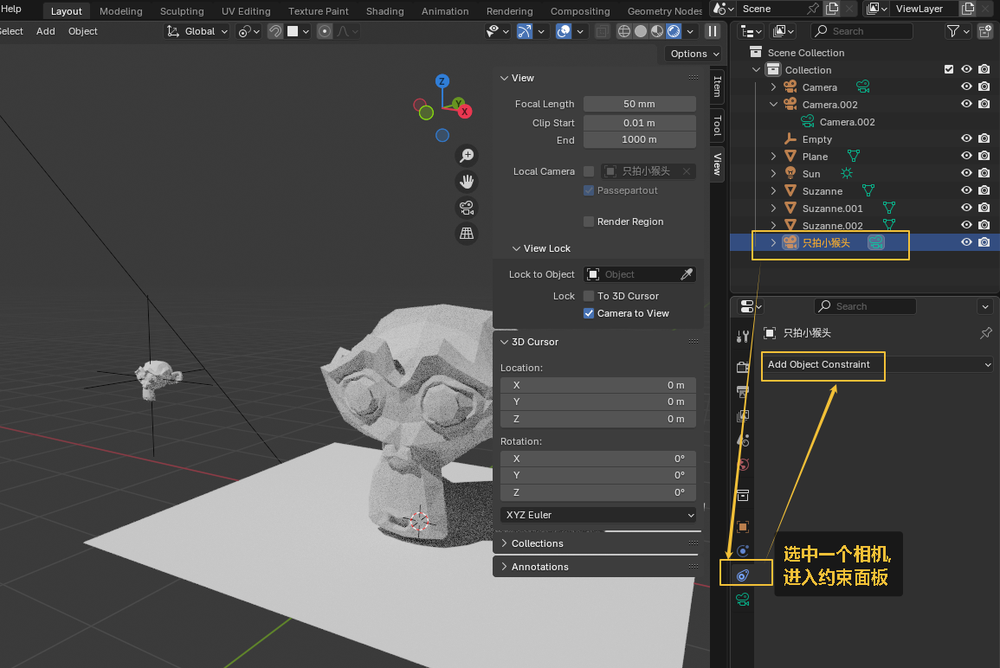

= 相机
:toc: left
:toclevels: 3
:sectnums:
:stylesheet: myAdocCss.css

'''

==== 调整相机取景

要看摄像机取到什么景, 就按键盘右侧数字键的 0

下面似乎是老版本的操作

image:img/0040.png[,]

新版本的操作, 如下

image:img/0251.png[,]

image:img/0252.png[,]

image:img/0253.png[,]

'''

==== 多相机镜头切换

要创建多个相机, 可以先复制相机

image:img/0274.png[,]

image:img/0275.png[,]

'''

==== ★ 一次性渲染多个摄像机视图

image:img/0666.png[,]

image:img/0668.png[,]

image:img/0669.png[,]

image:img/0672.png[,]

image:img/0673.png[,]

'''

==== ★★ 将当前视图, 直接指定为某一个相机的取景视图 -> ctrl + alt + 0

image:img/0662.png[,]

image:img/0663.png[,]

image:img/0664.png[,]

然后按 0 退出相机取景设置.

注意: 你有多个相机时, 要预览各个相机的取景角度时, 也必须按 0 数字键后, 才能看到!

'''

== ★ 让相机, 始终围绕一个物体拍摄(即永远自动只盯着它看, 我的眼里只有你)

image:img/0691.png[,]

image:img/0692.png[,]

image:img/0695.png[,]

image:img/0696.png[,]

image:img/0697.png[,]

'''

