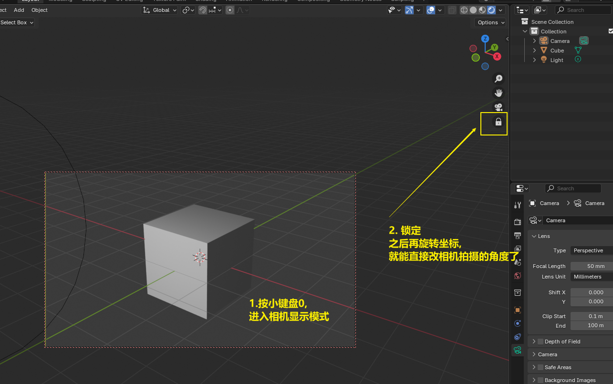
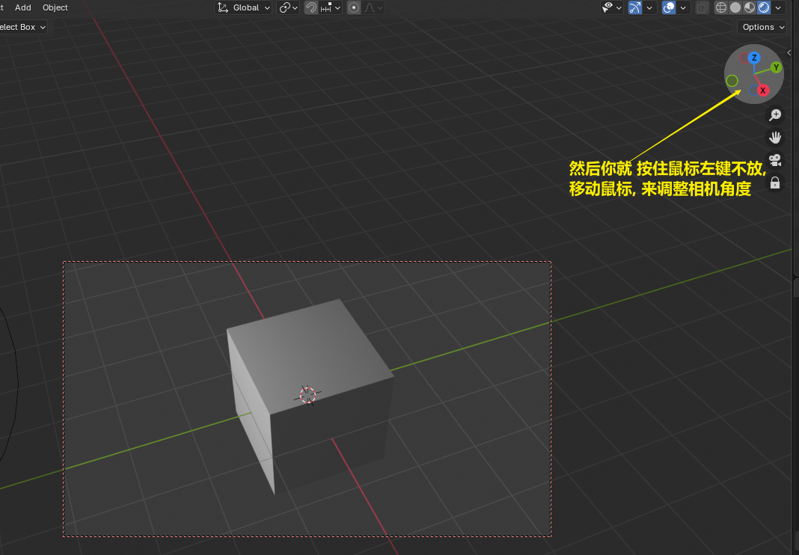
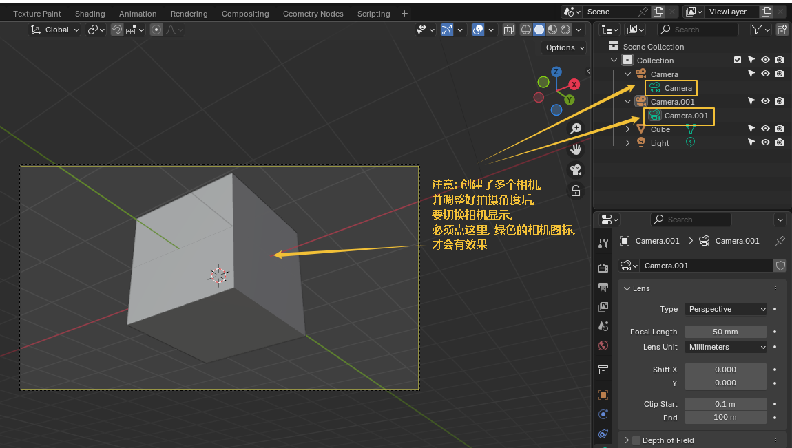
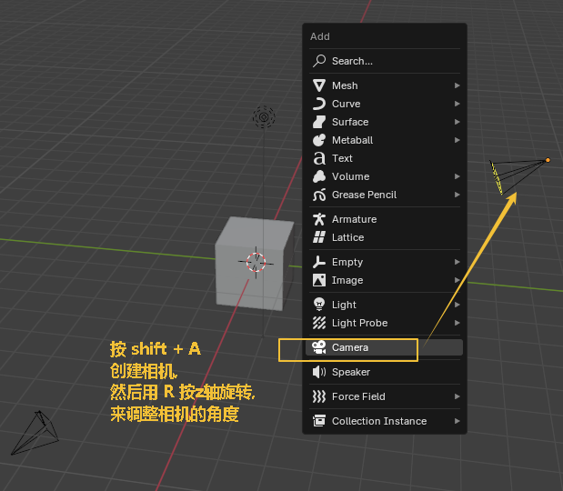

= 相机
:toc: left
:toclevels: 3
:sectnums:
:stylesheet: myAdocCss.css

'''

==== 调整相机取景

要看摄像机取到什么景, 就按键盘右侧数字键的 0

image:img/0038.png[,]

下面似乎是老版本的操作

image:img/0039.png[,]

image:img/0040.png[,]

image:img/0041.png[,]

image:img/0043.png[,]

新版本的操作, 如下

image:img/0253.png[,]

'''

==== 多相机镜头切换

要创建多个相机, 可以先复制相机

'''

==== ★ 一次性渲染多个摄像机视图

'''