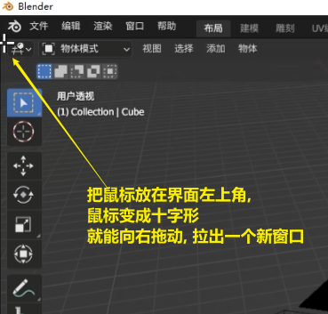
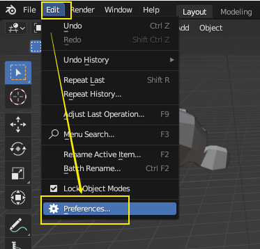
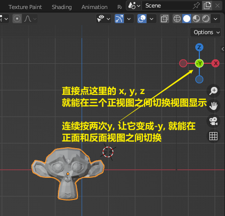
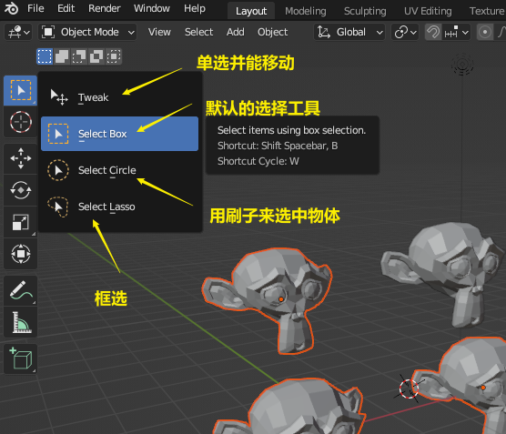
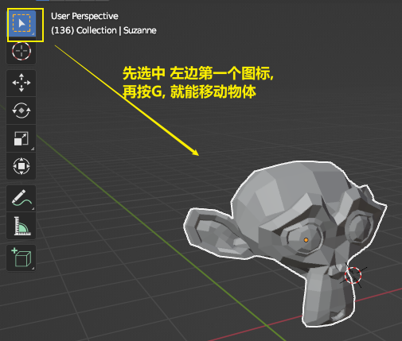
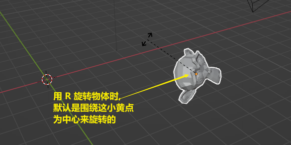
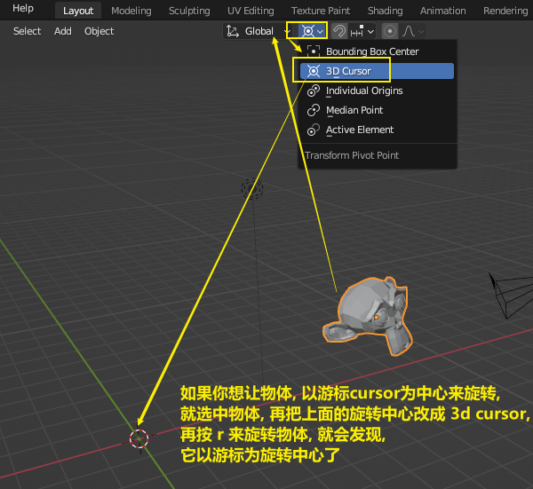
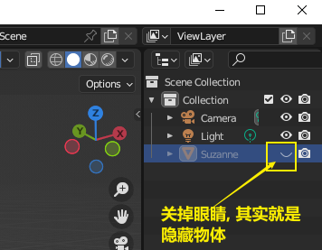

= blender
:toc: left
:sectnums: 3

'''

== 窗口操作

==== 拉出新窗口

== 视图操作

[.small]
[options="autowidth" cols="1a,1a"]
|===
|Header 1 |Header 2

|旋转视图
|鼠标中键

为了以你选中的物体为中心, 来旋转视图, 你要先这样设置:

image:img/0020.png[,]

|平移视图
|shift + 鼠标中键

|缩放视图
|鼠标滚轮 +
为了以你鼠标的当前位置, 为缩放的中心, 能更方便你来操作视图. 你要这样设置:

image:img/0019.png[,]

|===

==== 正视图, 侧视图, 顶视图 的切换 : 按 数字键盘上的 1-9

image:img/0006.png[,]

- 也可以按你键盘右边的"数字小键盘"上的 1-9, 来切换视图. 1,3,7,9 是90度旋转视图. 2,4,6,8 是 每次按15度旋转视图.

- 也可以按alt + 鼠标中间, 来转

==== 切换到摄像机视图 : 按数字键 0

==== 切换到正交视图 (即无透视视图) : 按数字键5

==== 在一堆物体中, 将选中的物体快速定位, 单独放大到视图中间显示 : 按数字键上的小数点"."键

== 物体 坐标

==== 在特定坐标位置, 新建物体

image:img/0008.png[,]

也可以用 "shift + 鼠标右键", 来快速更改该"虚线圆圈curse"的位置.

==== 将选中的物体, 移动到"游标"的坐标处

image:img/0011.png[,]

== 物体操作

==== 选中物体

==== 新建物体 : shift + A

image:img/0001.png[,]

==== 移动物体 : 按 G (go)

按住x, 就能让物体只沿着x轴移动, +
在移动物体的同时, 按住y, 就能让物体只沿着y轴移动, +
在移动物体的同时, 按住z, 就能让物体只沿着z轴移动, +

要撤销移动(即回到初始新建的位置), 就按 alt+g

==== 缩放物体 : 按 S

在缩放的同时, 按 x或y或z, 就可以指定只沿着某个轴来缩放.

要撤销缩放, 就按 alt+s

==== 旋转物体 : 按 R

要撤销旋转, 就按 alt+r

==== 隐藏选中的物体 : 按 H ;  重新显示物体 : 按 alt+H

==== 将没有选中的全部物体, 一次性直接隐藏 : 按 shift + H

==== 复制物体 : shift + D

注意: 如果你在选中物体后, 按了 shift+D 后, 再点右键, 它就会在该物体的当前位置上, 复制出一个新物体,  新旧两个物体是重叠在一起的. 所以不要将右键误认为是你取消了复制. 复制并没有取消!

'''

== 游标 cursor

==== 将游标, 重新回到激活的某物体坐标处

image:img/0009.png[,]

image:img/0010.png[,]

==== 将游标, 回到整个世界轴的中心处  : shift + c

image:img/0012.png[,]

== 每个物体自身的原点(小黄点)

注意: 小黄点才是代表物体的真正坐标位置. 计算机只认小黄点位置, 不认具体的模型物体位置.

==== 移动小黄点

image:img/0015.png[,]

image:img/0016.png[,]

image:img/0017.png[,]

'''

