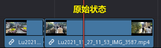
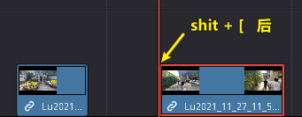
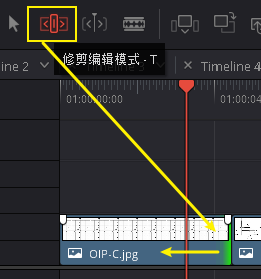
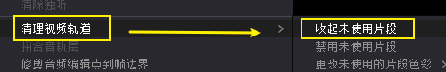
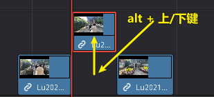
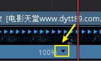
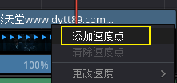
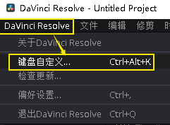

= DaVinci 视频 常用功能
:toc: left
:toclevels: 3
:sectnums:

---

== 插件

==== Voukoder

https://www.voukoder.org/forum/thread/783-downloads-instructions/

---

== *入点 I (in), 出点 O (out)*

==== 删除入点, 出点, 按 alt + i,  alt + o

---

==== ★ 重新找到原始素材上的"入点, 出点"位置 -> F 键

将已"入点, 出点"后的子片段, 重新定位它在原始长片段上的"入点, 出点"位置::
在轨道上选中子片段, 按 F 键

---

==== #轨道上的某片段, 查找它在媒体池中的原素材位置# -> alt + f (find)

---

==== 切刀 -> B (blade)

==== #在当前时间轴(红线)处, 直接做切刀# -> ctrl + \

image:img/035.png[]

注意 : 切刀后, 每段依然是完整状态, 可以被延伸. 只不过切刀相当于"蒙版"功能.

---

==== #将时间轴(红线)处, 变成"入点"# -> shift + [

---

==== #将时间轴(红线)处, 变成"出点"# -> shift + ]

image:img/039.png[]

---

==== #将时间轴(红线)处, 变成"入/出点", 并让后面的片段自动紧跟上来, 不要留空# -> ctrl + shift + [ 或 ]

---

==== 编辑前面素材的长短时, 让后面素材自动紧随其后, 而不中间留空

激活此"修剪编辑模式"后, 当你选中前面的素材, 将其变短或拉长, 后面的素材会紧贴这前面素材的长短而移动, 而不会中间留空.

---

== *删除片段*

==== 删除片段, 并留空 -> 选中要删的片段, 按退格键

==== 删除片段, 不留空, 后面的片段自动紧跟上来 -> 按del键

---

== *快速定位*

==== 在各片段的"连接处"间, 进行快速定位 -> 按"上/下键"

image:img/033.png[]

---

==== 按1秒跳跃 -> shift + 左/右键

---

==== 按1帧跳跃 -> 左/右键

---

== *显示, 暂时隐藏(变灰)*

==== #暂时关闭时间线上的某片段 (变灰)# -> 按 D 键

==== 一次性删除所有 "用 快捷键D 关闭的片段"

菜单: 时间线 -> 清理视频轨道 -> 收起未使用片段  +

但该方法只对变灰的"视频部分"有效, 对相应的"音频部分"无效, 不会被删除

---

== *轨道上, 调整片段位置*

==== #将两个片段的前后位置, 进行交换# -> Shift+Ctrl + 鼠标左键拖动

---

==== #让素材移到上一个/下一个轨道# -> alt + 上/下键

---

== *轨道*

==== 复制片段 -> alt + 拖动素材

---

==== 选中轨道上的片段: #*alt 代表"所有轨道";  ctrl 代表"前面"; y代表"选中片段"*#

====  #选中"*当前轨道*"上, 时间轴"后面"的所有片段# ->  y(选中)

---

====  #选中"*所有轨道*"上, 时间轴"后面"的所有片段# ->  alt(所有轨道) + y(选中)

---

====  #选中"*当前轨道*"上, 时间轴"前面"的所有片段# -> ctry(向前) + y(选中)

---

==== #选中"*所有轨道*"上, 时间轴"前面"的所有片段# -> ctrl(向前) + alt(所有轨道) + y(选中)

---

==== 锁定视频轨道 -> alt + shift + 1/2/3 ...

锁定轨道, 只是让轨道上的片段无法被移动, 片段依然能播放出来, 而不会失效 (让片段暂时失效的快捷键是 D).

==== 锁定音频轨道 -> alt + shift + f1/ f2/ f3...

== ---------- ----------

---

== *调速(视频)*

====  更改a片段速度时,让后面的b片段, 紧连a片段移动 -> 波纹序列

对轨道上的a片段, 右键 -> 更改片段速度 -> 勾选"波纹序列": 则无论前面的片段调速后变短还是边长. 后面的片段, 都能自动紧连前面的片段移动.

---

==== 变速控制 (更专业) -> ctrl + R (rate)

[cols="1a,2a"]
|===
|Header 1 |Header 2

|更专业的调整变速, 是对轨道上的片段, 右键 -> "变速控制" (ctrl + R)
|

|在你想要变速"开始"与"结束"的时间轴(即红线)位置处, 点击黑色小三角 -> 添加速度点, 会创建一个拉杆
|

|再点击某段的小三角, 就能"更改速度"了:

- 上面的拉杆, 是调整拉杆"前面片段"的 视频速度
- 下面的拉杆, 是调整"速度点"(即本拉杆)的位置
|

|===

---

==== 调速的又一方法 : 检查器 -> 变速

[cols="1a,2a"]
|===
|Header 1 |Header 2

|在"检查器"中, 也可以对视频片段, 进行"调速" (该片段的播放时长就会相应边长或缩短)
|
|===

---

==== ★ 让视频的变速, 不突快突慢, 不生硬 -> 变速曲线 shfit + c

[cols="1a,2a"]
|===
|Header 1 |Header 2

|对视频右键 -> 变速曲线
|

|先放大时间线, 以露出"重新调整帧变速"按钮, 点击它
|

|选中 "重新调整变速", 就能看到 调速曲线, 目前处于"生硬变速"的状态
|

|选中某个"变速点"(白色小点), 按上面的"曲线化", 就能看到贝赛尔曲线了
|

|===

---

== *调"帧率"*

==== 强制更改原始素材的"帧率"

可以对媒体池中的片段素材, 先调整好帧率(比如, 将原始30帧, 调成60帧, 素材的播放时长就会缩成原来的一半, 播放速度就会变快), 再拖动到轨道上.

如果你对已经拖到轨道上的片段, 重新在媒体池中调整该素材的"帧率", 则轨道上的该片段可能会变红, 提示成"离线媒体". 只要把轨道上该片段删除, 重新从媒体池中拖入即可.

---

==== ★ #自动插帧#

当你对原始素材, 强制使用了调整"帧率", 或变速拉长后, 导致播放时帧率下降, 你可以让达芬奇用算法, 自动帮你"插帧", 弥补一下播放时的不流畅感.

项目设置 -> 主设置 -> 帧内插值 -> 变速处理, 改成"帧混合"或"光混".

- 最近: 容易产生跳帧, 卡顿(一帧放了两遍)的情况
- 帧混合  : 就是借助前后的帧, 来自动生成一个模糊的中间的帧
- 光流算法: 也是自动算出中间的帧, 其缺点是容易算不出来.

---

==== 让插帧跟流畅 -> 速度扭曲

在 检查器 -> 视频 ->变速与缩放设置 -> 运动估计, 改成"速度扭曲", 也能让"插帧"更流畅.

---

== *静帧*

==== #让视频变成"静帧"#

在轨道上, 选中某片段, 在时间轴位置处, 点击"变速"中的雪花图标, 则该时间轴之后的片段长度, 会全部变成"静帧".

---

==== 抓取一张静帧

[cols="1a,2a"]
|===
|Header 1 |Header 2

|在"调色"模块界面, 在视频窗口上右键 -> 抓取静帧, +
截图就会在"画廊"里出现了.

然后对"画廊"里的静帧画面, 右键 -> 导出, 可以导出该图片

|image:img/023.png[]

|===

---

== ★ #稳定器# -> 在调色模块中

[cols="1a,2a"]
|===
|Header 1 |Header 2

|稳定器, 是在"调色"模块界面中的.
|

它有三种稳定算法, 可供选择:

|===

---

== ---------- ----------

---

== *时间线*

==== ★ 缩放"时间线" -> alt + 鼠标中键

轨道时间线的缩放 :

- alt + 滚动"鼠标中键"
- ctrl + 加号/减号

---

==== #调整轨道显示高度# -> shfit + 鼠标滚轮

---

==== ★ #时间线总览# (即把全部片段, 缩放到整个屏幕来查看) -> shift + z (zoom)

比如你一开始的缩放是如下:

按 shift + z 总览后, 就会:

---

==== 在轨道上方, 显示多条时间线

创建时间线::
在媒体池的空白处, 右键 -> 时间线 -> 新建时间线

在轨道上方, 显示多条时间线::

image:img/003.png[]

---

==== ★ 自动激活"当前时间线"位置处的素材片段

轨道上, 时间线拖到哪里, 就自动激活该位置处的片段素材:

菜单 : 时间线 -> 选框跟随播放头

---

== ---------- ----------

---

== *预览窗口*

==== 将播放预览窗口, 全屏来播放 -> ctrl + f,  或 直接按 p

== ---------- ----------

---

== ★ #优化性能#

==== 设置"代理文件"的分辨率

项目设置 -> 主设置 -> 优化媒体和渲染缓存 -> 代理媒体的分辨率

---

== *操作效率 设置*

==== 自定义快捷键 -> ctrl + alt + k

'''

==== 打开"历史记录"

菜单: 编辑 -> 历史记录 -> 打开历史窗口 +

注意: 历史记录窗口, 仅仅支持"轨道编辑"界面, 而不支持"调色"界面

---

==== 查看轨道上片段的 原始视频信息

[cols="1a,2a"]
|===
|Header 1 |Header 2

|在轨道模块, 选中轨道上的某片段, 在屏幕右上方, -> 元数据 , 就可以看到该片段的原始信息了 (*注意: 是拖入轨道前的最原始素材的信息, 而非是后期调速过后的信息*).
|

本例中, 因为我们是一开始在"媒体池"中, 强行更改了素材的帧率 (而非是在轨道上来调速更改帧率的), 所以相当于是强制更改了素材的最原始信息.
|===

---

== *编码, 解码*

==== 使支持 iphone 4k 视频 -> 安装 HEVC 解码器

安装地址: +
https://www.free-codecs.com/download/hevc_video_extension.htm

---

== *与其他软件交互*

==== pr 导出到达芬奇中编辑 -> 导出 xml 格式

在pr 里, 导出 xml (final cut pro xml) 文件, 就能导入达芬奇中进行调色了.

---

