= DaVinci 节点编辑器
:toc: left
:sectnums:
:toclevels: 3

---

== *节点编辑器 (增/ 删/ 打包)*

==== 添加"串行节点" -> alt + s (serial)

==== 添加"并行节点" -> alt + p (parallel)

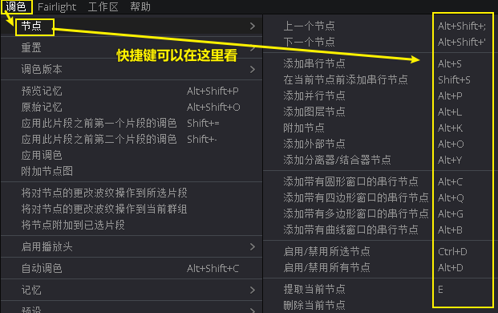

---

==== #关闭(禁用) /显示(开启) *选中的节点*# -> ctrl + d

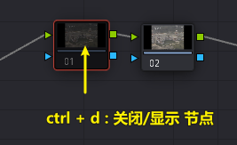

---

==== #关闭(禁用) /显示(开启) *所有节点*# -> alt + d

---

==== 创建/解散 复合节点

[cols="1a,2a"]
|===
|Header 1 |Header 2

|选中多个节点, 右键 -> 创建复合节点 (相当于做了"群组","打包")
|image:img/057.png[]

|将复合节点解散, 恢复成多个节点的状态, 就右键 -> 分解复合节点
|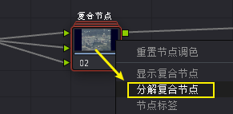

|显示复合节点, 则是保持"复合节点"(打包)的状态下, 进入打包的内部, 查看其子节点
|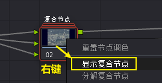

查看之后, 要退回上一级, 就右键 -> "退出复合节点"
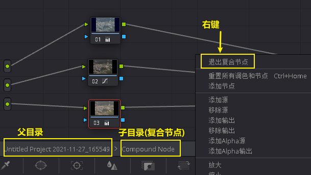
|===

---

==== 对"*单一节点*", 去除调色状态, 恢复成默认的颜色状态 -> 右键 : 重置(本)节点调色

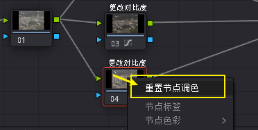

---

==== 删除你创建的"*所有节点*", 恢复成一开始的默认状态 -> ctrl + home

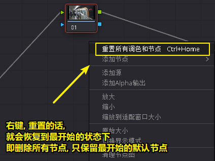

---

==== 给节点加上名字(标签) -> 右键 : 节点标签

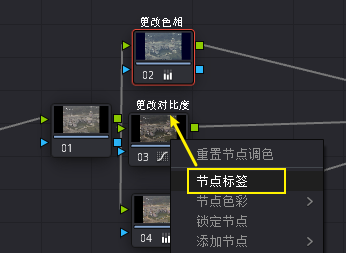

---

==  *节点编辑器 (复制属性)*

==== 要查看每个节点的调色结果 -> 要点击"突出显示"按钮 : shift + h

突出显示按钮, 能让你看到每个节点过程中的, 分别调色结果, 而不只是最终的合成效果.

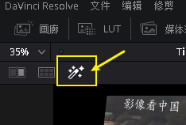

---

==== 把"a节点"的属性, 复制到"节点b"身上 -> 方法1: ctrl + c,  ctrl + v.  方法2: 按住alt + 拖动a 到b身上

- 方法1: ctrl+c, ctrl+v

- 方法2:

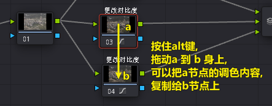

---

==== 将静帧的调色, 赋给另一个节点

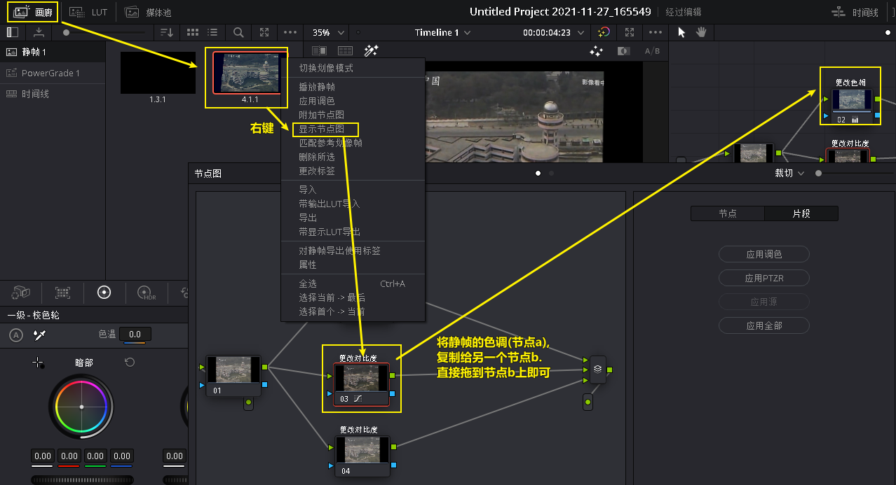

---

==== 交换两个节点的调色 -> 按ctrl + 拖动a节点 到 b节点上

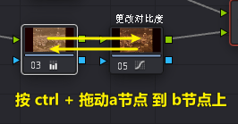

---

== *并行混合器*

==== 手动添加"并行混合器"

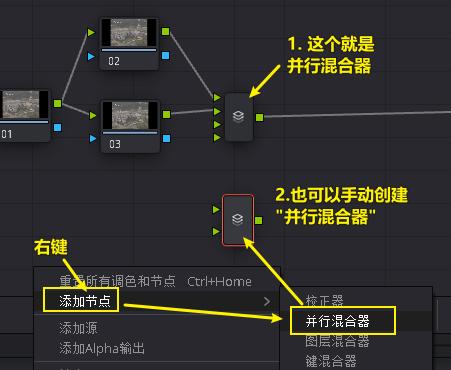

---

==== 给"并行混合器", 添加新的"接口"

手动创建的:"并行混合器", 默认只有两个接口. 为了让更多的节点连接进来, 你需要手动添加新接口.

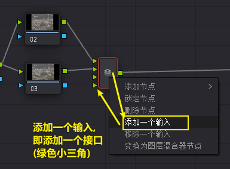

---

== *图层混合器*

[cols="1a,2a"]
|===
|Header 1 |Header 2

|先添加"图层节点" alt + L (layer)
|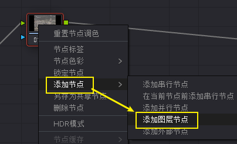

|Column 1, row 2
|Column 2, row 2
|===

"并行混合器节点" 和 "图层混合器节点", 可以互相转化

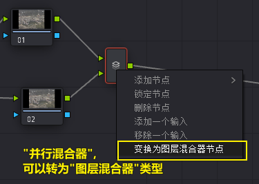

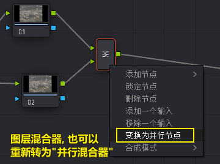

== ---------- ----------

---
