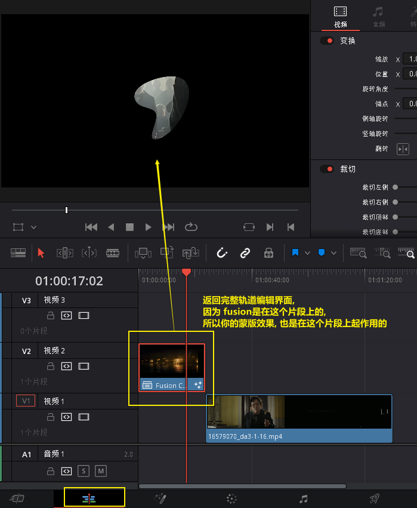
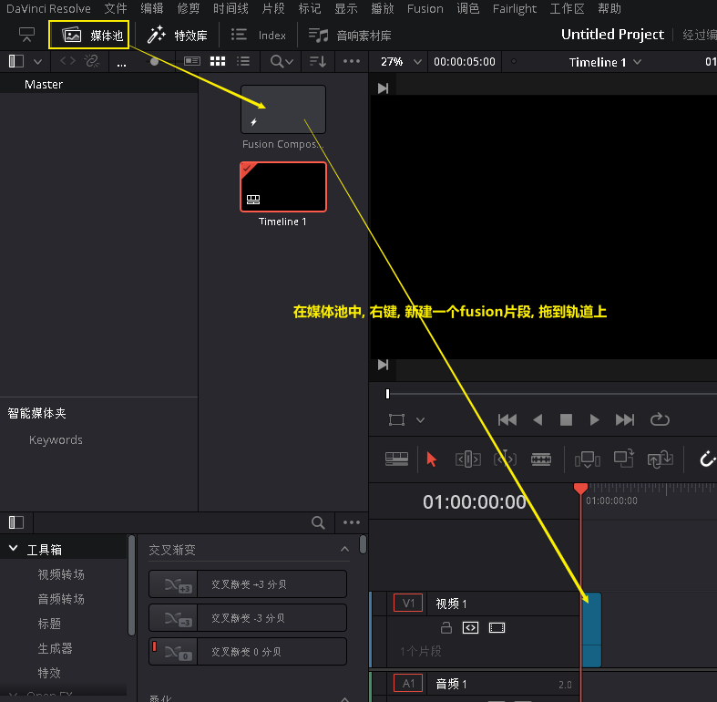

= DaVinci fusion
:toc: left
:sectnums:
:toclevels: 3

---

== *特效 (几何变形)*

==== 查看关键帧 -> ctrl + shfit + c

image:img/044.png[]

---

==== 将尺寸不一的素材, 按比例缩放, 让其宽度(x轴)自动匹配到 和你的视频分辨率宽度一样

在媒体池中, 选中你的素材, 双击它, 在屏幕右边的检查器 -> 视频 -> 变速与缩放设置 -> 将 "缩放比例"改成 "填充" 即可.

image:img/002.png[]

---

==== ★ 上下加黑边 -> 调整片段

[cols="1a,2a"]
|===
|Header 1 |Header 2

|推荐: 用特效库中的"调整片段", 拖到轨道上,  不会挡字幕
|image:img/022.png[]

|不推荐 (会挡字幕):  +
菜单: 时间线 -> 输出加遮幅
|
|===

---

== *特效 (滤镜)*

==== ★ 将 a片段的特效, 应用到b片段上 -> alt + v (粘贴属性)

选中a片段, ctrl+c;  再选中b片段, alt + v

---

==== 让视频模糊 (方法1)

在调色模块界面中, 效果 -> 搜索关键词"模糊" -> 将高斯模糊, 拖动到节点编辑器上.

image:img/023.png[]

image:img/031.png[]

---

====  让视频模糊 (方法2)

在节点编辑器中, 新建一个节点, 然后对其使用"模糊"效果:

image:img/073.png[]

---

==== 给"竖视频"素材, 添加该视频的模糊化横背景.

给你的"竖视频"片段, 添加一个特效 "遮幅填充"即可, 就会自动把视频模糊化, 放到背景上.  +
还可以在右侧面板中设置模糊的缩放样式, 和模糊度.

image:img/104.png[,]

'''

== *转场*

==== 给片段加上默认转场效果 -> ctrl + t

image:img/042.png[]

---

== ---------- ----------

---

== fusion

=== *创建fusion片段*

==== 方法1

==== 方法2

==== 在预览窗口中, 显示任意片段 -> 直接拖动节点到预览窗口中, 即可.

==== 跳到指定帧数

上面的帧数红线, 也可以手动拖动位置.

==== 缩放节点面板的显示范围 -> ctrl + 鼠标滚轮

==== 整体平移节点面板 -> 用鼠标中键

==== 将节点显示成图标

==== 移动节点时, 让它们能自动水平或垂直对齐, 相当于吸附到网格功能

==== 将多个节点的效果, 融合在一起

==== 手动添加任何节点

==== ★ 连线箭头的颜色 的意思 : 绿前, 黄后

==== 缩放"节点内容"的尺寸

=== *蒙版*

==== 蓝色箭头连线, 表示"蒙版"功能

==== 蒙版案例 : 让曲线生长

image:img/148.png[]

==== 抠出任意形状的路径蒙版

image:img/151.png[]

=== *文本*

==== 打字机效果, 一个字一个字出来

==== 文字描边

==== 文字阴影

==== 动画案例 1

=== *跟踪节点*

==== 让文字做跟踪

下面, 在空白处直接右键也行, 不需要在最后一帧上右键.

==== 平面跟踪 (注意: 平面区域前, 不能有遮挡, 否则失效.)

image:img/172.png[]

image:img/174.png[]

'''

==== 用"点跟踪", 来跟踪前面有遮挡的平面

