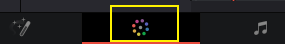

= DaVinci fusion
:toc:
:sectnums:

---

== *特效 (几何变形)*

==== 查看关键帧 -> ctrl + shfit + c

image:img/043.png[]

---

==== 将尺寸不一的素材, 按比例缩放, 让其宽度(x轴)自动匹配到 和你的视频分辨率宽度一样

在媒体池中, 选中你的素材, 双击它, 在屏幕右边的检查器 -> 视频 -> 变速与缩放设置 -> 将 "缩放比例"改成 "填充" 即可.

image:img/002.png[]

---

==== ★ 上下加黑边 -> 调整片段

[cols="1a,2a"]
|===
|Header 1 |Header 2

|推荐: 用特效库中的"调整片段", 拖到轨道上,  不会挡字幕
|

|不推荐 (会挡字幕):  +
菜单: 时间线 -> 输出加遮幅
|
|===

---

== *特效 (滤镜)*

==== ★ 将 a片段的特效, 应用到b片段上 -> alt + v (粘贴属性)

选中a片段, ctrl+c;  再选中b片段, alt + v

---

==== 让视频模糊 (方法1)

在调色模块界面中, 效果 -> 搜索关键词"模糊" -> 将高斯模糊, 拖动到节点编辑器上.

---

====  让视频模糊 (方法2)

在节点编辑器中, 新建一个节点, 然后对其使用"模糊"效果:

---

== *转场*

==== 给片段加上默认转场效果 -> ctrl + t

---

== ---------- ----------

---
