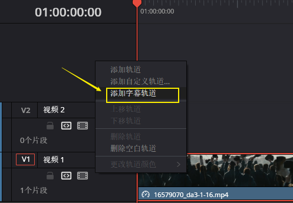
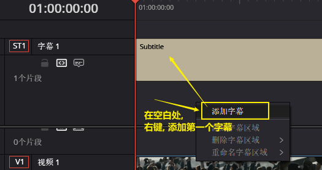
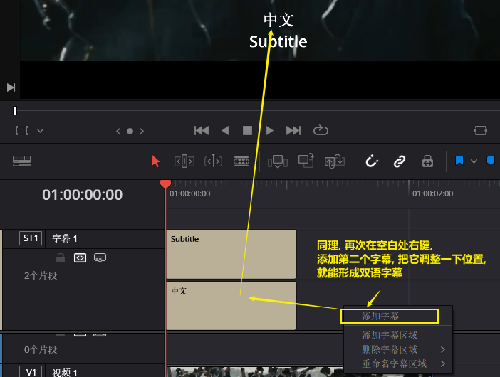
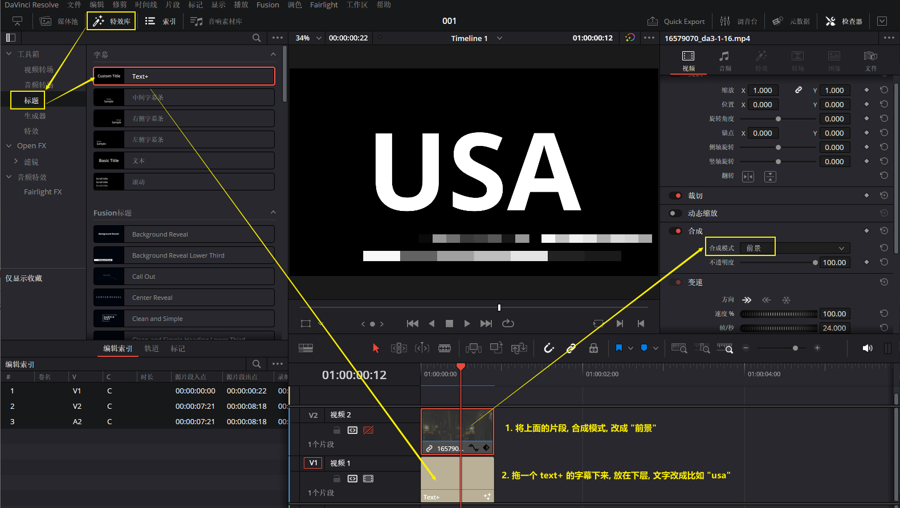
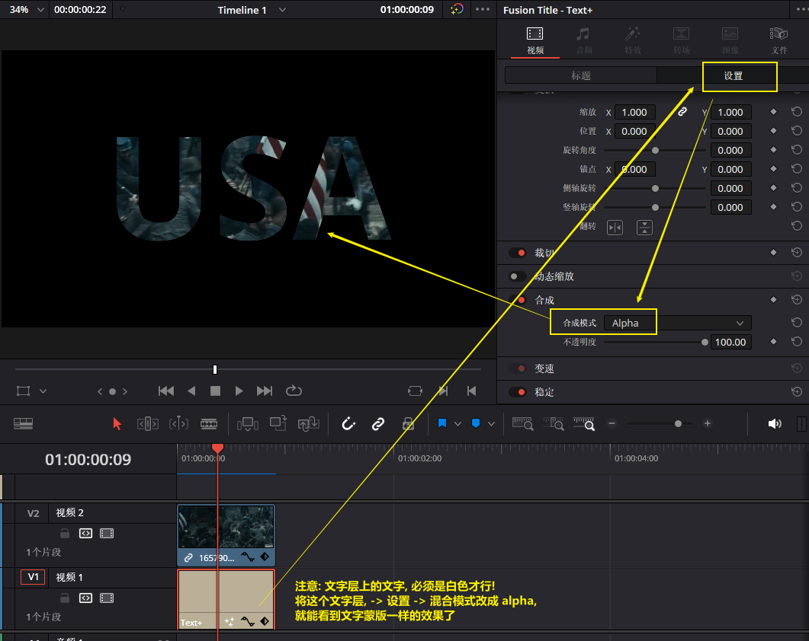
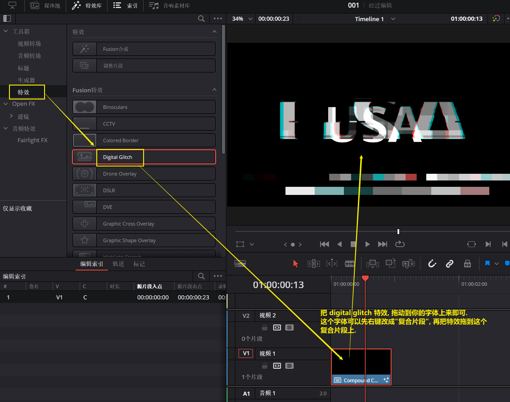
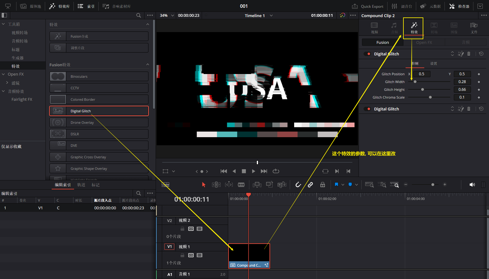
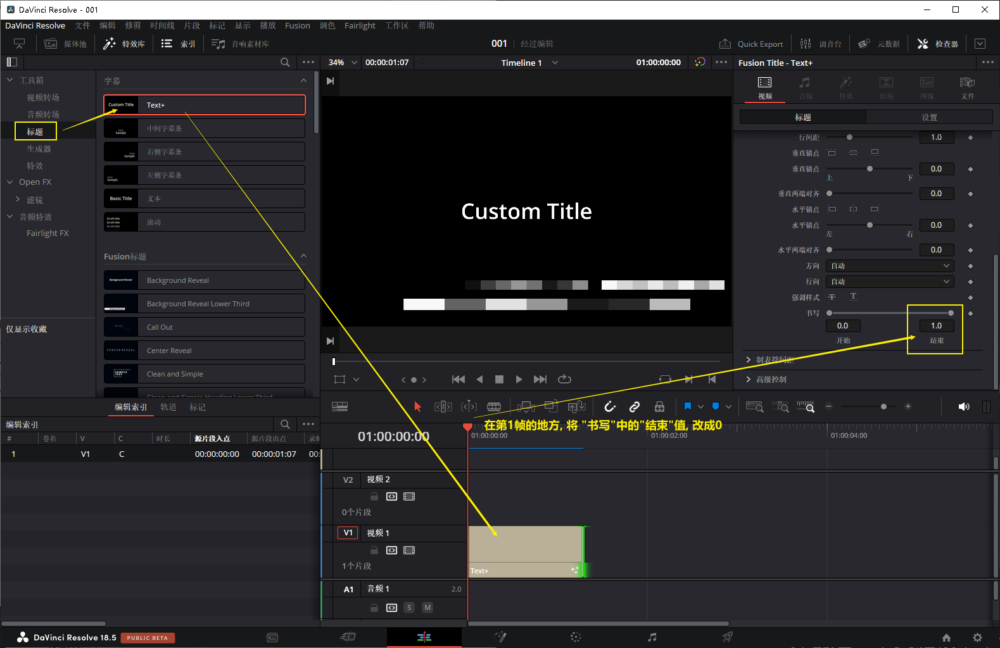
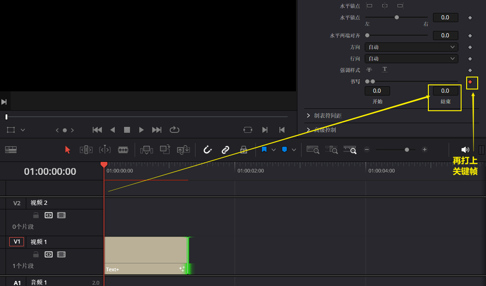
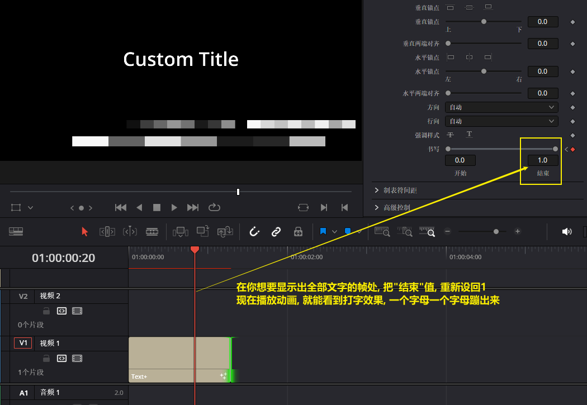

= DaVinci 添加字幕
:toc: left
:sectnums:

---

== 中英双字幕

image:img/205.png[]

现在, 字幕轨道好像看起来没什么变化, 其实你已经可以给这个字幕轨道, 添加多个字幕了

image:img/208.png[]

'''

== ★ 文字形状的蒙版效果

== 文字: 数码效果

'''

== 文字: 打字机效果

'''

== 文字: 霓虹灯效果

https://www.bilibili.com/video/BV1sg4y1N7tM/?spm_id_from=333.999.0.0&vd_source=52c6cb2c1143f8e222795afbab2ab1b5

3.56

