- Adobe ExtendScript Toolkit 工具 download
  collapsed:: true
	- https://adobe-extendscript-toolkit.software.informer.com/
	- ---
- 编程代码
  collapsed:: true
	- 变量
	  background-color:: #793e3e
	  collapsed:: true
		- 不需要任何输出语句, 直接打上变量名, 就能输出该变量的值
		- 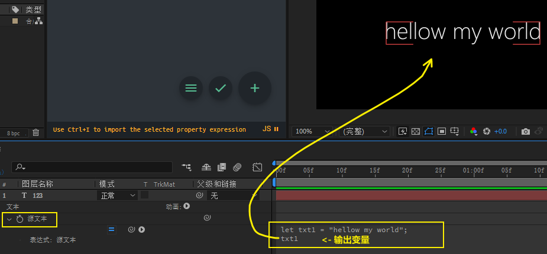
		- 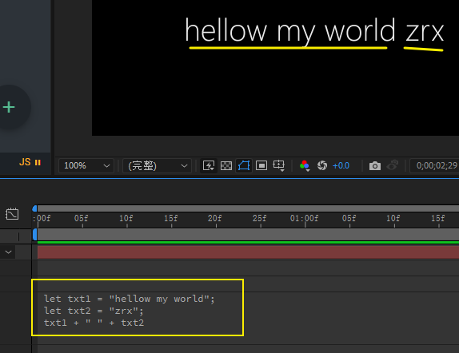
	- 获取属性值
	  collapsed:: true
		- 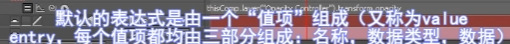
		- 比如, 获取元素的位置坐标 -> position.value
			- 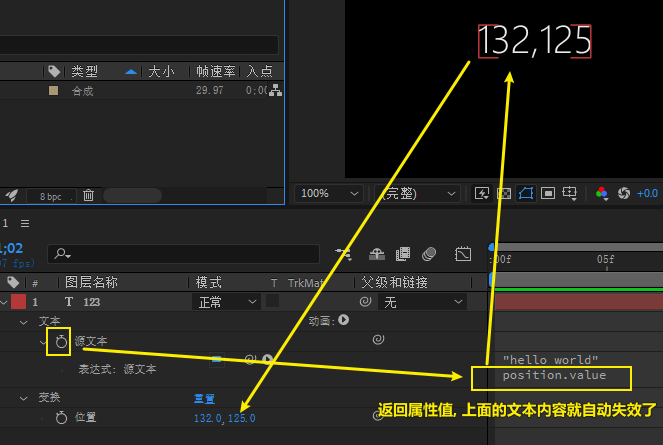
			- 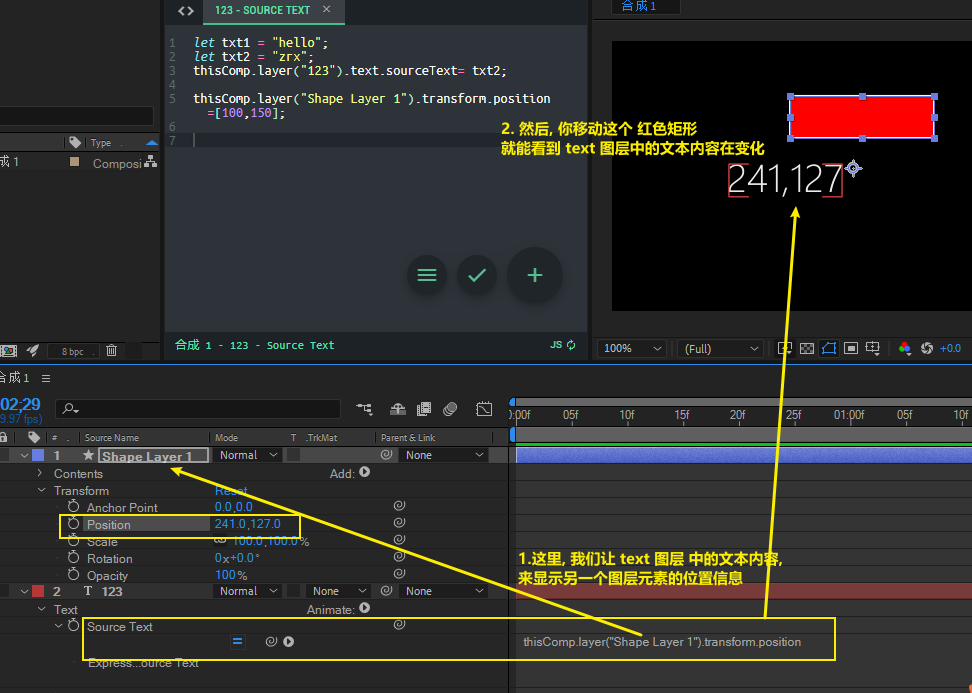
			-
		- 返回"本合成"(thisComp对象)的时长:  thisComp.duration   返回秒数
		  collapsed:: true
			- 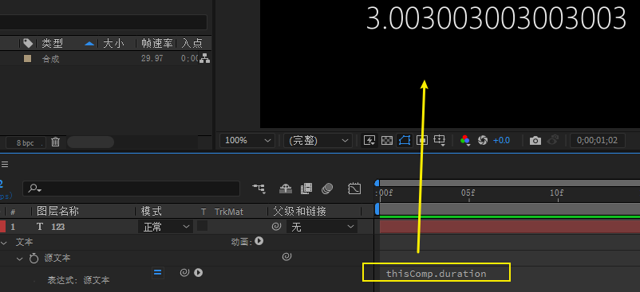
			-
		-
	- 获取某个"合成"Comp
	  collapsed:: true
		- 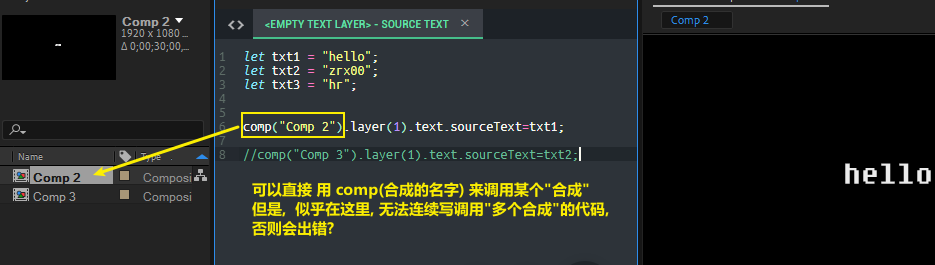
	- 让当前图层所有关键帧的值, 全部"加减乘除"某个数值: value +100,  value*2,  value+time(time返回秒数)   等等
	  collapsed:: true
		- 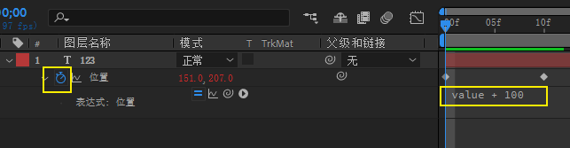
		-
	- 用3d点控制, 来操控list多维属性
	  background-color:: #793e3e
	  collapsed:: true
		- 你要先选中图层后, 才能在"效果控件"中右键, 看到菜单
		- 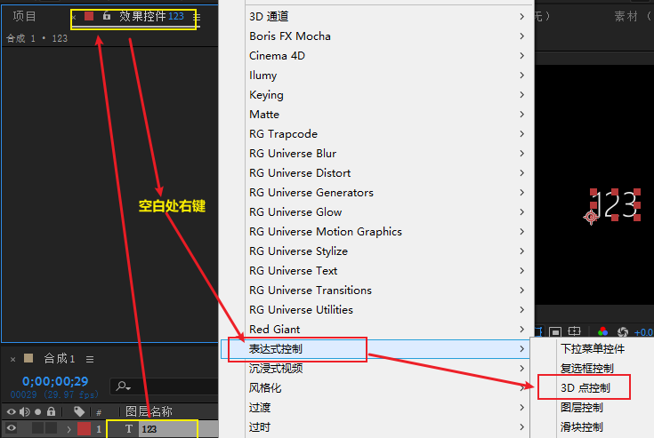
		- 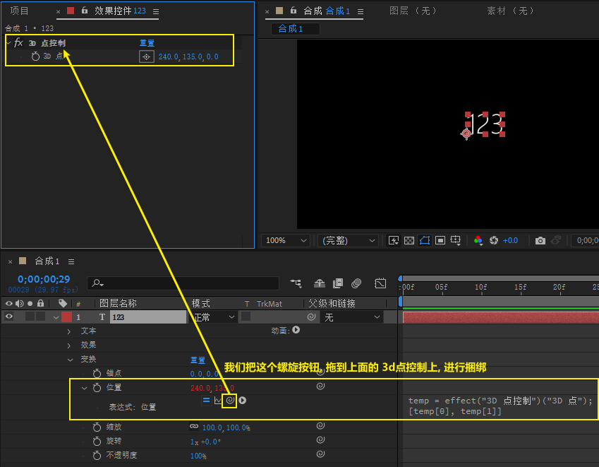
		- 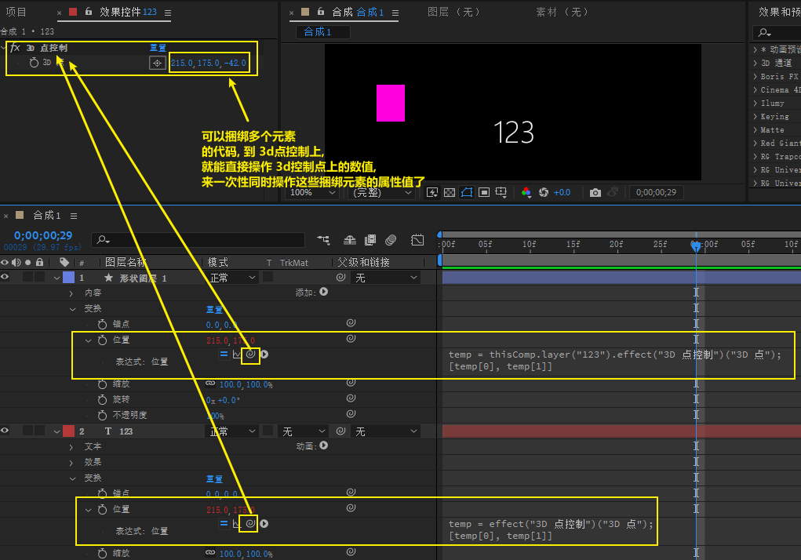
		-
	- list变量的index
	  collapsed:: true
		- 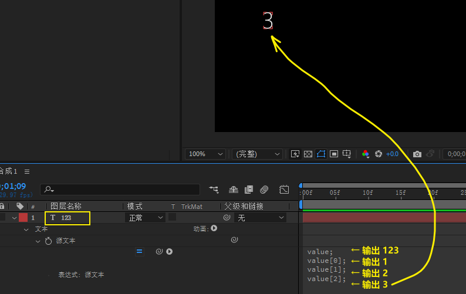
		-
	- 单独的index, 会输出当前图层是排在第几层的
	  collapsed:: true
		- 当你移动本图层的前后顺序时, 你能看到 index的值会发生变化.
		- 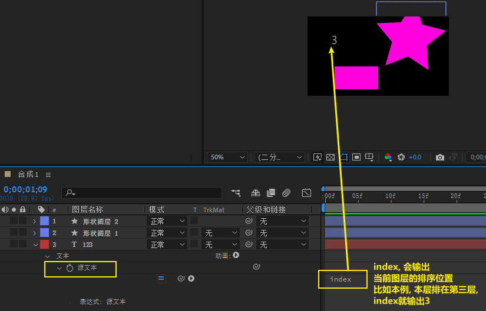
		- 在对元素的位置等属性, 修改数值时, 就可以用上 index的值了:
		  collapsed:: true
			- 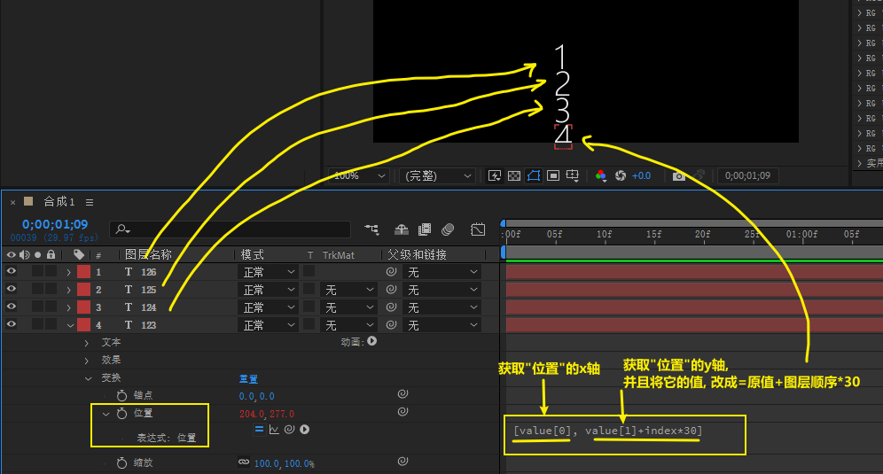
		-
	- ---
- 软件设置
	- 编辑 -> 首选项,  我们要重新设置几个参数, 如下图
	  collapsed:: true
		- 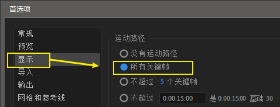
		- 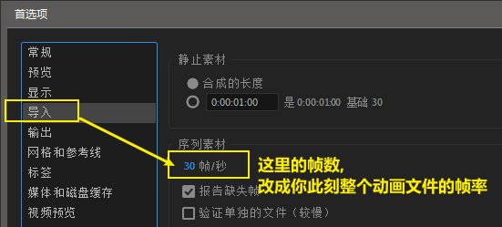
		- 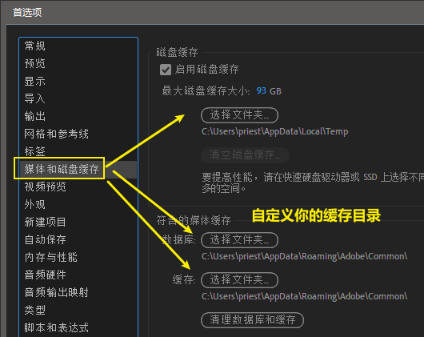
		- 
		-
	- 导出
	  collapsed:: true
		- 导出 : 要导出mp4的话, 就选择 导出 AME , 需要另外单独安装
		  collapsed:: true
			- 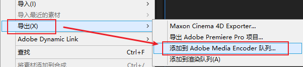
		- 导出: ae自带的导出, 推荐使用 QuickTime格式
			- 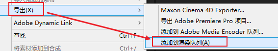
			- 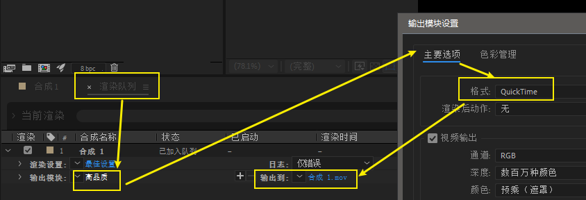
			-
			-
	- ---
- 视频本身的属性
	- 制式
	  collapsed:: true
		- 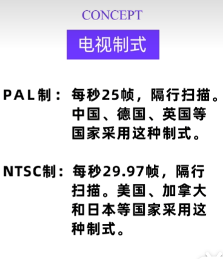{:height 317, :width 210}
		- 我们一般可以选用 pal 或 hdtv 1080p 25帧
		- 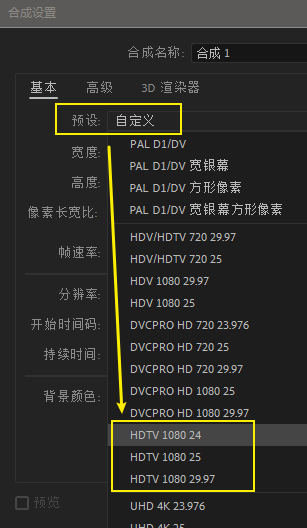
		- 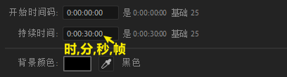
		-
		-
		-
		-
		-
	- ---
- 工具栏
	- "工具中更多子项"的切换 -> alt + 鼠标点击
	  collapsed:: true
		- 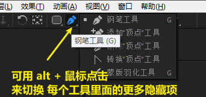
	- ---
- 播放显示
	- 全屏预览  :  按 ~ 波浪线 键
- ---
- "合成"片段的属性修改
	- 修改某已有"合成"(相当于动画片段)的帧速率, 和片段时长 -> ctrl + K
	  collapsed:: true
		- 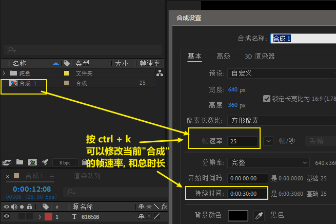
	- ---
- 素材导入导出
	- 拖入psd素材
	  collapsed:: true
		- 拖入时的设置要如下
		- 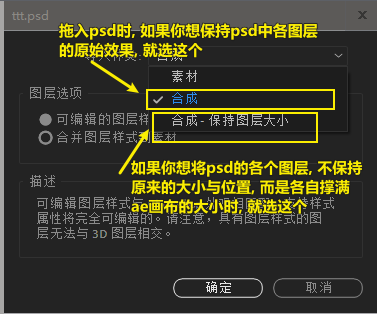
		-
		-
	- 让gif 素材, 无限循环
	  collapsed:: true
		- gif素材, 默认只会运行一次, 要让它无限循环, 就要如下设置
		- 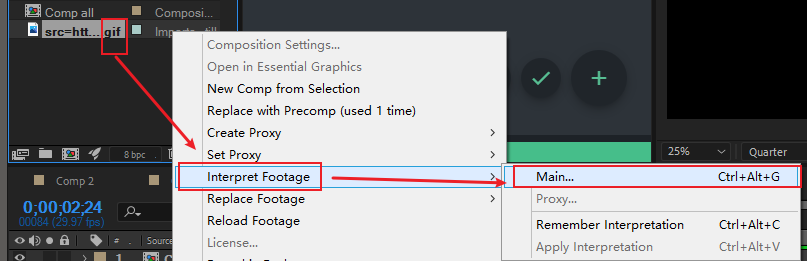
		- 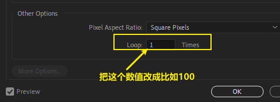
		-
	- ---
- 图层操作
	- 独显示某个图层, 其他的图层中的元素, 都暂时在画布上隐藏掉
	  collapsed:: true
		- 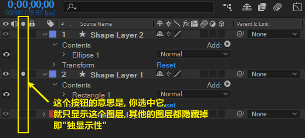
	- 隐藏图层, 不显示图层.
	  collapsed:: true
		- 注意: 此操作, 隐藏的是图层, 而不是画布中该图层的元素! 画布上的显示不受影响. 只不过图层轨道不显示而已.
		- 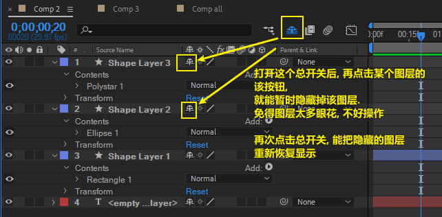
	- 裁剪每一个图层中的片段, 在轨道时间上的位置
	  collapsed:: true
		- 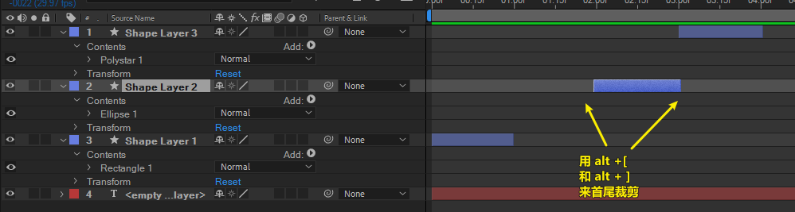
	- 裁剪时, 保持片段的入点不变(如果你片段里有动画的话, 一定要保持入点不被蒙版裁掉). -> 按 alt + 伸缩片段的头部位置
	  background-color:: #793e3e
	  collapsed:: true
		- 
	- 将ae中的图层, 排序翻转过来, 最上面的图层到最下面, 最下面的图层到最上面
	  collapsed:: true
		- 按shift + 从下往上选中所有图层, 再ctrl+c,  再ctrl+v
		- 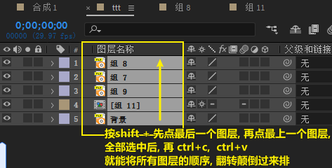
	- 复制出一个图层 -> ctrl + d
	- 将多个图层, 合并到一个"预合成"中 -> 选中多个图层, ctrl+shift+c
	- 展开所有图层的属性层 -> 按u
	  background-color:: #793e3e
	  collapsed:: true
		- 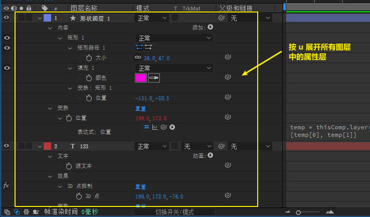
	- ---
- 蒙版
	- 蒙版
	  collapsed:: true
		- 对某图层施加蒙版效果, 必须先选中该图层, 再来画蒙版形状. 如果你不先选中某图层, 直接画形状, 只会创建一个形状图层
		- 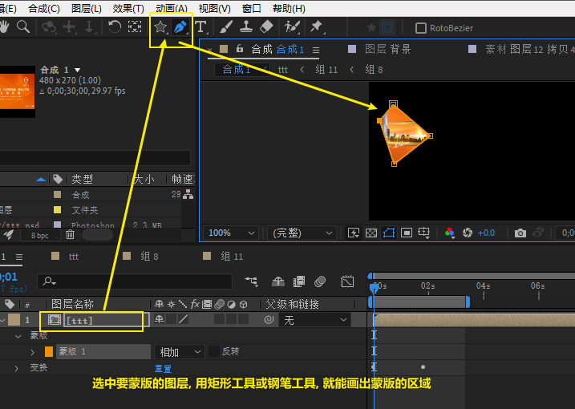
		- 但上面这种方式, 其实会将蒙版和图形一起运动了
		-
		-
	- 轨道遮罩 -> 按 f4
	  collapsed:: true
		- 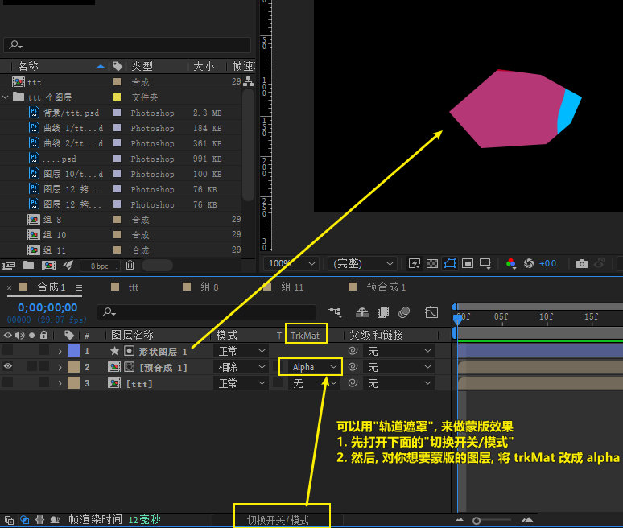
		-
	- ---
- 时间段
	- 视频素材, 只在某时间段中进行预览 -> b 和 n 确定头尾, 即循环播放预览的区间
	  collapsed:: true
		- 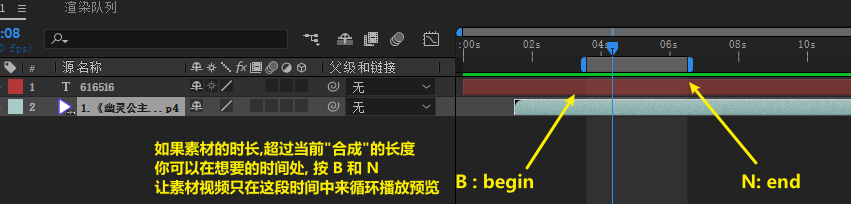
		- 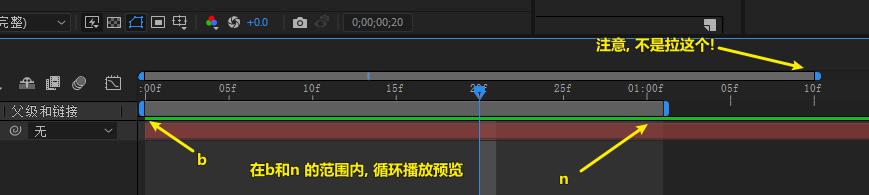
	- 切断视频素材 -> ctrl+shift+d,  或 "alt+["      和 "alt+ ]"
	  collapsed:: true
	  background-color:: #793e3e
		- 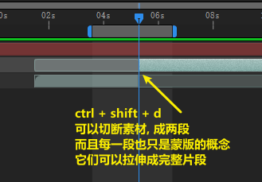
	- 整体移动片段到时间线处, "片段的开头, 即入点"对齐时间线 ->  直接按 [
	  collapsed:: true
		- 若直接按 有中括号 ],  则将片段整体移动到时间线处, "片段的末尾, 即出点"对齐时间线.
		- 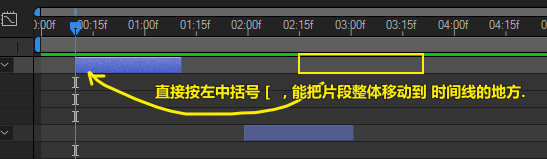
		- 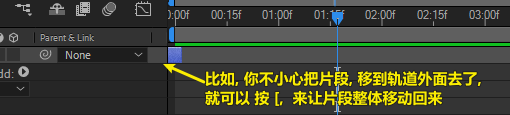
		-
	- 快速定位"入点", "出点" ->  i, o
	  collapsed:: true
		- 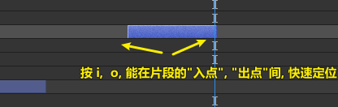
	- 查看入点, 出点时间信息, 并直接修改时间
	  background-color:: #793e3e
	  collapsed:: true
		- 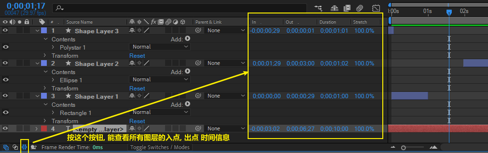
	-
	- ---
- 时间定位
	- 逐帧移动 -> page up + page down 键
	  collapsed:: true
		- 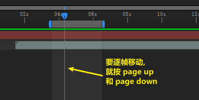
	- 关键帧
	  collapsed:: true
		- 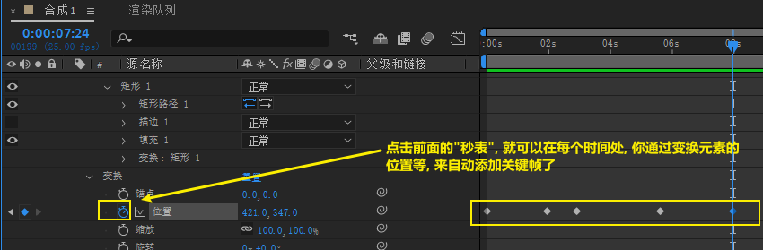
		- 下面, 可以等比例缩放所有关键帧的位置
		- 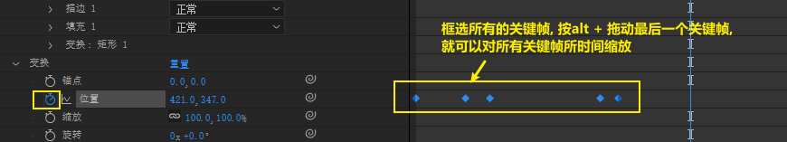
		- 选中多个关键帧后, 可以反向它们
		- 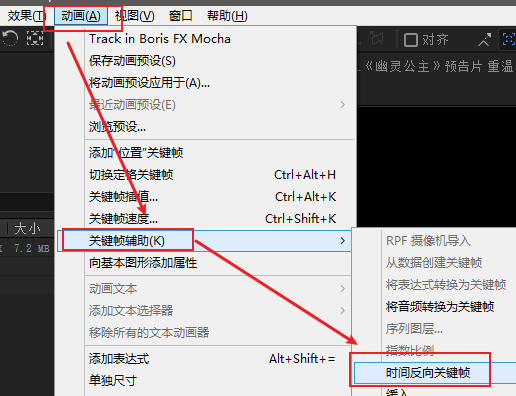
	- 在几个关键帧中定位, 切换 -> j 定位到前一个关键帧处;  k 定位到后一个关键帧处
	  collapsed:: true
		- 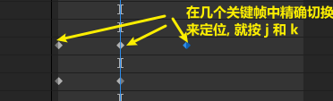
	- 让关键帧处的动画, 缓入缓出 -> 选中所有关键帧, 按 f9
	  collapsed:: true
		- 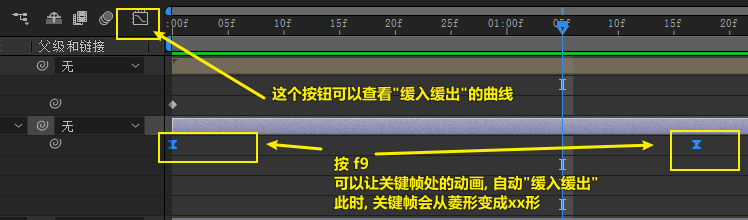
	- 让关键帧, 从"缓入缓出"效果再变回默认的 无缓冲效果. -> 全选关键帧后, 再 ctrl + 单击关键帧
	  collapsed:: true
		- 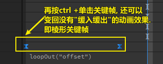
	- 在时间轴上, 设置定位标签
	  collapsed:: true
		- 首先, 你要如下设置, 才能让标签生效
		- 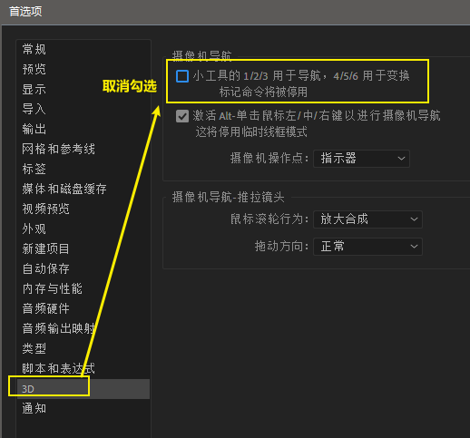
		- 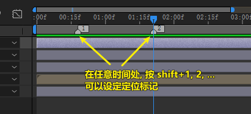
		- 然后, 你再按 1, 2, 3 ... 就能在这些标签间进行切换
		-
	- ---
- 动画
	- 位移图像
	  collapsed:: true
		- 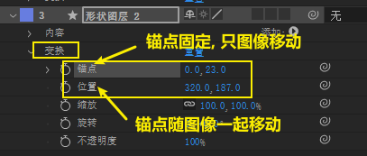
	- 位移锚点
	  collapsed:: true
		- 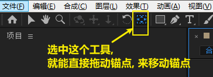
	- 旋转
	  collapsed:: true
		- 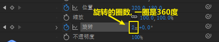
		-
	- 图层中各种属性的快捷键 -> 按u 显示全部属性
	  collapsed:: true
		- 下面的快捷键, 是指显示某个属性. 如果要复原查看所有属性, 就按u来恢复.
		- 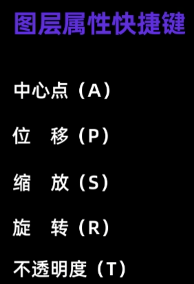{:height 157, :width 133}
	- 让某图层, 跟着另一个图层一起动画变化
	  collapsed:: true
		- 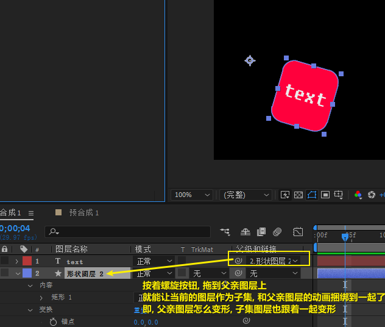
	- 插件 autofill 自动生长动画
		- 使用透明底的图就行, 不用设置关键帧, 使用了autofill 效果后,  按空格就能自动播放动画了. 当然, 你还可以设定"生长"的起始点位置
		- 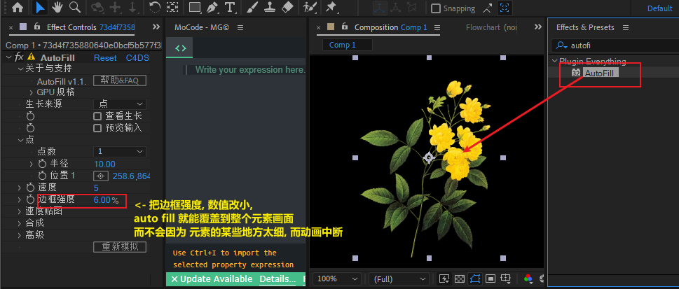
		- 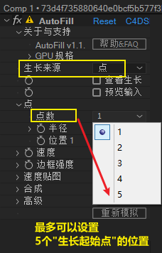
		- 如果你发现, 动画的过程中, 画面不流畅, 一闪一闪的, 就点"重新模拟"
		- 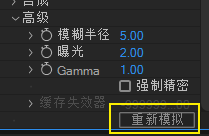
		-
	- ---
- 特效效果
	- 效果: 湍流置换
	  collapsed:: true
		- 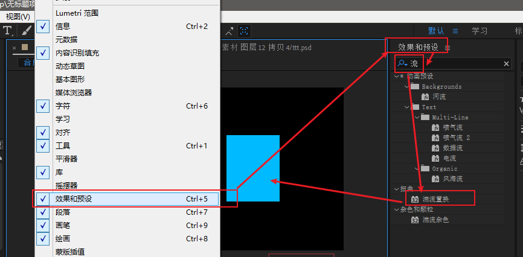
		- 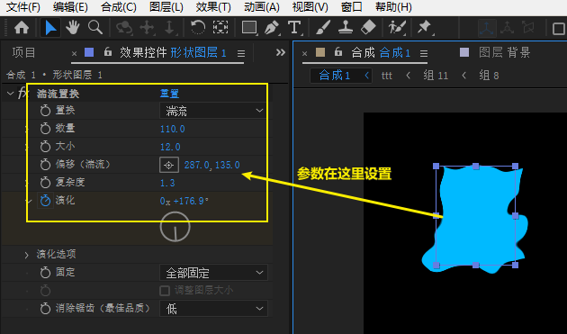
		- 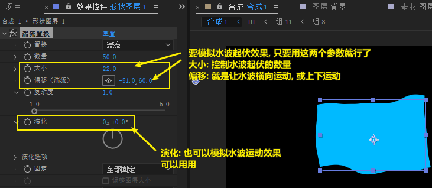
		-
		-
	- "效果"中的关键帧, 如何选中它? -> u键
	  collapsed:: true
		- 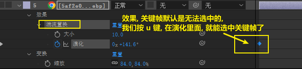
	- 运动模糊
	  collapsed:: true
		- 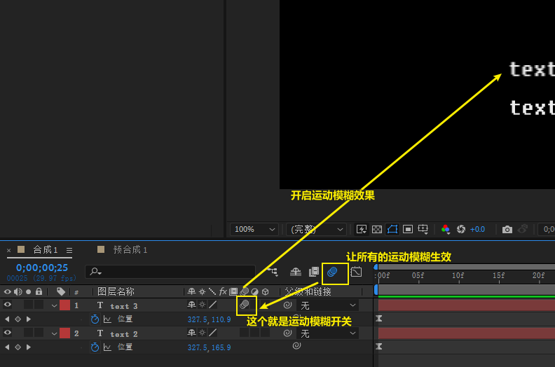
		-
	- 黑夜白天切换效果
	  collapsed:: true
		- 先画两个相同图像, 但颜色不同(即一个代表白天 ,一个代表夜晚)的画面. 然后用圆形图像作为蒙版, 蒙住最上层的图层.  让圆形图像缩放, 即可
		- 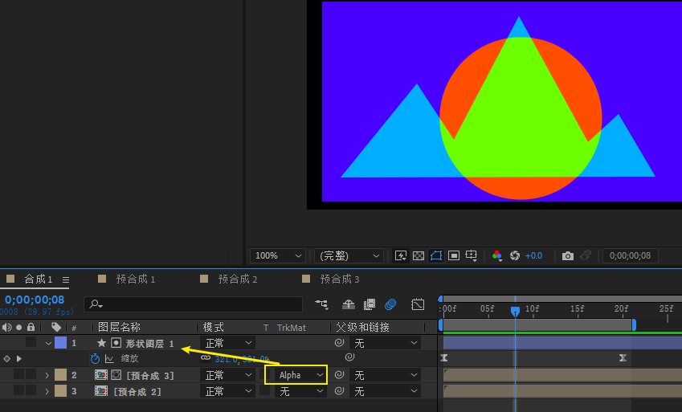
	- 3d球形
	  collapsed:: true
		- 先画个这个效果
		- 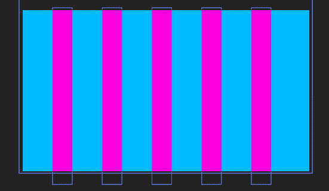{:height 102, :width 157}
		- 然后把它们预合成
		- 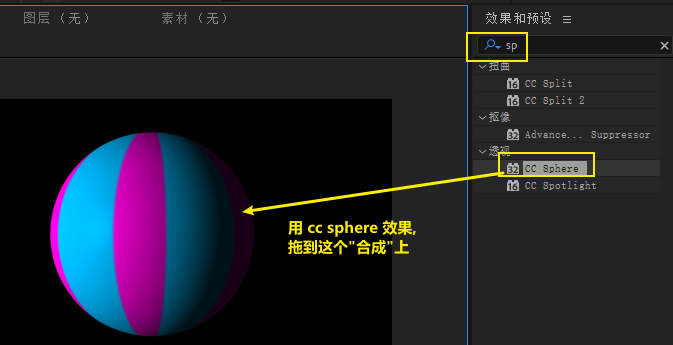
		- 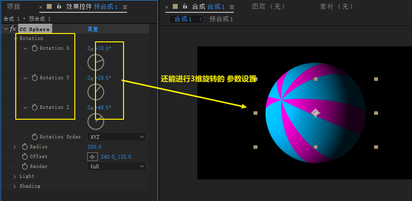
		- 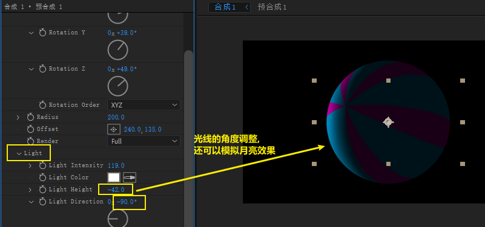
		- 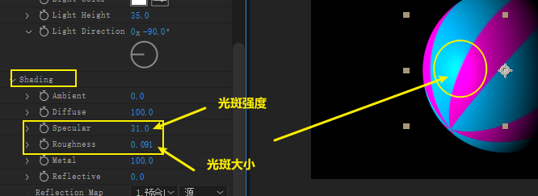
		-
		-
	- ---
- 代码编辑 -> alt + 点击秒表
	- 将一个物体的代码, 和另一个物体的代码挂钩, 即两者公用一个代码, 并且修改其中一个, 另一个也会一并修改
	  collapsed:: true
		- 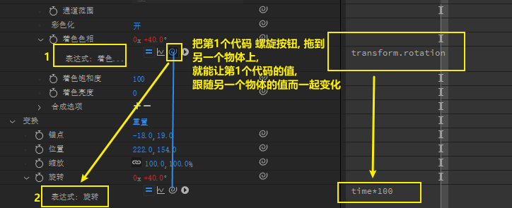
	- 文本
	  background-color:: #793e3e
	  collapsed:: true
		- 可以用代码, 控制文本内容
		- 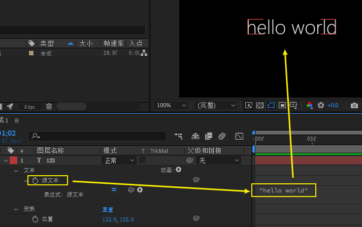
		-
	- 抖动  wiggle(freq=3, amp=1)
	  background-color:: #793e3e
	  collapsed:: true
		- 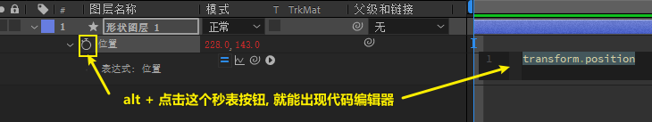
		- 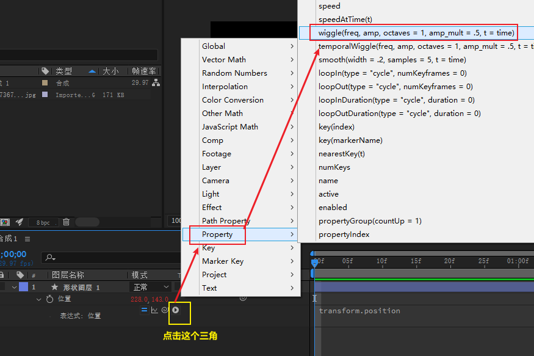
		- 这个代码 wiggle(freq, amp, octaves = 1, amp_mult = .5, t = time)
		- wiggle()函数就是抖动效果. freq是频次,  amp 是振动幅度, 即每秒震动多少次
		- 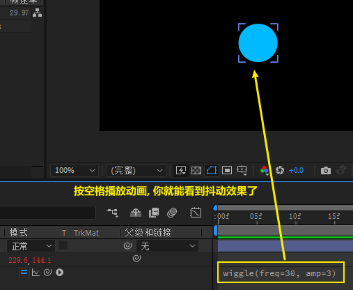
		- 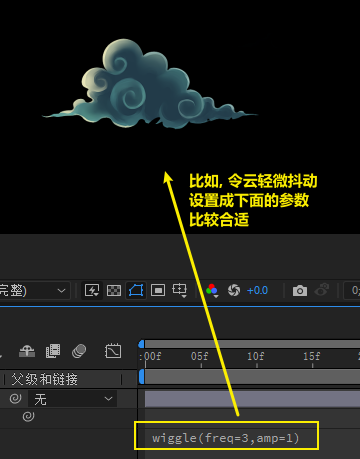
	- 循环往复,  loopOut("cycle"),   loopOut("pingpong")
	  background-color:: #793e3e
	  collapsed:: true
		- cycle参数, 就是把你设定的关键帧动画(本例中就是你的三个关键帧), 不停地自动循环下去
		- 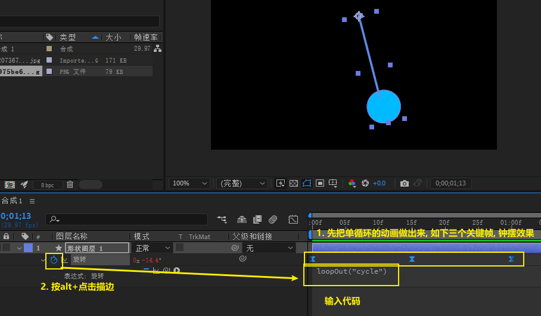
		- 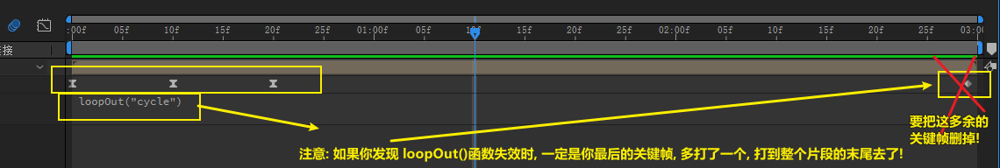
		- 事实上:  省力一点, 你还可以用这个代码: loopOut("pingpong")
		- 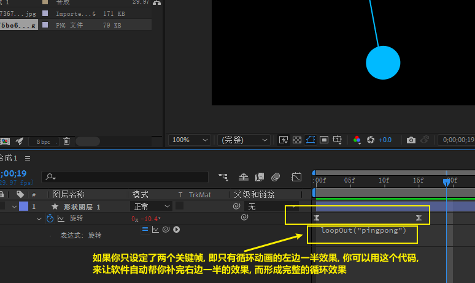
		- loopOut("cycle", 0) ← 第二个参数, 是帧范围. 默认是0, 表示覆盖"所有帧", 即在到达最后一帧后, 就直接返回第一帧继续重复执行.
		  collapsed:: true
			- {:height 155, :width 144}
		- loopOut(type = "pingpong", numKey s = 0) ← 即先走完关键帧后, 再倒放一遍，也就是以逆时针的方向再运动到其初始状态的位置。
		  collapsed:: true
			- 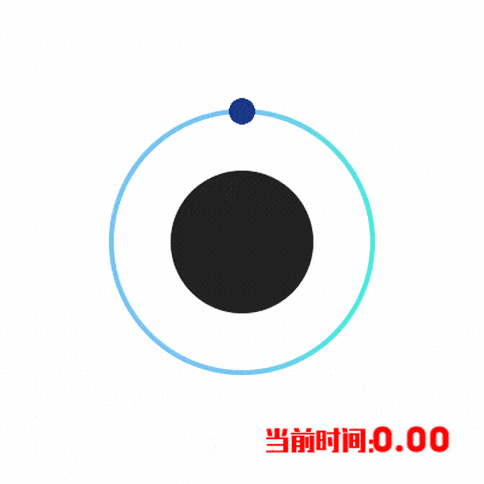{:height 186, :width 158}
			-
		-
	- 旋转 -> time*度数
	  collapsed:: true
		- 
		- 即使不用关键帧, 代码也能生效
		  collapsed:: true
			- 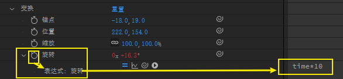
	- 霓虹灯色相圆环旋转
	  collapsed:: true
		- 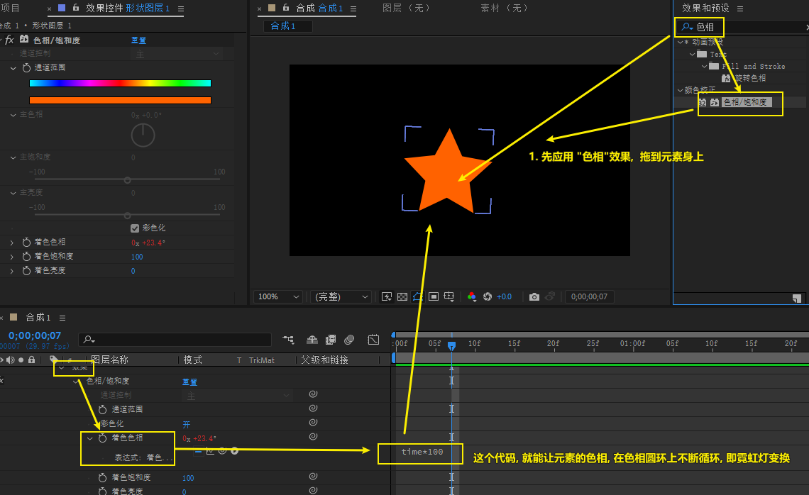
		- time*100   ← 让色彩沿着"色相环"上旋转
		  wiggle(50,100) ← 让颜色在色相环上跳跃, 更有变化, 而不是死板的按数值顺序旋转
		- 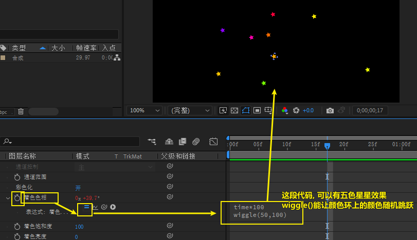
	- 随机 random([维度1, 维度2, 维度3])  ← 如果有多个维度参数, 就需要放在一个列表list中.  这种多维参数, 即"阵列参数".   如, 位置, 轴向, 颜色等, 都是阵列(即列表 list)  ← 注意:  此时, 频率是每一帧都会随机变化, 而不是每一秒变化一次.
	  collapsed:: true
		- 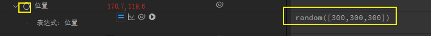
		- 也可以如下写, 直接写在一个list中.  这个代码, 是让x轴在0-100像素范围中随机变化; y轴在0-200像素范围中随机变化.    但, 这种写法, 会让随机效果在每一帧中都进行随机, 速度太快了
			- 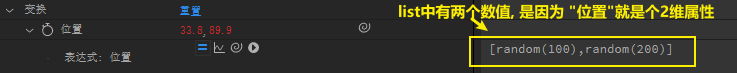
		- 我们可以让随机数, 有个范围, 而不是从0开始. 如下,  x轴在100-200像素区间上随机,  y轴在200-300像素区间上随机
			- 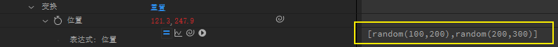
		- 获取画布的长宽, 在这个范围内随机 
		  background-color:: #793e3e
		  -> random([thisComp.width, thisComp.height])
			- 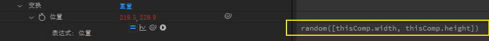
			-
	- 随机, 每一秒, 只变化一次 -> posterizeTime(1);   ← 参数1, 就是指定1秒只变化1次.  <- posterizeTime () 降帧，后面输入的是帧率.
	  background-color:: #793e3e
	  collapsed:: true
		- 若写成 posterizeTime(3); 就是每秒走3帧
		- 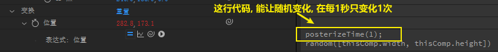
		-
	-
	- ---
- 色调
	- 曲线
	  collapsed:: true
		- 在效果里面, 搜"曲线"
		- 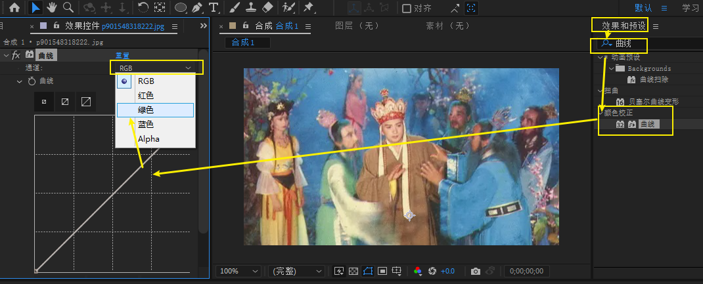
		-
-
- https://www.bilibili.com/video/BV1ZA411g7Sb?p=10&vd_source=52c6cb2c1143f8e222795afbab2ab1b5
- 4.24