- https://www.bilibili.com/video/BV17y4y1J71q?spm_id_from=333.999.0.0
- 创建fusion片段
  collapsed:: true
	- 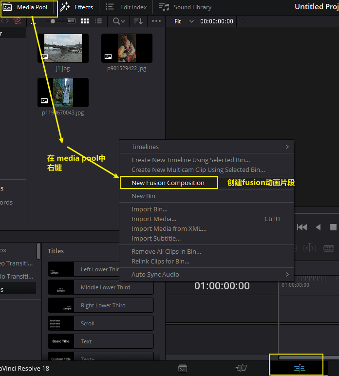
	- 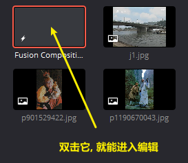
	- 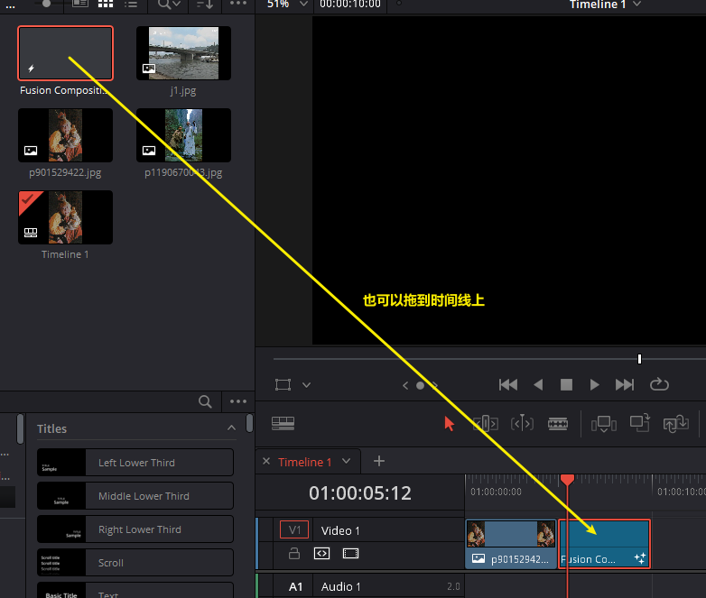
	- 但注意: 你媒体池中的fusion片段, 和你拖到时间线上的fusion片段, 会被分成两个独立的片段, 彼此的编辑, 互不影响对方.
- 节点
	- 节点类型
	  collapsed:: true
		- 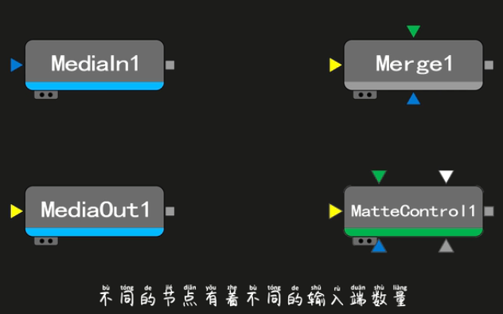
		- 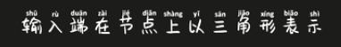
		- 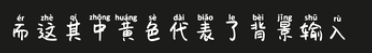
		- 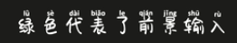
		- 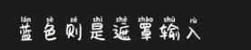
		- 每个节点的输入端, 只能连接一个输入
		- 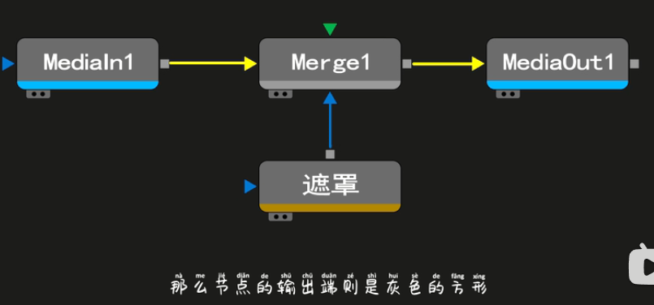
		- 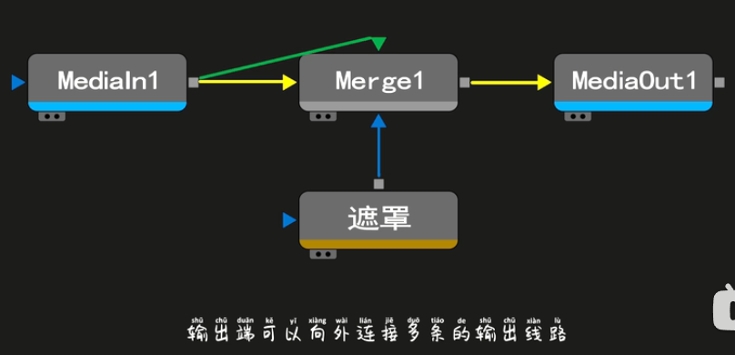
	- 重命名节点 F2
	  collapsed:: true
		- 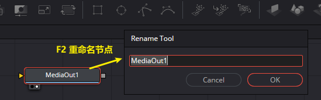
		- 节点命名, 不能以数字为开头
	- 在监视器中显示
	  collapsed:: true
		- 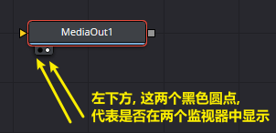
		- 选中节点, 按数字键1或2, 来将它显示到对应的监视器上.
- 节点的逻辑
  collapsed:: true
	- 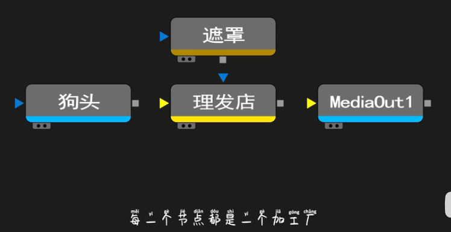
	- 原素材, 通过输入端, 进入到节点中, 来进行加工.
	- 加工好的内容, 通过输出端, 传给下一个加工厂, 进行下一步加工.
	- 最后的成品, 交给meidaout
	- 而mask遮罩, 就是告诉这个加工厂, 你只需要加工哪个部分(区域)
	-
	-
	-
- 案例1:
  collapsed:: true
	- 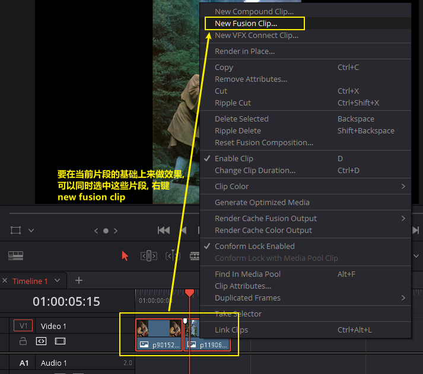
	- 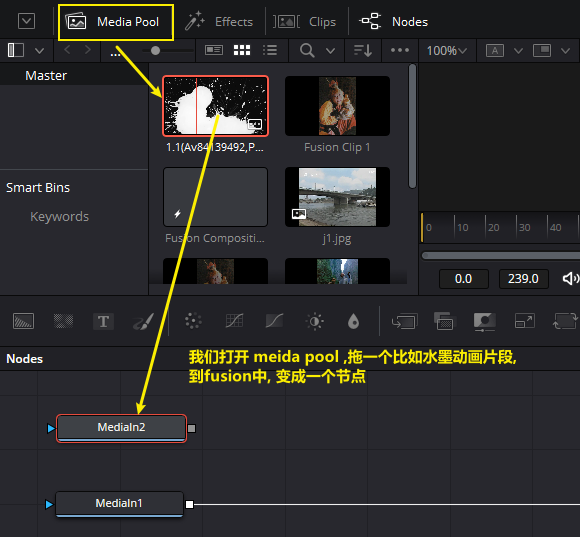
	- 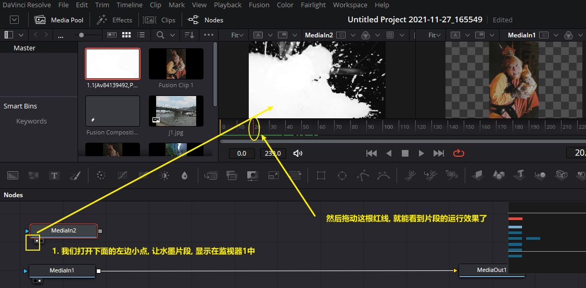
	- 我们还要看这个水墨片段, 是否包含alpha通道, 如下
	- 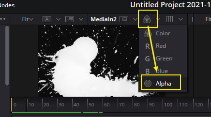
	- 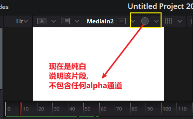
	- 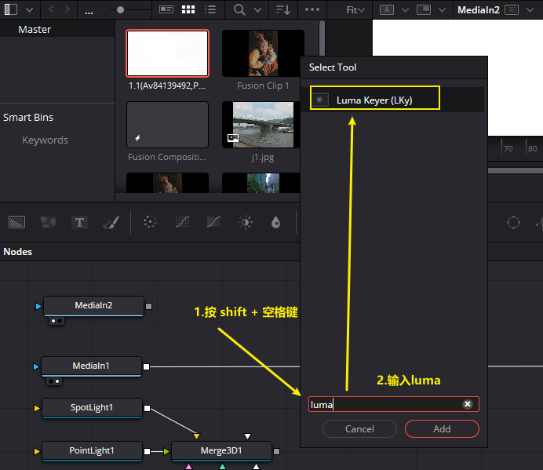
	- 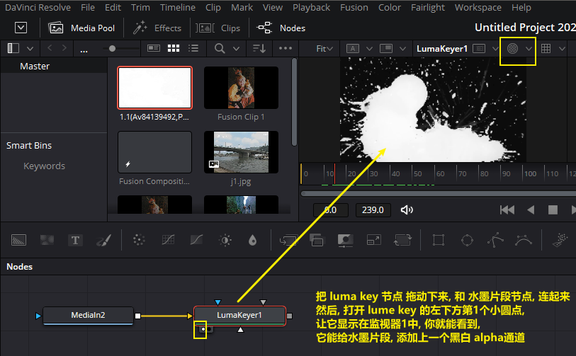
	- luma keyer, 就是一个"亮度抠像节点"
	- 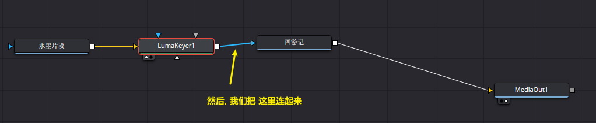
- 案例2
  collapsed:: true
	- 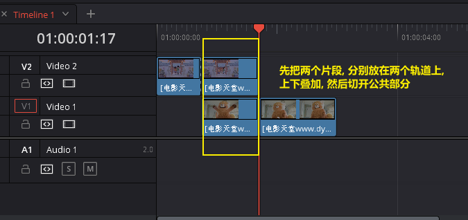
	- 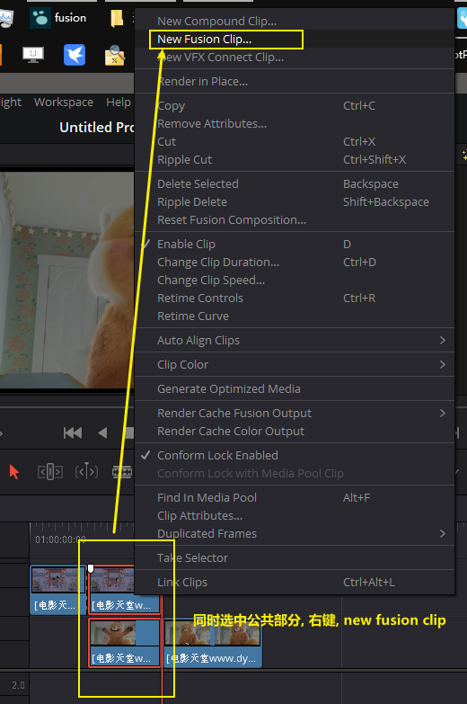
	- 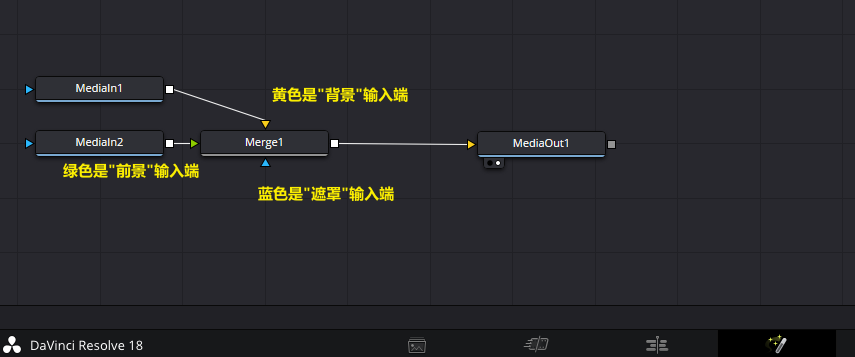
	- 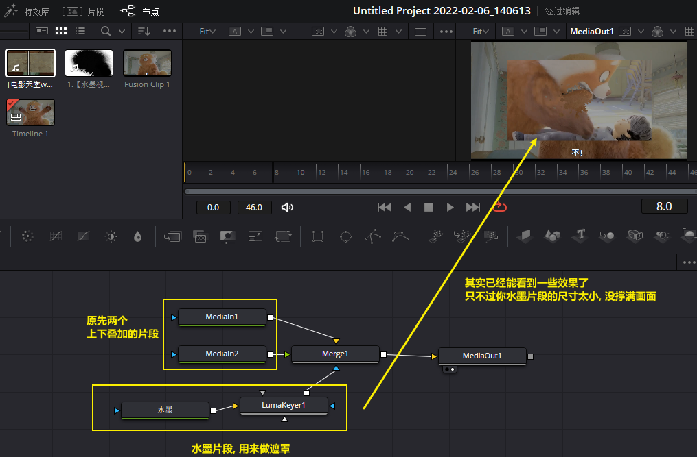
	-
	-
	-
-
-