-
-
- 转场
	- 缩放定位
	  collapsed:: true
		- 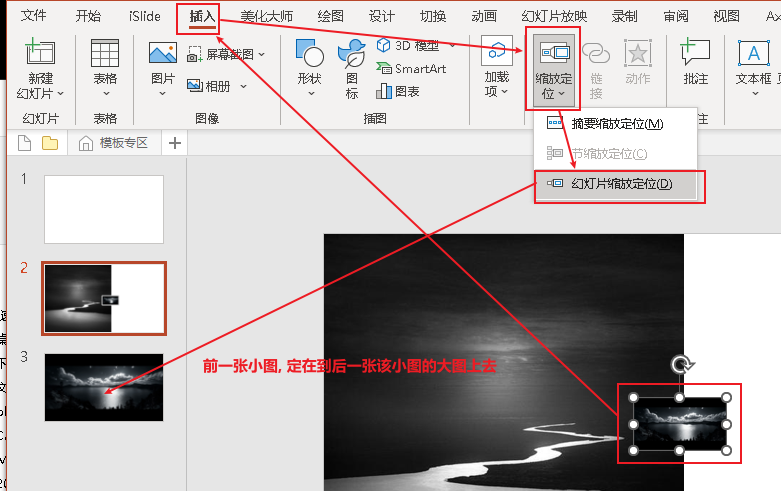
		-
	- 平滑切换 : 可以利用这个功能, 做位移时"近大远小"的视差动画
		- 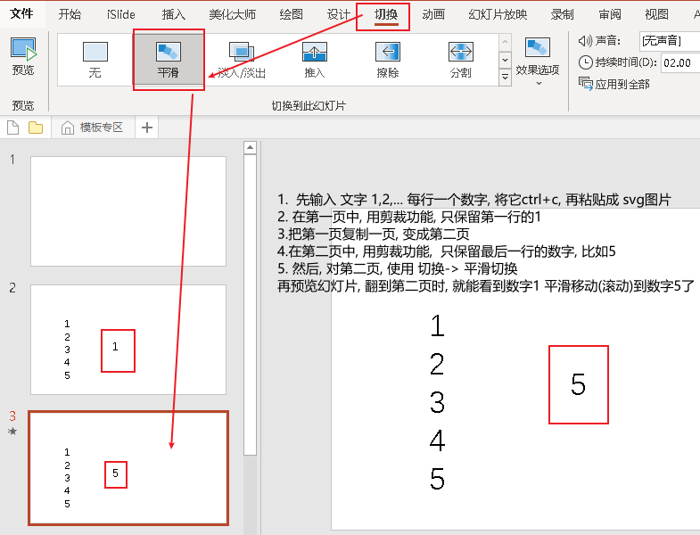
		- 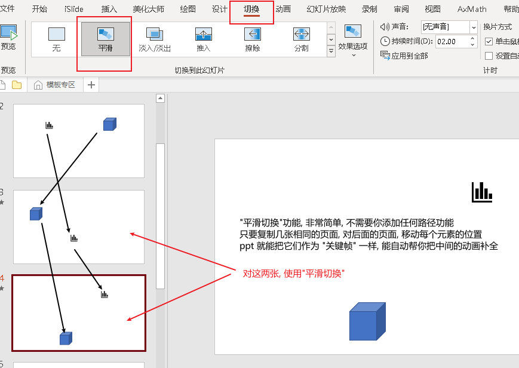
		- 色块与线条的动画变换, 依然很酷
		  collapsed:: true
			- 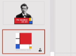
		- 模拟开关
		  collapsed:: true
			- 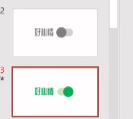
		- 指示动画
		  collapsed:: true
			- 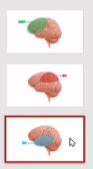
		- 转动的效果
		  collapsed:: true
			- 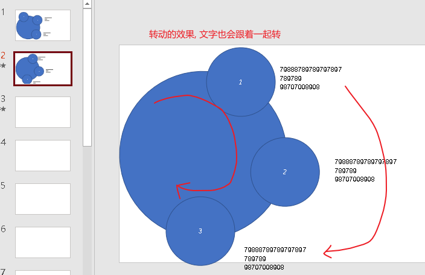
		- 推入文字
		  collapsed:: true
			- 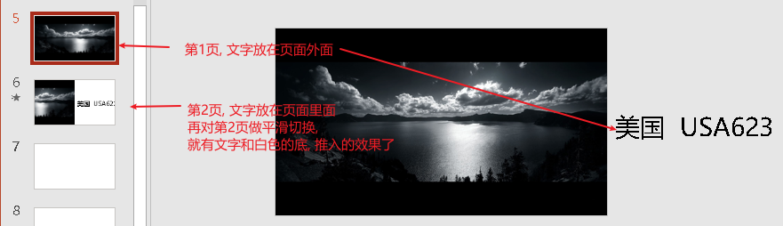
		- 对文字, 做动画
		  collapsed:: true
			- 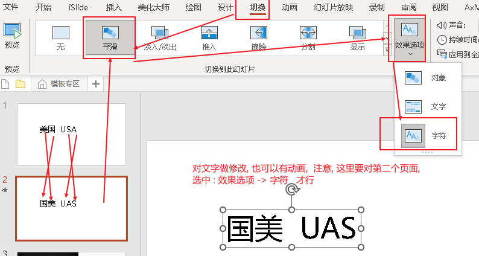
			- 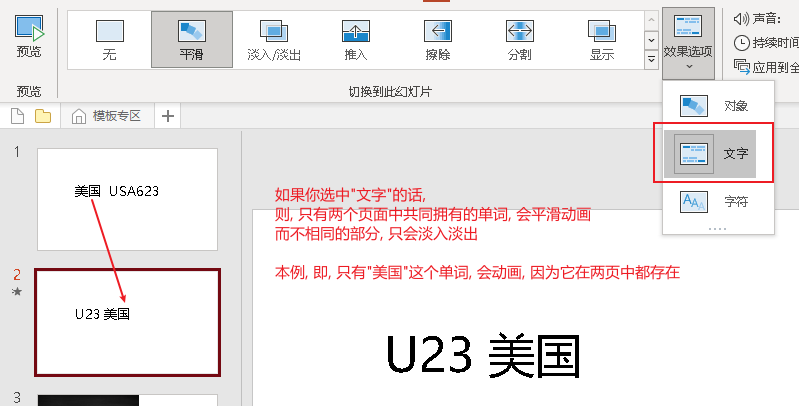
		- 展开标题, 出现具体文字内容
		  collapsed:: true
			- 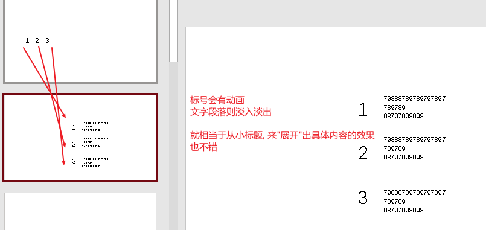
	- 强制两个图形做"平滑切换"
	  collapsed:: true
		- 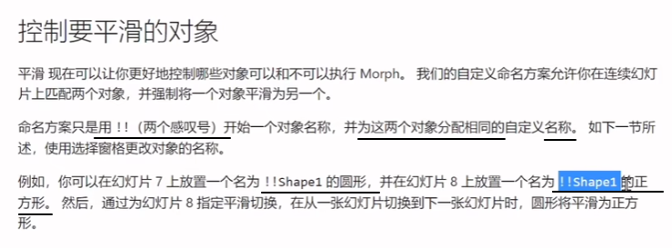
		- 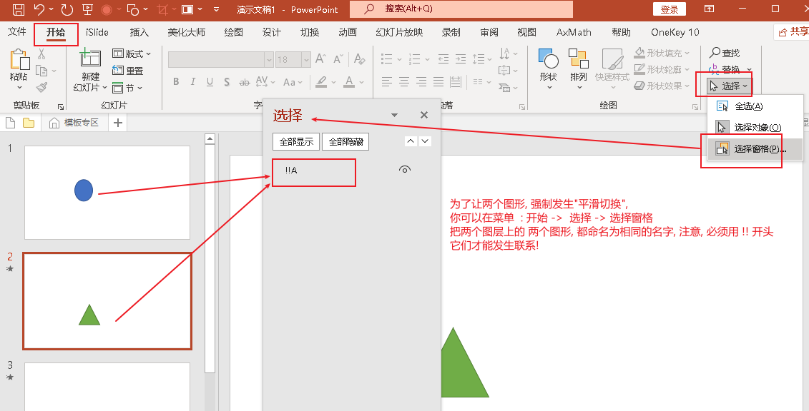
		-
-
-