-
- 调色
	- ★ 改成任何颜色
	  background-color:: #793e3e
	  collapsed:: true
		- 先添加色相图层,  选中"着色"
		- 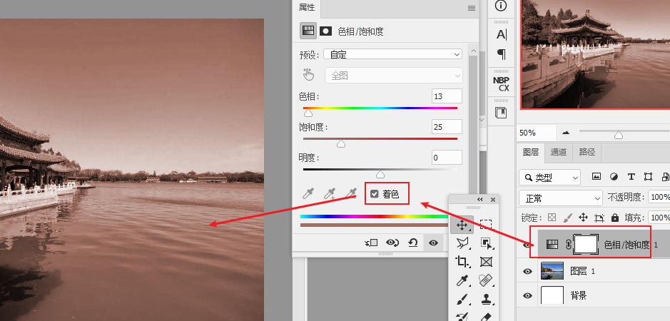
		- 再对"色相"层,  ctrl + i  反向
		- 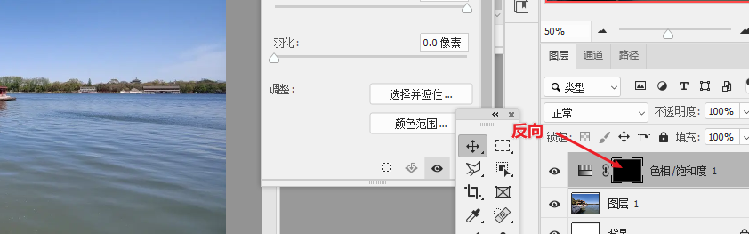
		- 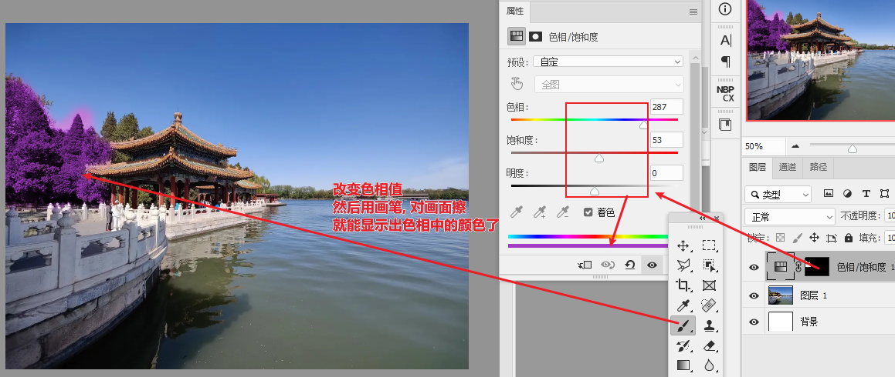
		- 可以添加多个"色相"层, 重复之前的操作
		- 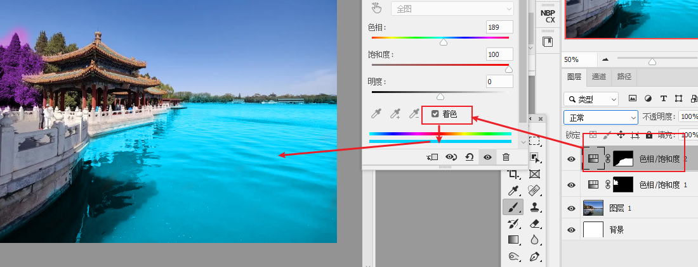
		-
		-
	- 单色调
	  background-color:: #793e3e
	  collapsed:: true
		- 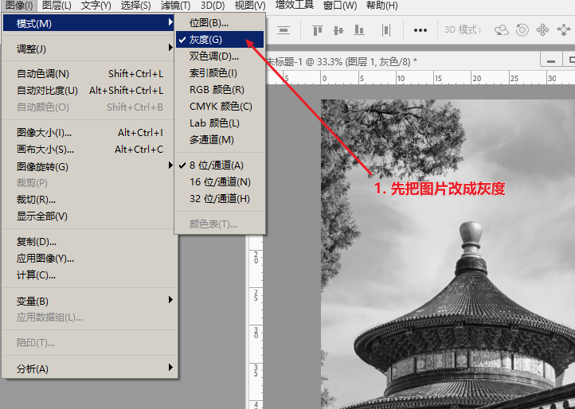
		- 2. 再添加一个"双色调"
			- 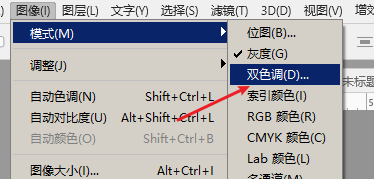
			- 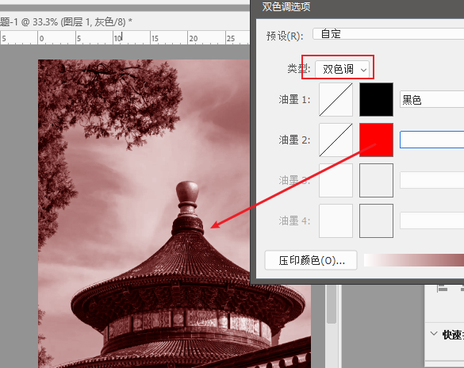
			- 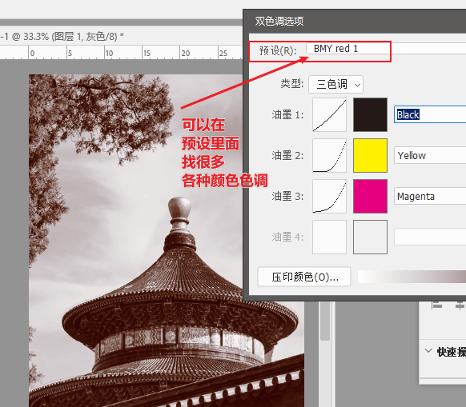
			- 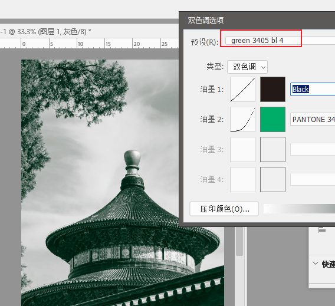
			- 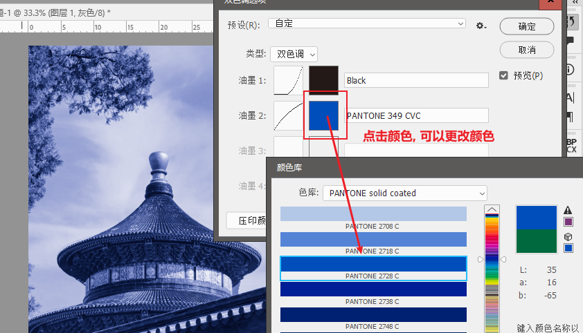
			-
		-
	- 单色调 方法2
	  collapsed:: true
		- 图层样式的"渐变叠加", 也能有另一种单色调, 但不如上面的单色调方法纯粹
		- 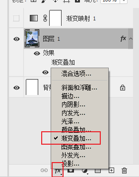
		- 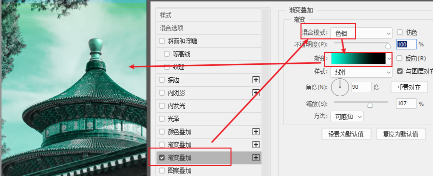
		-
	- 单色调 方法3
	  collapsed:: true
		- 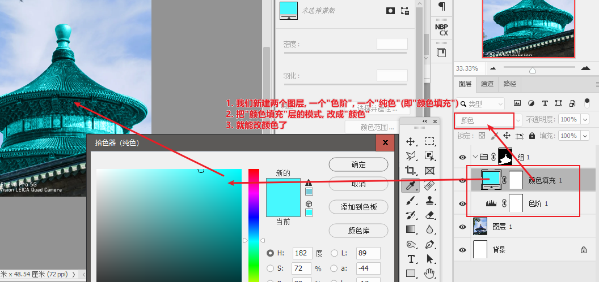
		- 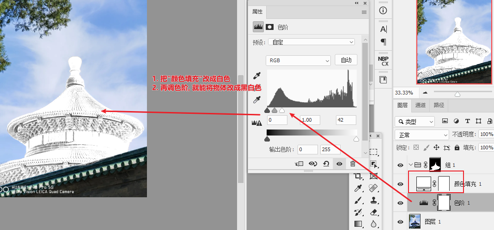
	- 双色调 : 添加 "渐变映射"层即可
	  background-color:: #793e3e
	  collapsed:: true
		- 
		- 你可以给多个图层, 同时应用一个渐变映射
			- 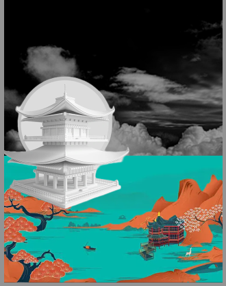
			- 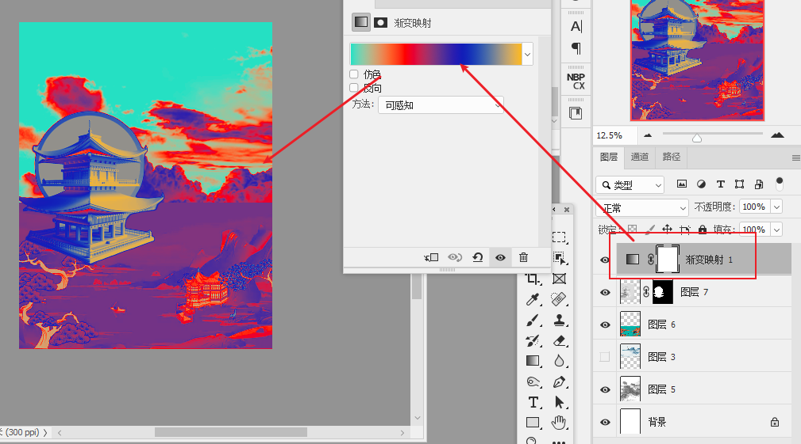
			-
	- 让两张图色调统一
		- 用人工智能中的 "色彩转换"
		  collapsed:: true
			- 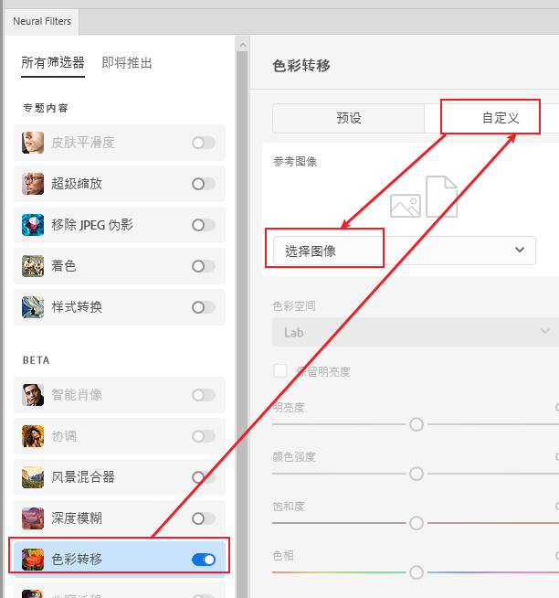
	- 色彩: 色相H, 饱和度S, 明度B
	  collapsed:: true
		- 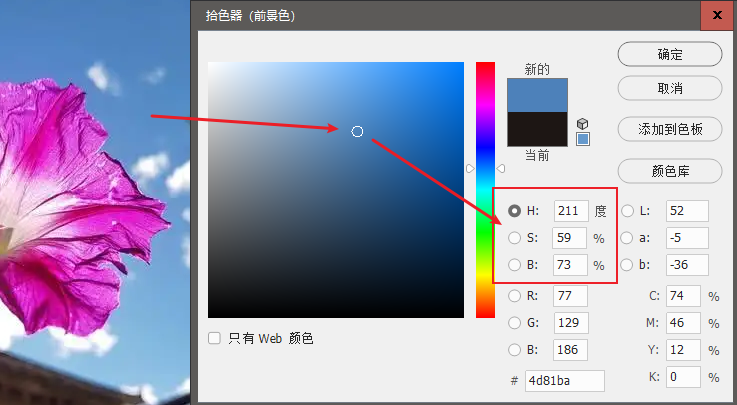
		- 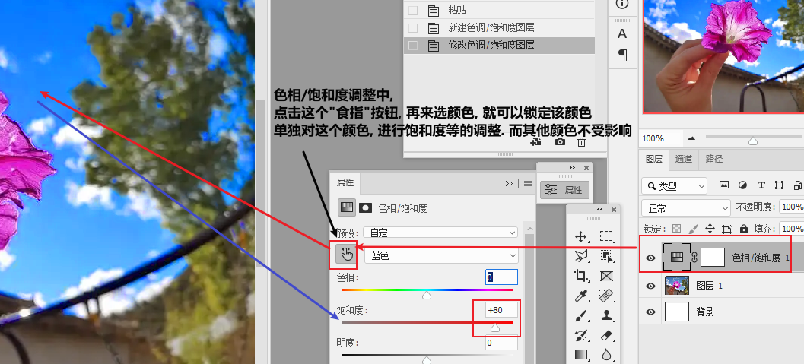
		-
	- [[让蓝天通透]]
	-
		-
-