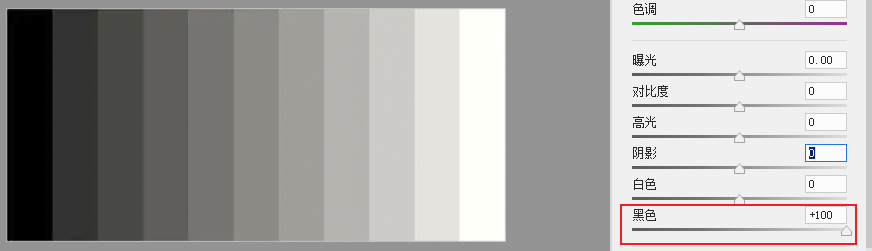
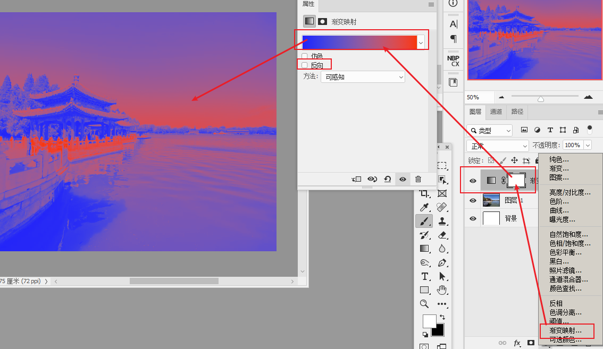

- 三级调色步骤
	- 
- 先调明暗, 再调色彩
	- 明暗调整:
	  collapsed:: true
		- 用camera raw :  白(高<-->白);  黑(黑<-->阴)
		  background-color:: #793e3e
		- 压暗亮部的时候,  高光的作用 > 白色
			- 
			- 
			  id:: 6321bbd7-bcbc-49de-b78c-18cf9421a452
		- 提亮亮部 : 白色的作用 > 高光
			- 
			- 
		- 压暗暗部: 黑色的作用 > 阴影
			- 
			- 
		- 提亮暗部: 阴影的作用 > 黑色
			- 
			- 
		-
- 先调整体, 再调局部
- 色调大统一中(颜色只保持在2-3种即可. 颜色太多就会杂乱), 寻求小对比 -> "相机校准" & "分离色调" 的区别
  collapsed:: true
	- 因为"校准"能让所有带有某一颜色的色彩, 整体做调整 (比如你想调整黄色, 而肤色里面是带有黄色的, 于是你在调整其他的黄色时, 会连肤色也一起被调整了). 所以, **你想要实现"色调大统一"时, 就用"校准"来调.**
	- 而你想在大统一的色调中, **实现"寻求小对比", 就要用"分离色调"来调.**
	-
	-  
	-
- 颜色直方图
	- 
-
- 调色
	- ★ 改成任何颜色
	  background-color:: #793e3e
	  collapsed:: true
		- 先添加色相图层,  选中"着色"
		- 
		- 再对"色相"层,  ctrl + i  反向
		- 
		- 
		- 可以添加多个"色相"层, 重复之前的操作
		- 
		-
		-
	- 单色调
	  background-color:: #793e3e
	  collapsed:: true
		- 
		- 2. 再添加一个"双色调"
			- 
			- 
			- 
			- 
			- 
			-
		-
	- 单色调 方法2
	  collapsed:: true
		- 图层样式的"渐变叠加", 也能有另一种单色调, 但不如上面的单色调方法纯粹
		- 
		- 
		-
	- 单色调 方法3
	  collapsed:: true
		- 
		- 
	- 双色调 : 添加 "渐变映射"层即可
	  background-color:: #793e3e
	  collapsed:: true
		- 
		- 你可以给多个图层, 同时应用一个渐变映射
			- 
			- 
			-
	- 让两张图色调统一
		- 用人工智能中的 "色彩转换"
		  collapsed:: true
			- 
	- 色彩: 色相H, 饱和度S, 明度B
	  collapsed:: true
		- 
		- 
		-
	- [[让蓝天通透]]
	-
		-
-