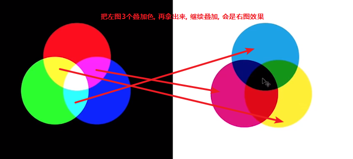
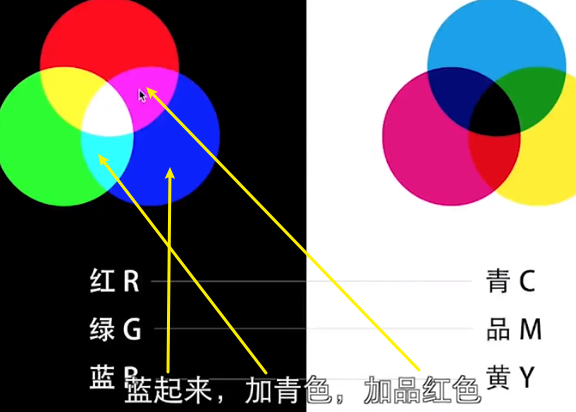

-
- **蓝天灰蒙蒙的, 原因是颜色里面有"黄色"介入.** 从CMYK可以看出, Y有数值. 
  而干净的天空色值, 是没有黄色的!
  所以, 如果想让天空干净清澈, 必须把黄色去掉.
- 有这个规律! :
  collapsed:: true
  在rgb里面, 蕴含着青品黄; 
  在青品黄里面, 又反过来隐含着rgb
	- 
	- {:height 333, :width 560}
	- 
	- 
	-
- 红色有两个支持色: 黄色和品红
  collapsed:: true
  红色的互补色, 是青色(下图中的淡蓝色)
	- 
	- 这个原理意味着什么? 即, 假如我们想晚霞的颜色更红, 我们只要在颜色里加黄色和品红就行了, 并减少青色
	  同理,  我们想蓝天更蓝, 只要增强青色和品红色,  并减少黄色.
	  同理, 我们想草地更绿, 只要增强绿色的支持色 黄色和青色, 并减少它的对立色品红即可.
	- 
	- 这种滑块, 即色温 / 色调 面板
	- 
	- **黄色和蓝色是互补色, 它们叠加在一起就会产生干扰, 因此导致天空灰蒙蒙的, 不通透**
	  如下, 把黄色透明度降到50%, 颜色中同时存在蓝黄, 就会是灰色效果, 即灰蒙蒙的天空色, 雾霾色. 
	  这种脏脏的灰色, 只有在"补色"重叠的情况下, 才会出现.
	  因此, 让蓝天还原更蓝的方法, 就是减去蓝色的互补色--黄色.
	- 
	-
	-
	-
- ---
- 案例1
	- 用"色调曲线"来调整
	  collapsed:: true
		- 
		- 
		- 
		- 
		- 
		- 
		- 为了让草地上的黄色更明显, 我们要减蓝, 加黄
		- 
			- 
	- 进一步, 我们可以单独把某些局部更突显, 比如, 让中间的山坡更亮,  用径向滤镜拉出选取, 将羽化设成向内, 再拉高曝光值即可.
	  collapsed:: true
		- 
		- 
		-
- ---
- 案例2
	- 下面这张照片, 蓝天和草地的黄, 你似乎不能两者兼得, 要让天更蓝, 就会影响草地的黄; 反制, 要让草地更黄些, 蓝天会雾霾化, 那怎么办呢?
	- 打开"可选颜色"
		- 
		- {:height 175, :width 247}
		- 
		- 下面处理草地, 我们选黄色来处理, 比如, **要让草地更绿, 绿色的支持色是黄色和青色, 只要增强黄色和青色即可, 并减少品红色**
		- 
		-
-