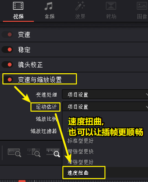
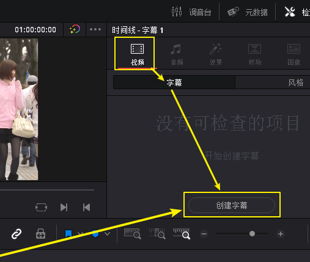
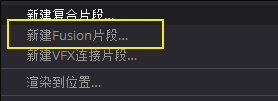
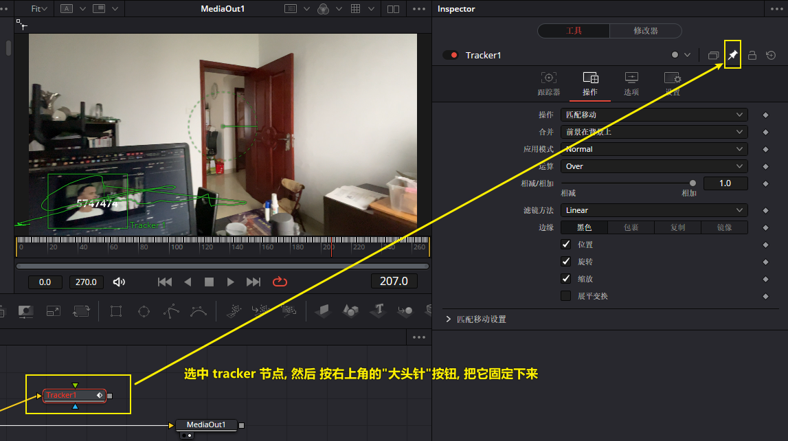
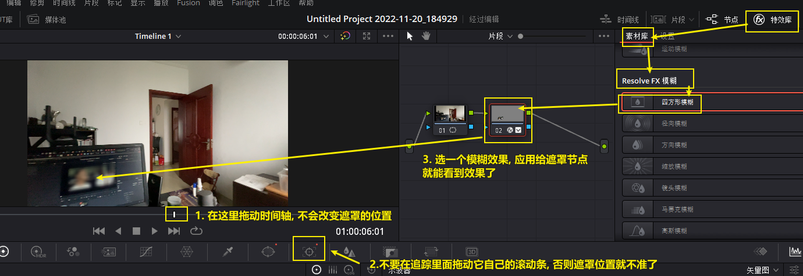
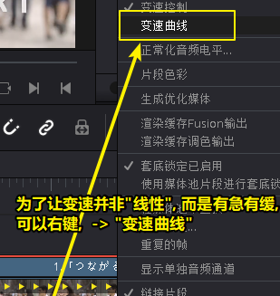
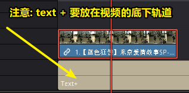
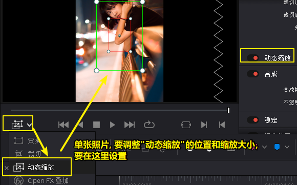
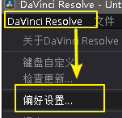
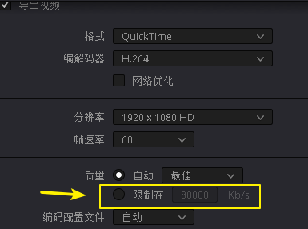

-
- [[fusion]]
-
- ### 项目初始设置
	- 自动备份
	  collapsed:: true
		- 在"偏好设置-> 用户-> 项目保存和加载" 中, 可以打开自动备份, 以免软件崩溃文件丢失
			- 
	- 缓存文件的位置
	  background-color:: pink
	  collapsed:: true
		- 
		- "代理媒体"的分辨率, 位置设置, 和"缓存"位置设置
		- 
		-
	- 解码质量设置
	  collapsed:: true
		- 
	- RAW
	  collapsed:: true
		- RAW只是保存传感器接收到的最原始的光的数据,  需要经过转化, 才能变成 log 画面. 所以RAW会比Log具有更大的可调性.
			- 
			-
		-
	- 图片导入视频后, 有锯齿
	  collapsed:: true
		- 
		- 在高级设置中
		- 
		- 
	- 重新恢复默认界面
	  background-color:: pink
	  collapsed:: true
		- 
	- 达芬奇一旦导入素材, 就无法修改项目的帧率, 所以, 在导入前,  就需要在 文件 -> 项目设置 -> 主设置 中, 设置好项目帧率.  之后再导入素材!
	- 历史记录
	  collapsed:: true
		- 
		-
- ---
- ### 最常用功能
	- iphone 4k 视频导入问题
	  collapsed:: true
		- 遇到iphone 4k 载入视频是离线媒体的问题, 要安装HEVC解码器
		- 可以从第三方安装HEVC解码器。例如从“free-codecs”网站。
		- HEVC解码器：[https://www.free-codecs.com/download/hevc_video_extension.htm](https://link.zhihu.com/?target=https%3A//www.free-codecs.com/download/hevc_video_extension.htm)
		- 这是一个专门提供各种多媒体工具的网站，我们可以从中免费下载到HEVC解码器。选择对应的版本，安装即可，效果和从Win10商店下载的HEVC解码器是一致的。
	- 场景剪切探测
	  collapsed:: true
		- 
		- 
		- 在左下方, 点击 "自动探测", 之后可以点中间的"添加"(即手动添加)
		- 
		-
	- 视频尺寸, 由横幅转成竖幅
	  background-color:: pink
	  collapsed:: true
		- 文件 -> 项目设置 -> 主设置 -> 选中 use vertical resolution
		  collapsed:: true
			- 
		- 默认会变成这种样子:
		  collapsed:: true
			- {:height 171, :width 169}
		- 所以还需要做这个设置:
		  collapsed:: true
			- 
			- 或第二个也行, 它会自动缩放画面顶天立地, 左右则扩到画幅外面出去
				- 
				- 效果:
				- 
				-
			-
		-
	- 将尺寸不一素材的画面, 自动充满屏幕
	  collapsed:: true
		- 选中视频, 然后
		- 
	- 事后调整项目帧率
	  background-color:: pink
	  collapsed:: true
		- 比如你的视频是60帧, 结果你项目是用30帧做的, 事后才发现, 但已经没法改项目的帧率了.
		- 现在有一个补救性的办法:
		- 
		- 可以单独设置某个新建时间线的帧率
		- 
		- 
		- 
		- 
		-
	- 上下加黑边
	  background-color:: blue
	  collapsed:: true
		- {:height 326, :width 716}
	- 自动插帧, 让视频更平滑
	  background-color:: pink
	  collapsed:: true
		- 对单个片段独立进行插帧
		  collapsed:: true
			- 
			- 
		- 自动对所有素材, 进行插帧
		  collapsed:: true
			- 
			- 三个参数,就是在改变素材速率时, 帧不够时, 如何"插帧"的算法:
			  collapsed:: true
				- 最近: 容易产生跳帧, 卡顿(一帧放了两遍)的情况
				- 帧混合  :
				  就是借助前后的帧, 来自动生成一个模糊的中间的帧
				- 光流算法: 也是自动算出中间的帧, 其缺点是容易算不出来.
	- 稳定器
	  collapsed:: true
		- 
		- 
		- 
	- 静帧
	  collapsed:: true
		- 截图, 抓取静帧
		  collapsed:: true
			- 
			- 
			- 
		- 将视频中的某段变成静帧
		  collapsed:: true
			- 
		- 静帧调色
		  collapsed:: true
			- 
			- 
			- 
			- 
			-
	-
	- 时间线
	  collapsed:: true
		- 备份你的某个版本的时间线
		  background-color:: blue
		  collapsed:: true
			- 
			- 
			- 
			- 
			- 
	- 入点i,出点o
	  collapsed:: true
		- 删除入点出点, 按  alt + i, alt + o
		- 将入点出点间的片段, 另存为素材
		  background-color:: blue
		  collapsed:: true
			- 
-
- ---
- ### 字幕
	- 字幕类型的轨道
	  collapsed:: true
		- 
		- 
		-
	- 给字幕加黑色底框
	  background-color:: blue
	  collapsed:: true
		- 
		- 
		-
	- "字幕轨道", 分开单独调整每个字幕的属性
	  collapsed:: true
		- 默认状态下, 字幕轨道上的每个字幕, 有统一的位置, 大小, 字体
		- 
		- 
		- 如果你想单独调整每个字幕片段的位置的话, 就
		- 
		-
	- 导出字幕轨道上的字幕
	  collapsed:: true
		- 
		-
	- 导入字幕
	  collapsed:: true
		- 
	- 导入第三方str字幕
	  collapsed:: true
		- 
		- 也可直接把srt字幕拖到字幕轨道上
		- 
		-
- ---
- ### 选区 & 蒙版
	- 选区
	  collapsed:: true
		- 
		-
	- 矩形蒙版剪裁
	  collapsed:: true
		- 
	-
- ### 效果
	- #### 文字跟踪
	  background-color:: red
	  collapsed:: true
		- 方法1 : 跟踪
		  collapsed:: true
			- 对片段点右键, 新建fusion合成
			- 
			- 然后双击该fusion片段进去, **注意, 必须要先进入该片段, 因为下面的追踪方法, 必须在第1帧开始就建立跟踪目标, 不能再中间再建立跟踪目标, 否则方法无效.**
			- **并且, 要追踪的位置, 不能被遮住!** 否则方法无效
			- 进入 fusion 面板
			- 
			- 
			- 
			- 
			- 
			- 
			- 
			- 
			- 
			- 
			- 
			- 
			- 
			- 然后我们就能在 "transform 节点"上, 来改变"文字节点"的大小和位置了
			- 
			- 
			- 
			- 
			- 然后点播放, 就能看到文字跟踪效果
			- 
			- 如果要再添加一个跟踪文字, 就
			- 
			- 
			- 
			- 
			- 
			- 
			-
		- 文字跟踪 方法2 (不支持文字的动态模糊效果):
		  collapsed:: true
			- 把片段, 右键转成 fusion片段. 因为跟踪效果只能在fusion片段里才能做.
			- 
			- 
			- 
			- 
			- 下面, 让软件先自动进行路径追踪
			  id:: 637a25e3-3a3f-409d-9108-ac60e05ebcdb
				- 
			- 
			- 
			- 
			- 
			- 
			- 
			- 
			-
		- 文字跟踪, 方法3 (支持文字动态模糊效果):
			- 
			- 注意: 下图说错了, tracker节点不是新建出来的, 而是之前我们已经做好跟踪路径的. 方法在: ((637a25e3-3a3f-409d-9108-ac60e05ebcdb))
			- 
			- 
			- 
			- 注意, 下图, 似乎不用大头针按钮也行
			- 
			- 大头针, 可以把某个设置界面, 固定在界面上.
			- 注意, 下图说错了, 不是在坐标输入栏中右键, 而是在"中心"后面的界面空白处右键
			- 
			- 通过"表达式", 可以将两个节点中的属性, 进行关联. 相当于是变量了
			- 
			- 
			- 
			- 
			- 
			- 
			- 
			- 
			- 
			-
		-
	- #### 遮罩跟踪
	  background-color:: pink
	  collapsed:: true
		- 方法1 :
			- 先添加一个串行节点
			- 
			- 
			- 
			- 
			- 
			- 
			-
	- 关键帧
	  collapsed:: true
		- 
		- 
		- 
		- 
		- 
		-
	- 把一个片段的效果, 应用到另一个片段上
	  background-color:: blue
	  collapsed:: true
		- 
	- 视频变速, 调速
	  background-color:: blue
	  collapsed:: true
		- 方法 1
		  collapsed:: true
			- 
			- 对片段点右键 -> 更改片段速度
			- 
			-
		- 方法2 : 变速控制
		  collapsed:: true
			- 
			- 
			- 
			- 
			- 
			- 
			- 
			- 
			-
		- 修改帧率
		  collapsed:: true
			- 
			- 
			- 
			-
	- 模糊
	  background-color:: blue
	  collapsed:: true
		- 在调色界面
		- 
		- 
		-
	- 文字蒙版遮罩
	  collapsed:: true
		- 使用 text +
		- 
		- 
		- 
		- 
		-
	- 动态缩放静图
	  collapsed:: true
		- 
		- 
		-
		-
	-
	- 交叉叠化
	  collapsed:: true
		- 
		-
	-
- ---
- #### 调色
	- 一级调色, 二级调色
	  collapsed:: true
		- 一级调色: 是对画面整体, 进行颜色调整
		- 二级调色: 是对画面的局部, 或特定颜色, 进行调整. 因此, 会经常用到 抠像, 蒙版, 跟踪. 来调画面单独的一块区域
		- 
	- 调色显示开关 -> shift+h
	  collapsed:: true
		- 
		- 
		- 
		- 
		- 
		-
	- 示波器
	  collapsed:: true
		- 示波器 - 波形图
		  collapsed:: true
			- 
			- 
			- 
			- 
			- 
			- 
			- 
			-
		- 示波器 - 矢量图
		  collapsed:: true
			- 
			- 
			- 
			-
			-
	- 白平衡
	  collapsed:: true
		- 
		-
	- 单独调片段的颜色
	  collapsed:: true
		- 
		-
	- 单独调某色
	  collapsed:: true
		- 
		- 
	- 批量对片段进行调色
	-
	- lut颜色查找表
	  collapsed:: true
		- 注意: 套 lut  是调色的起点, 而不是终点. 你需要在 lut 的基础上, 进行进一步的调色.
		  collapsed:: true
			- lut 分两种: 1.矫正lut(能把你的画面, 放到一个合理的调色起始点), 2.风格lut
			- 相机的 log格式, 会保留大量光影信息. 但不同的厂家会, 开发不同的Log曲线. 所以, 你应该在你相机的官网, 下载对应这个log的矫正lut, 在达芬奇中给你的素材套上去. 你的画面, 应该就能被转换成一个正常的画面.
			-
		- lut 的载入, 在 "色彩管理" 中
		  collapsed:: true
		  background-color:: blue
			- 
			- 
			- 
			- 
			- 
			- 
			-
		- 对lut颜色的预览, 换封面
		  collapsed:: true
			- 
		- 降低 lut的颜色浓度
		  background-color:: blue
		  collapsed:: true
			- 选中节点后,
			- 
			-
		- 用了lut后, 发现颜色出现断层
		  collapsed:: true
			- 有时, 套用 lut后, 会发现有的色彩出现断层,  只要在"项目设置 -> 色彩管理"中, 把 3d lut 改成"四面体" ,就能缓解这一问题
			- 
			-
	- 将你不同版本的调色设置, 存储下来
	  background-color:: blue
	  collapsed:: true
		- 
		- 
		- 
		- 
		- 
		- 
		- 
		- 
		- 
		- 
		-
	-
	- 复制一个画面的调色, 到另一个画面
	  background-color:: blue
	  collapsed:: true
		- 方法1:
		  collapsed:: true
			- 
		- 方法2
		  collapsed:: true
			- 
			-
		- 方法3
		  collapsed:: true
			- 
		- 方法4
		  collapsed:: true
			- 
		-
- ---
- ### 节点
	- 节点简介
	  collapsed:: true
		- 串行节点, 是后面的节点是站在前面节点的效果的基础上, 来做进一步调整的. 只要前面的节点一动, 后面的节点就会全部受影响.
		- 所以当你有大量"串型节点"的时候, 你就很容易引发多米诺骨牌效应. 前面的东西一动, 后面的所有调整都会翻车. 因此, 对于 "二级调色" ,我们需要使用 "并行节点" !
		- 
		- 
		- 
		-
	- 节点快捷键
	  collapsed:: true
		- Alt + p , 添加并行节点
		- Alt + s 添加串行节点
		- 
		-
	- 图层节点 -> alt+L
	  collapsed:: true
		- 还有一个类型叫 "图层节点",  是起什么作用? 它就类似于 ps 里的 图层混合, 可以营造图层叠加效果.
		- 
		- 从媒体池中, 拖入一张炫光图片, 直接到"节点编辑器"中来, 链接到"图层节点"上, 只有就像 ps 中的图层模式叠加一样操作了
		- 
		- 
	- 并行节点, 和"图层混合节点", 可以互相转换 (注意: 图标会变)
	  collapsed:: true
		- 
		- 
		- 
		- 
		- 
		- 
		-
	- 缩放显示节点框架
	  collapsed:: true
		- 
	- 自动理顺多个节点的布局
	  collapsed:: true
		- 
	-
	- 节点间的连线
	  collapsed:: true
		- 
		-
	- 让节点暂时失效 -> ctrl+d
	  background-color:: blue
	  collapsed:: true
		- 
		- 其实就是这个菜单:
		- 
	- 让所有节点, 暂时失效 -> alt+d
	  collapsed:: true
		- 
	- 复合节点
	  collapsed:: true
		- 
		- 
		- 
		- 
	- 重命名节点
	  collapsed:: true
		- 
	-
	- 将一个节点的调色, 复制给另一个节点
	  collapsed:: true
		- 
		- 
	- 将静帧的调色, 复制给某个节点上
	  collapsed:: true
		- 
	- 交换两个节点的调色状态
	  collapsed:: true
		- 
		-
	- 把并行节点的效果, 综合起来
	  collapsed:: true
		- 
		- 
		- 
		- 
		-
	- 重置节点到初始状态
	  collapsed:: true
		- 
		-
- ---
- ### 片段
	- 片段间不吸附了, 怎么办?
	  collapsed:: true
		- 
		-
	- 复合片段
	  collapsed:: true
		- 对片段右键 -> 新建复合片段
		- 
		- 
	-
-
- ---
- ### 注释功能
	- 标记
	  collapsed:: true
		- 
		- 
		-
-
- ### 素材
	- 素材管理
	-
	-
- ### 配音
	- 音效素材库
	  collapsed:: true
		- 
		-
		-
		-
		-
-
- ### 输出成品
	- 将每个片段输出成独立的文件
	  collapsed:: true
		- 
	- 渲染输出后, 发现成品的颜色和编辑时有偏差
	  background-color:: blue
	  collapsed:: true
		- 
		- Windows 用户要如下设置: 在"项目设置"中
		  collapsed:: true
			- 
			- 
			- 
			- 
			- 这样, 你渲染出的视频, 就不会出现偏色问题了
			-
		- Mac 用户要如下设置
		  collapsed:: true
			- 
			- 
		-
	- 无损渲染
	  collapsed:: true
		- 如果你想无损渲染, 可以选下图中的编码
		- 
		-
	- 输出质量的控制
	  collapsed:: true
		- 在这里控制视频的质量
		- 
		- 4k+25帧 = 码率 35000
		- 4k+50帧 = 码率55000
		- 720p = 码率 1500-3000kbps , 即 1分钟15MB左右
		-