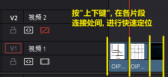
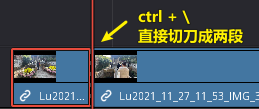

title:: 00 main_DaVinci_Resolve

- 显示, 暂时隐藏(变灰)
  background-color:: #793e3e
	- 暂时关闭时间线上的某片段 (变灰) -> 按 D 键
	- 一次性删除所有 "用 快捷键D 关闭的片段"
		- 菜单: 时间线 -> 清理视频轨道 -> 收起未使用片段
		- 
		- 但该方法只对变灰的"视频部分"有效, 对相应的"音频部分"无效, 不会被删除
		-
	-
- 查找片段, 快速定位到某时间点/帧处
  background-color:: #793e3e
	- 轨道上的某片段, 查找它在媒体池中的原素材位置 -> alt + f (find)
	- 在各片段的"连接处"间, 进行快速定位 -> 按"上/下键"
	  collapsed:: true
		- 
	- 按1秒跳跃 -> shift + 左/右键
	  collapsed:: true
		- 
	- 按1帧跳跃 -> 左/右键
	-
- 轨道上, 调整片段位置
  background-color:: #793e3e
	- 将两个片段的前后位置, 进行交换 -> Shift+Ctrl + 鼠标左键拖动
	- 让素材移到上一个/下一个轨道 -> alt + 上/下键
	  collapsed:: true
		- 
-
- 轨道
  background-color:: #793e3e
	-
-
- 入点 I (in), 出点 O (out)
  background-color:: #793e3e
	- 删除入点, 出点, 按 alt + i,  alt + o
	- ★ 重新找到原始素材上的"入点, 出点"位置 -> F 键
		- 将已"入点, 出点"后的子片段, 重新定位它在原始长片段上的"入点, 出点"位置 -> 在轨道上选中子片段, 按 F 键
	- 将时间轴(红线)处, 变成"入点" -> shift + [
		- 
		- 
	- 将时间轴(红线)处, 变成"出点" -> shift + ]
	  collapsed:: true
		- 
		- 
		- 
	- 将时间轴(红线)处, 变成"入/出点", 并让后面的片段自动紧跟上来, 不要留空# -> ctrl + shift + [ 或 ]
	- 编辑前面素材的长短时, 让后面素材自动紧随其后, 而不中间留空
	  collapsed:: true
		- 激活此"修剪编辑模式"后, 当你选中前面的素材, 将其变短或拉长, 后面的素材会紧贴这前面素材的长短而移动, 而不会中间留空.
		- 
		-
	-
- 切刀 -> B (blade)
  background-color:: #793e3e
	- 在当前时间轴(红线)处, 直接做切刀 -> ctrl + \
	  collapsed:: true
		- 注意 : 切刀后, 每段依然是完整状态, 可以被延伸. 只不过切刀相当于"蒙版"功能.
		- 
	-
- 删除片段
  background-color:: #793e3e
	- 删除片段, 并留空 -> 选中要删的片段, 按退格键
	- 删除片段, 不留空, 后面的片段自动紧跟上来 -> 按del键
	-
-