-
- > ▶ premiere /prɪˈmɪrˌprɪˈmjɪr/ (n.)(v.) the first public performance of a film/movie or play （电影、戏剧的）首次公演，首映
-
- 时:分:秒:帧:场
  collapsed:: true
	- 帧:
	  background-color:: #787f97
	  collapsed:: true
		- 下图中, 第四个数字是"帧", 比如你 设成 25帧/秒,  则第4个数字的最大就是25了,  再多一帧(即第26帧)就会进入下一秒(进到第2秒).
		- 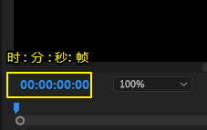
	- 场 (这个概念对计算机无用):
	  background-color:: #787f97
	  collapsed:: true
		- 比"帧"更小的单位, 是"场". **1帧 =  2 场**
		- 每个电视帧都是通过扫描屏幕两次而产生的(隔行扫描  和 逐行扫描)，第二个扫描的线条刚好填满第一次扫描所留下的缝隙。**每个扫描即称为一个场。因此 25 帧/秒的电视画面实际上为 50 场/秒** (若为 NTSC 则分别为 30 & 60).
		- 当计算机在显示器上播放视频时，它只会显示一系列完整的帧，而不使用交错场的电视技巧。因此针对计算机显示器所设计的视频格式和 MPEG-1 , 都不使用场。
-
- 新建pr项目 -> ctrl +alt + n
  collapsed:: true
	- 在这里, 可以输入你项目的名称, 和存储位置. 其他都可以不动, 然后确定
	- 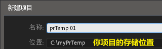
- 复位pr的界面布局
  collapsed:: true
	- 先选 编辑(这一步不能省略!), 再选 重置
	- 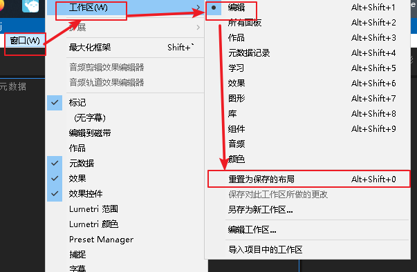
-
- ---
- 素材
  background-color:: #264c9b
	- 导入素材 -> 左下角的项目窗口, 可以双击它导入素材, 或直接把素材拖进去也可以
	- 让视频素材, 在时间轴中都显示缩略图
	  collapsed:: true
		- 在轨道上, 左上方的"三"按钮, 能对片段显示的缩略图, 进行设置
		- 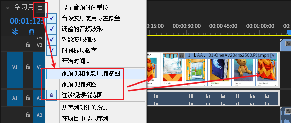
	- 给素材加上颜色标签, 以方便之后快速寻找
	  collapsed:: true
		- 对素材点右键 -> 标签 , 即可更改颜色
		- 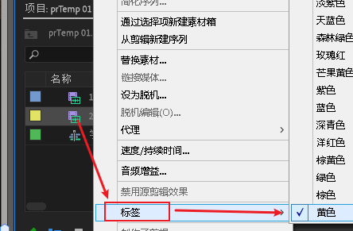
	- 要查看素材的更多信息, 可以打开"元数据显示"
	  collapsed:: true
		- 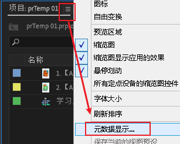
	- 素材拖到时间轨道上, 尺寸大于或小于视频分辨率时, 如何让其调整到屏幕大小?
	  collapsed:: true
	  background-color:: #793e3e
		- 如果导入的素材, 面积大于或小于视频窗口, 可以右键该素材, 选"缩放为帧大小", 让它缩放为视频大小
		- 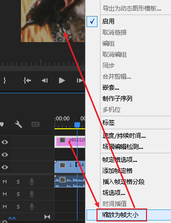
	- 将多个素材, 一次性插入到轨道中
	  collapsed:: true
		- 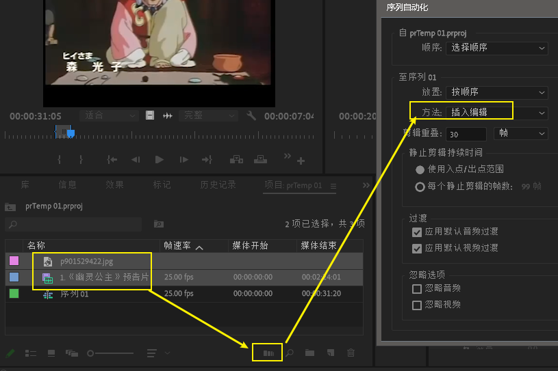
	- 批量将素材尺寸, 缩放到和视频分辨率大小一样
	  collapsed:: true
		- 如果你有很多的素材, 都大于或小于窗口视频, 可以这样批处理操作:
		  在 编辑菜单 -> 首选项 -> 媒体 -> 默认媒体缩放, 设为"缩放为帧大小"
		- 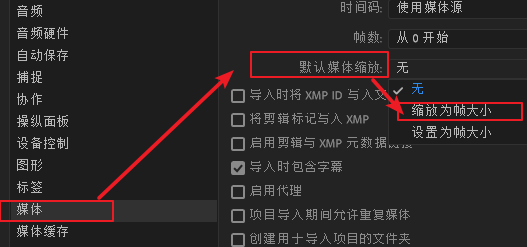
		-
		-
- ---
- 视频预览窗口
  background-color:: #264c9b
	- 将视频预览窗口, 满屏显示 -> 英文输入法状态下, 按 数字1键 左边的 ~键
	- 在视频窗口, 显示时间 -> 右键, 打开时间标尺数字
	  collapsed:: true
		- 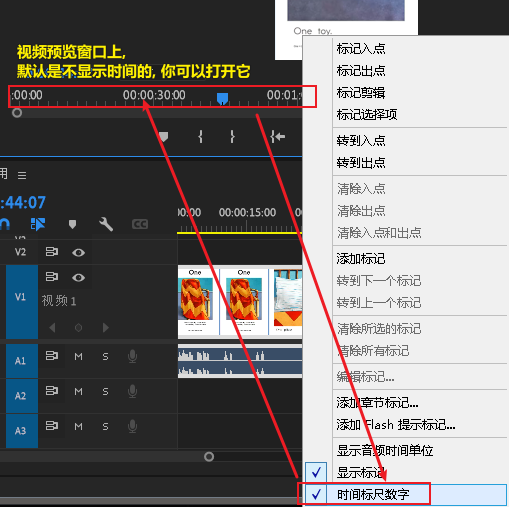
		-
	- 通过 j, k, l, 可以的视频进行: 倒退, 暂停, 前进.   双击l则加速倒放, 双击j 则加速快进, (这和达芬奇一样)
	- 入点 I, 出点 O, (跟达芬奇一样)
	  collapsed:: true
		- 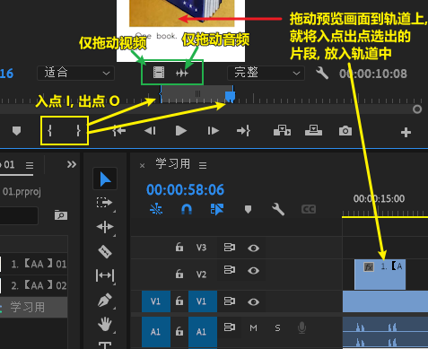
		- 右键, 可以清除"入点出点"
		- 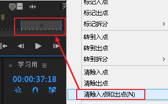
	- 删除"入点出点"之间的片段, 删除部分镂空, 后面片段不跟上来
	  background-color:: #793e3e
	  collapsed:: true
		- 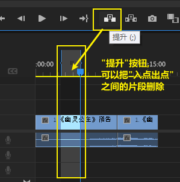
		- 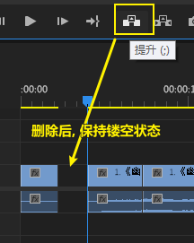
		- 注意: 要想使这个功能生效, 必须把该轨道上的蓝色打开
		- 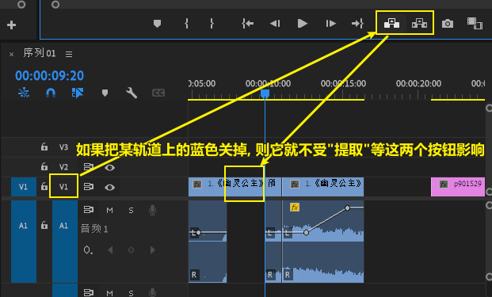
	- 删除"入点出点"之间的片段, 不镂空, 让后面的片段自动跟上来
	  background-color:: #793e3e
	  collapsed:: true
		- 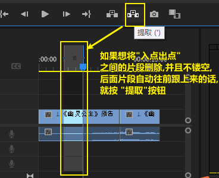
	- 插入片段, 与 覆盖掉原片段位置
	  collapsed:: true
		- 插入(快捷键: ctrl+ 拖动片段 到轨道上) : 是把入点出点片段, 插入到轨道的当前时间线上. 总长度会增加
		- 覆盖 (快捷键: 直接拖动片段到轨道上) : 是把片段, 覆盖掉轨道上原来素材的位置, 总长度不变
		- 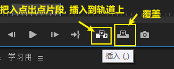
		- 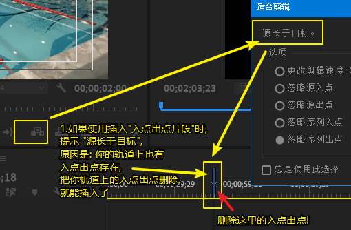
	- 只插入一帧 -> 在同一个位置处使用"入点""出点", 就能选出1帧范围, 然后插入到时间轴上即可
	  collapsed:: true
	  background-color:: #793e3e
		-
	- "入点出点"选出的片段, 可以直接拖到素材库中, 变成素材
	  collapsed:: true
		- 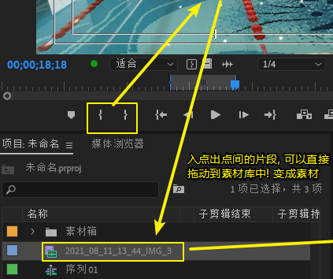
	- 将入点出点片段, 拖动到素材库中, 变成"子剪辑" -> 按ctrl + 拖动
	  collapsed:: true
		- 也可以在视频窗口上右键, 直接"制作子剪辑"
		- 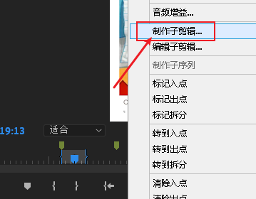
		- 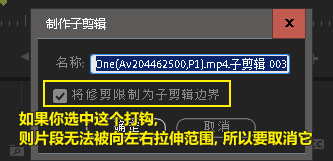
		- 也可以事后来取消左右无法拉伸的"边界"锁定. 直接对素材库中的子剪辑, 右键, 编辑子剪辑即可, 然后把打钩去掉.
		- 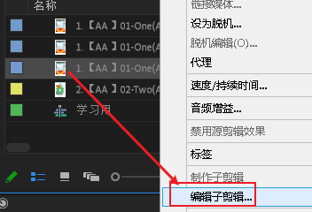
	- 单独导出某一帧
	  background-color:: #793e3e
	  collapsed:: true
		- 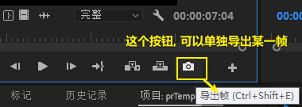
		- 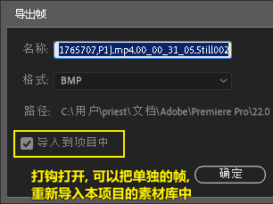
	-
- ---
- 时间轴轨道
  background-color:: #264c9b
	- 要创建时间线轨道, 必须先创建序列
	  collapsed:: true
		- 在项目窗口中, 右键, 新建项目 ->序列
		- 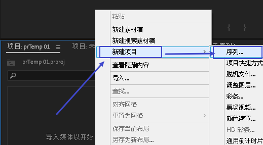
		- 并且, 在"设置"中, 可以自定义分辨率和帧率, 并给这个序列起名
		- 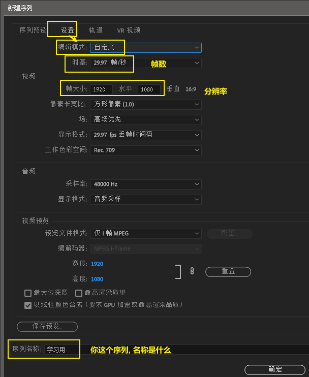
		-
		-
	- 如果你要对已创建的序列, 更改帧率, 就选中序列, 右键-> 序列设置
	  collapsed:: true
		- 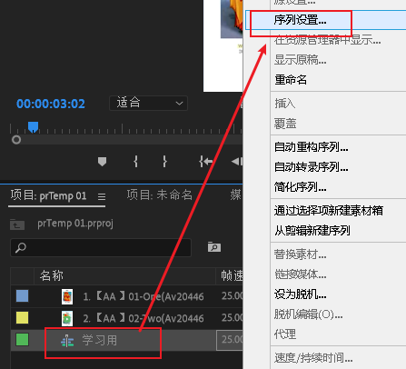
		- 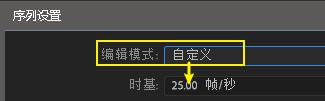
		-
	- 调节轨道的高度和长度 -> alt + 鼠标滚轮
	  collapsed:: true
		- 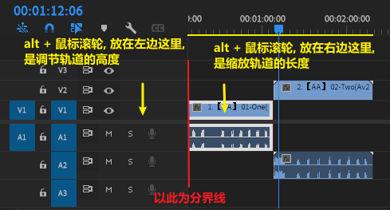
	- 拖动素材时, 会"覆盖掉"重叠处的其他素材. 你也可以改成 ctrl+拖动, 就是"插入"模式了
	  collapsed:: true
		- 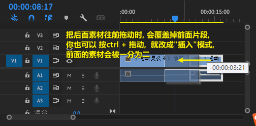
	- 在两段片段交界处,变换前后的时长, 而总长度保持不变 ->滚动编辑工具 (N)
	  collapsed:: true
		- 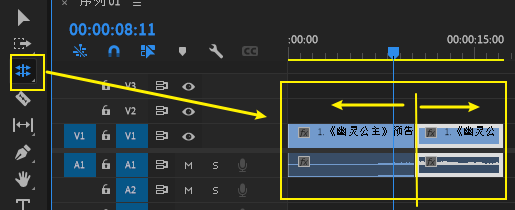
	- 断开音频和视频的链接 -> 选中轨道上的片段, 右键 -> 取消链接
	  collapsed:: true
		- 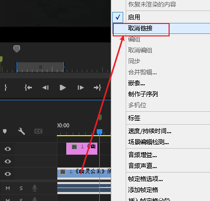
		- 断开后, 要重新链接, 只要同时选中视频和音频, 右键, "链接"即可
	- 删除片段时, 让后面的片段自动跟上来, 不镂空 -> shift + delet
	  background-color:: #793e3e
	  collapsed:: true
		- 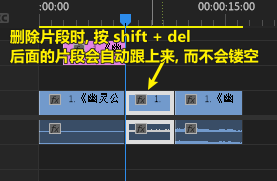
	- 修改片段的播放速度
	  background-color:: #793e3e
	  collapsed:: true
		- 选中某段视频, 右键 -> 速度/持续时间
		- 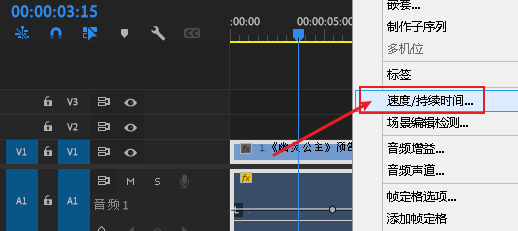
		- 注意: 加速后, 视频播放的时间会相应变短! 因为原来的帧数被压缩到了更短的时间内完成, 就是视频加速了.
		- 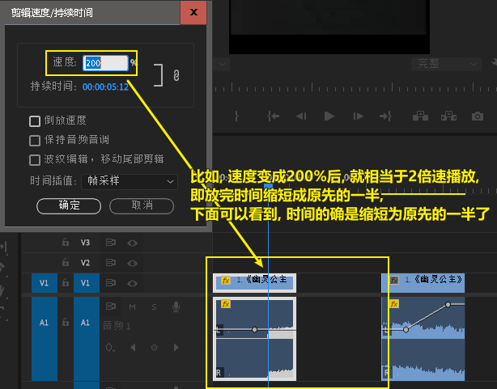
		- 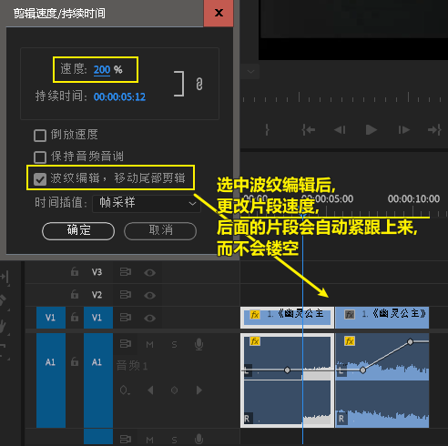
	- 修改片段播放速度 -> 用"比率拉伸工具"
	  background-color:: #793e3e
	  collapsed:: true
		- 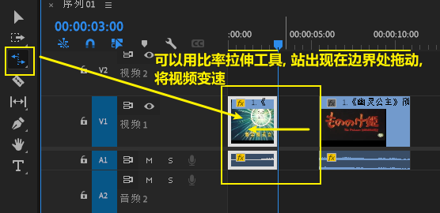
	- 对片段的其中某区域, 单独进行变速
	  background-color:: #793e3e
	  collapsed:: true
		- 先打开"显示视频关键帧"
		  id:: 621cb3a4-04fb-494b-9848-93d8dde47ebd
			- 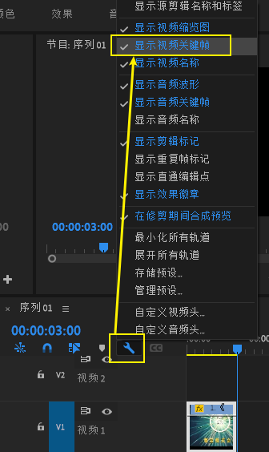
		- 点击 fx 按钮 -> 时间重映射 -> 速度
			- 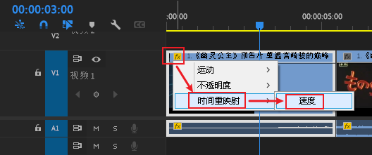
			- 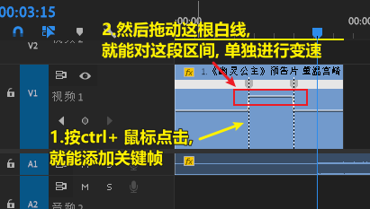
			-
	- 倒放视频
	  background-color:: #793e3e
	  collapsed:: true
		- 选中某段视频, 右键 -> 速度/持续时间 -> 选中"倒放速度"
		- 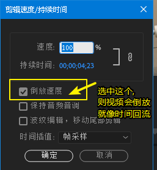
-
- 切刀 -> ctrl + k
  background-color:: #264c9b
  collapsed:: true
	- 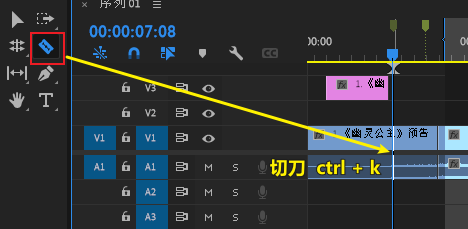
	- 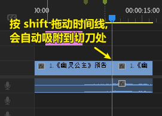
	- .
- ---
- 快速定位
  background-color:: #264c9b
	- 任意时间处
	  background-color:: #497d46
	  collapsed:: true
		- 快速定位到某时间处
			- 直接用小键盘输入 7.0  -> 就能到 7秒处
			  输入 2.15.0 -> 就能到2分15秒处
			  输入 5.59.24 -> 到 5分59秒24帧处 (如果你输入25帧, 则会进1秒, 变成 6分0秒)
			- 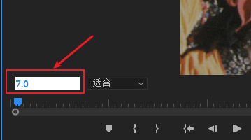
			- 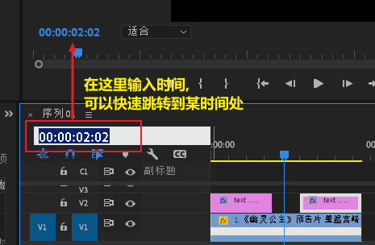
	- 标记
	  background-color:: #497d46
		- 在片段预览窗口上, 添加标记(快捷键 M), 以快速定位
		  collapsed:: true
			- 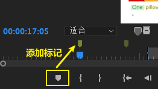
			- 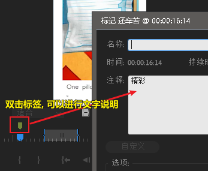
			- 你也可以在素材库中, 找到"标记"栏, 进行文字说明输入
			- 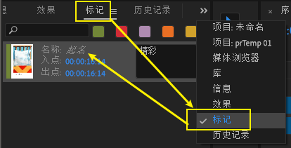
			-
		- 在时间轨道上, 添加标记
		  collapsed:: true
			- 双击标记, 就能编辑说明文字
			- 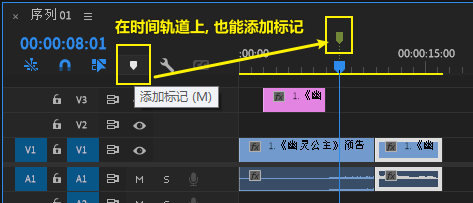
			- 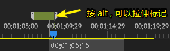
			- 
		- 如果添加的"标记"不显示怎么办? 我们需要打开它的显示, 点击扳手按钮
		  collapsed:: true
			- 
			- 
		- 查看你添加的所有"标记"
		  collapsed:: true
			- 先在菜单中, 窗口-> 打钩"标记", 才能在左下角的素材窗口中, 看到"标记"栏
			- 
			- 
			- 然后再切换到"标记"栏, 里面就能看到你添加的所有标记
			- 
		-
		-
- ---
- 优化, 降低预览精度, 提高编辑性能
  background-color:: #264c9b
  collapsed:: true
	-
- ---
- 辅助
  background-color:: #264c9b
	- 打开"时间显示"的大窗口 (即 时间码)
	  collapsed:: true
		- 
	- 打开"丢帧指示器", 可以查看视频是否丢帧
	  collapsed:: true
		- 播放素材时, 如果绿灯变成了黄灯, 就表示有丢帧现象
		- 
		- 
-
- ---
- 添加字幕
  background-color:: #264c9b
	- 添加字幕轨道
	  background-color:: #793e3e
	  collapsed:: true
		- 
		- 
		- 
		-
	- 最后导出视频时 ( ctrl + m), 别忘了把字幕 烧录到视频中
	  collapsed:: true
		- 
	- 文字工具 -> 按 ctrl + 拖动, 能出现居中对齐的参考线
	  collapsed:: true
		- 
	- 复制文字片段 -> 按 alt + 拖动
	  collapsed:: true
	  background-color:: #793e3e
		- 
	- 将你文字片段, 导出为模板, 方便下次直接套用它的样式
	  collapsed:: true
		- 
		- 
		- 
- ---
- 视频特效, 调色等
  background-color:: #264c9b
	- 调整视频透明度
	  collapsed:: true
		- ((621cb3a4-04fb-494b-9848-93d8dde47ebd))
		- 
	-
-
- ---
- 音频编辑
  background-color:: #264c9b
	- 调节片段的音量大小 -> 用钢笔工具添加关键帧
	  background-color:: #793e3e
	  collapsed:: true
		- 
		  id:: 621b6ea3-2dcf-4427-80e7-be39413a666a
	-
- ---
- 导出编辑好的视频 -> ctrl + M
  background-color:: #264c9b
	- 其中, CBR 是 恒定比特率;  VBR 是可变比特率. vbr2 比 vbr1 质量更好, 但耗时更长.
	  collapsed:: true
		- 
	-
-