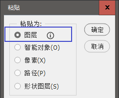
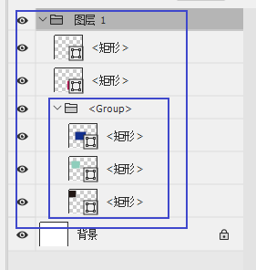
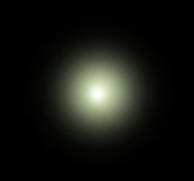
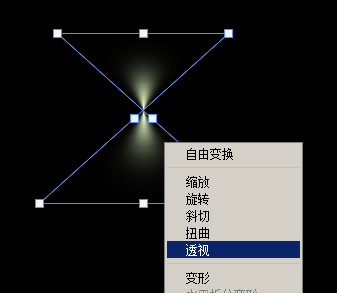
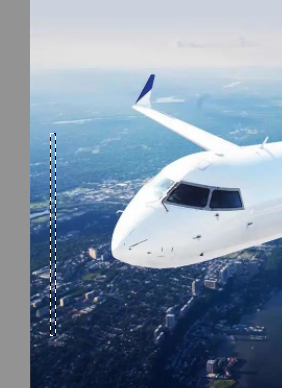
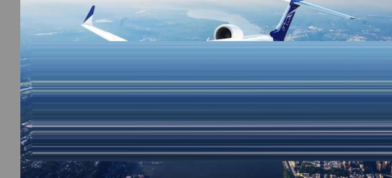
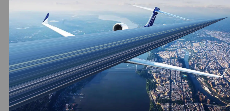
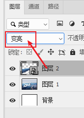
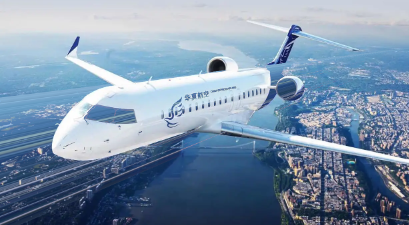

-
- 辅助功能
  heading:: true
	- 让ps 能打开 webp 格式 -> WebPShop.8bi
	  collapsed:: true
		- https://helpx.adobe.com/cn/photoshop/kb/support-webp-image-format.html
		- 把 WebPShop.8bi 下载下来后, 存放地址:
		- Windows：\Program Files\Common Files\Adobe\Plug-Ins\CC
		- macOS：/资源库/Application Support/Adobe/Plug-Ins/CC
-
- ai拷贝到ps中, 自动分层
  background-color:: #264c9b
  collapsed:: true
	- 选中ai中的东西, ctrl+ c, 直接在ps中 ctrl + v,  选粘贴为"图层", 就能在ps中自动分层了
	- 
	- 如果ai中时群组的话, 拷贝到ps中, 也会自动打包到图层组内, 组内依然是分层的
	- 
- ---
- 光线 : 射灯
  collapsed:: true
	- 先画一个模糊的点, 中间加个高亮点
	- 
	- ctrl + t, 右键 -> 透视,  交叉过来
	- 
	- 确定后, 再单独调整宽高, 可以模拟射灯
	- 
	-
- 光线 : 速度弧光
  collapsed:: true
	- 选一小条区域, 拉伸
	- 
	- 
	- 根据画面物体, 进行透视拉伸
	- 
	- 图层混合模式, 改成合适的类型
	- 
	- 就可以模拟速度光感
	- 
	-
-