= ps 特效 分形玻璃
:toc: left
:toclevels: 3
:sectnums:
:stylesheet: myAdocCss.css

'''

== 用置换, 来做这个效果

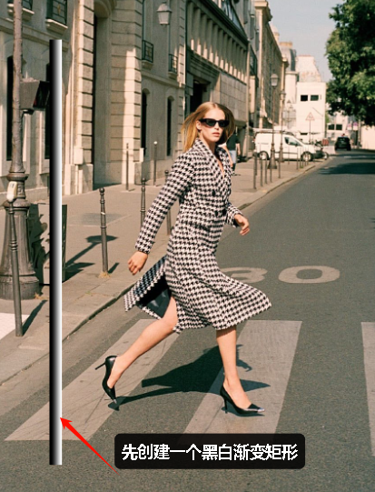

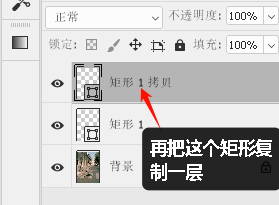

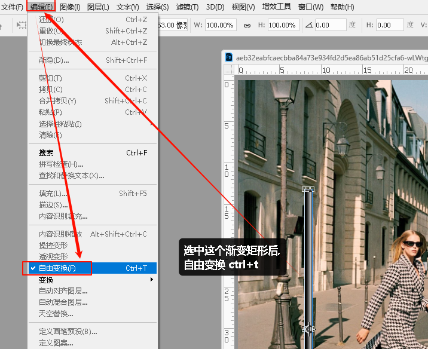

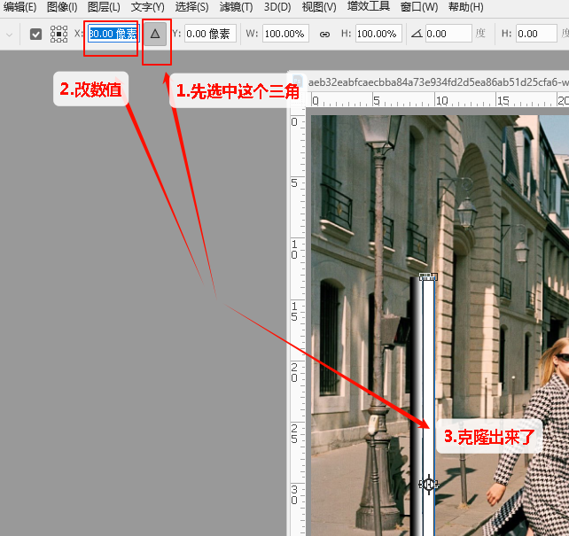

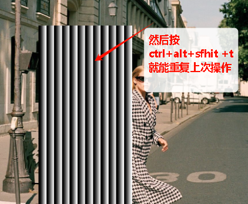

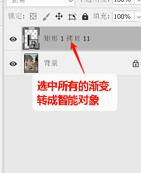

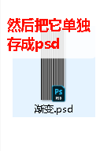

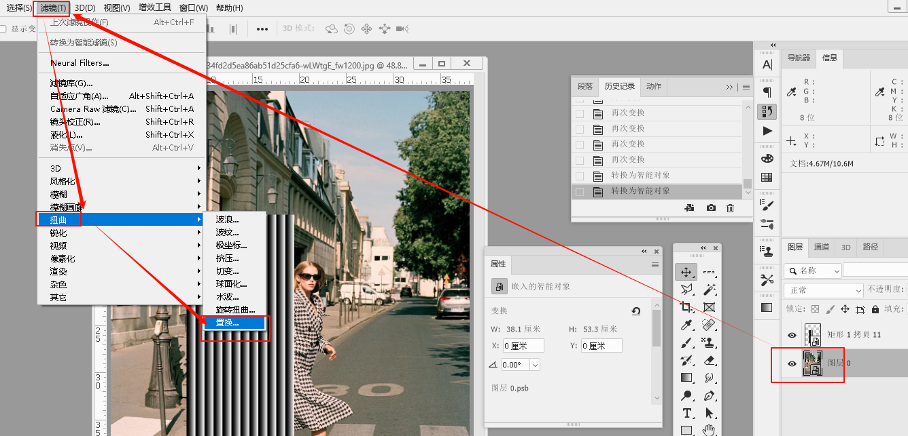

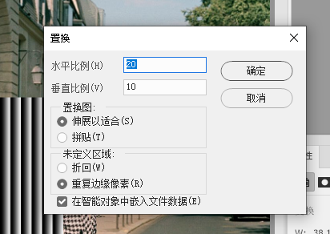

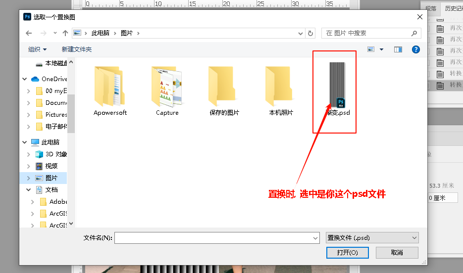

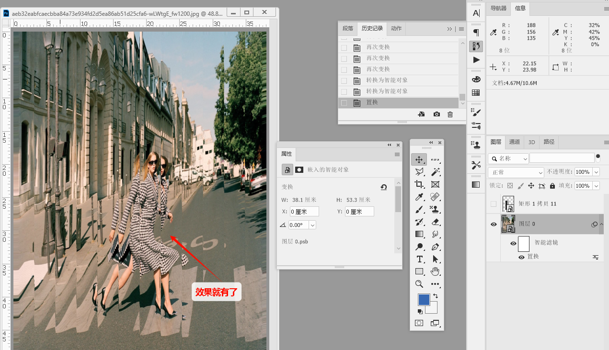

'''

== 置换的原理

执行“置换”滤镜时，目标图像会发生位移变形，而变形的程度及方向, 与一个称为“置换图”的 PSD 文件有密切关系。

[.small]
[options="autowidth" cols="1a,1a"]
|===
|Header 1 |Header 2

|当置换图(即置换时, 你要载入的那个黑白渐变psd)是"灰度模式"文件时:
|在灰度模式下，作为置换图的 PSD 文件, 仅有一个灰度通道，*目标图像的像素位移幅度, 由此灰度通道上的对应区域的灰度值决定。*

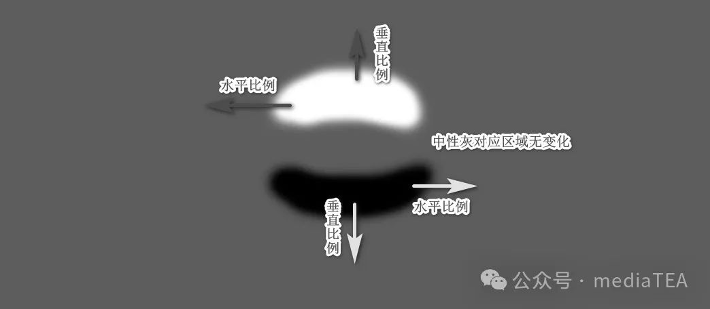

- “置换”滤镜, 使用置换图中的颜色值改变选区 -** 0 是最大的负向改变值，255 是最大的正向改变值，灰度值 128 不产生置换。**

- 如果置换图有一个通道，则图像沿着由水平比例和垂直比例所定义的对角线改变。 +
*如果置换图有多个通道，则第一个通道控制水平置换，第二个通道控制垂直置换。*

- 使用名为置换图的图像确定如何扭曲选区。例如，使用抛物线形的置换图创建的图像, 看上去像是印在一块两角固定悬垂的布上。

规律是:

- **灰度值为 128（中性灰）的, **被视为无移动的中点，*不产生置换。*
- 灰度值**大于 128 **的区域, 会使得目标图像对应区域的**像素向左（“水平比例”为正值时）或向上（“垂直比例”为正值时）位移。**
- 灰度值**小于 128** 的区域会使得目标图像对应区域的**像素向右（“水平比例”为正值时）或向下（“垂直比例”为正值时）位移。**
- *像素位移的幅度, 由灰度值的偏离"中点"的程度决定，以及“水平比例”和“垂直比例”设置的值。*

默认情况下，128 之上或之下的每个灰阶, 将对应移动一个像素距离。*因此，越亮或越暗的像素，导致目标图像的位移变化越大。*

*比如，当“水平比例”或“垂直比例”为 100 时，置换图中的纯黑和纯白像素, 可使得对应的目标图像区域, 沿水平方向或垂直方向移动 128 个像素点*，其中黑色对应向右、向下移动，白色对应向左、向上移动。

“水平比例”和“垂直比例”, 则是在此基础上按比例增加或减少位移的幅度。

如果其中的某一个比例为 0 时，则表示在此方向上无移动。

|当置换图(黑白渐变psd)为彩色图像时
|当此类文件用作置换图时，第一个原色通道，比如 *RGB 颜色模式下的“红”通道，它的灰度值的变化控制着"水平方向"的位移。* +
第二个原色通道，比如** RGB 模式下的“绿”通道，它的灰度值的变化, 控制着"垂直方向"的位移。**

其余的通道, 对置换效果不会产生影响。

|当置换图为黑白图像时
|在 RGB 或 CMYK 颜色模式下，如果将图层图像转换为黑白之后，由于各原色通道, 记录着相同的灰度信息，所以与在灰度模式下, 使用单个的灰度通道来控制位移量, 并无差别。

提示：

置换图不能是位图模式。

|===

