= ae 必做设置
:toc: left
:toclevels: 3
:sectnums:

'''

== 允许脚本安装

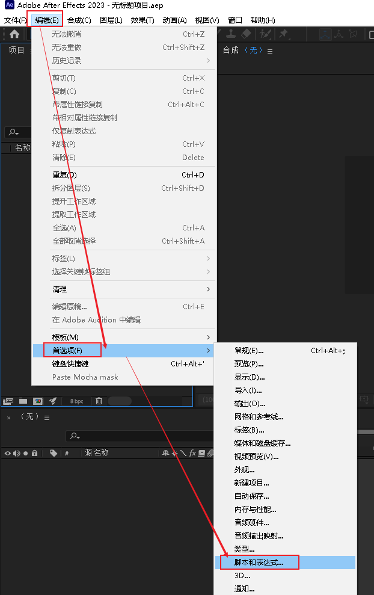

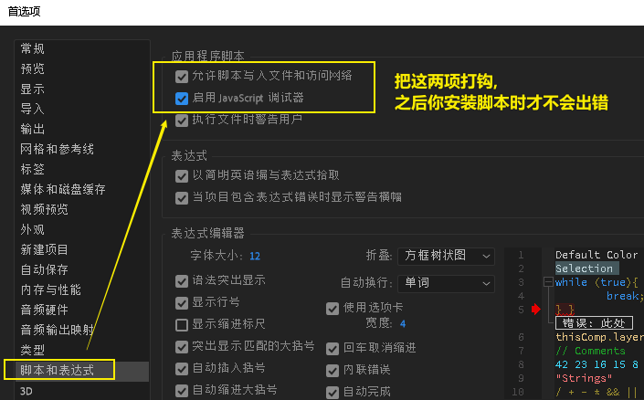

'''

== 自定义缓存目录位置

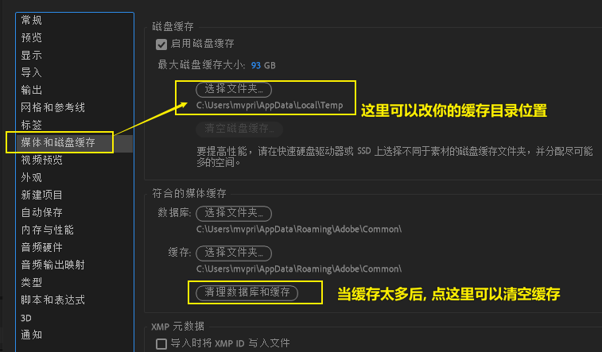

'''

== 为其它程序预留内存, 以免ae吃掉太多内存

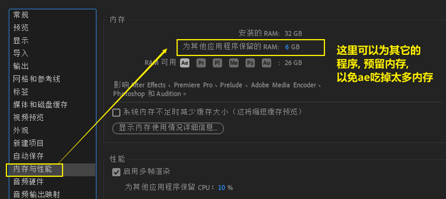

'''

== GPU 加速

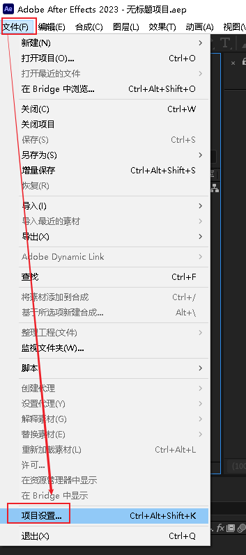

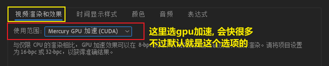

'''

== 保存自定义界面的布局

窗口也可以拖动, 比如把特效窗口, 拖到界面的左边

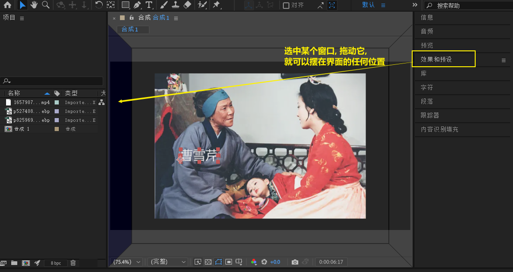

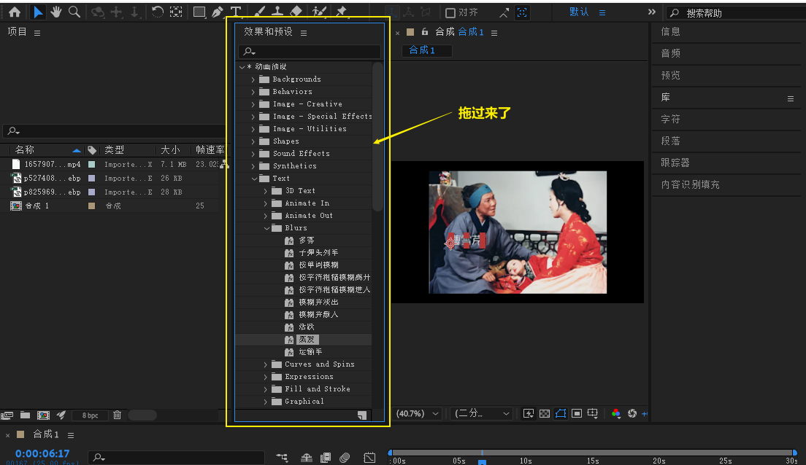

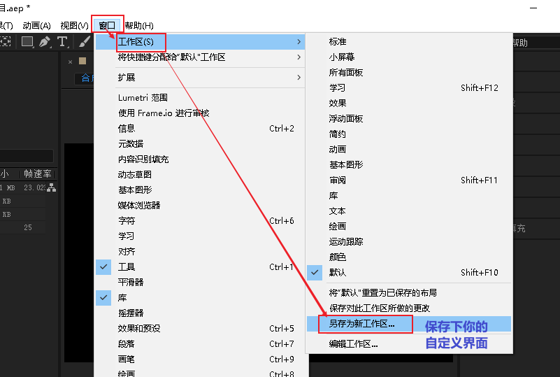

方法2: 点这里也可以

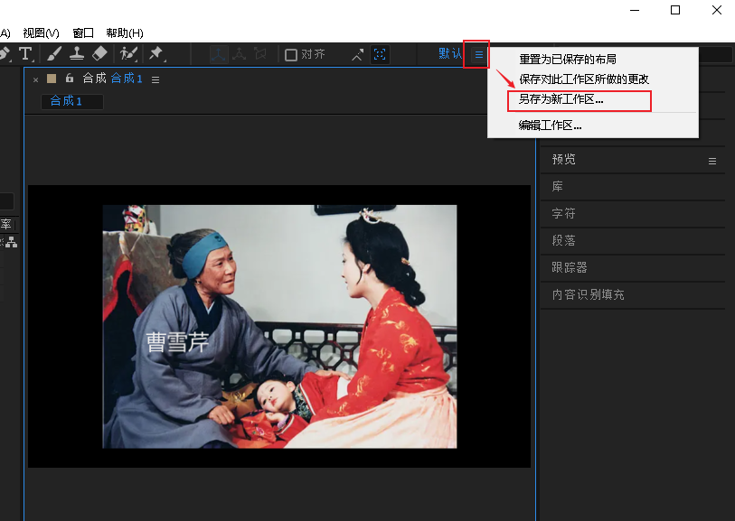

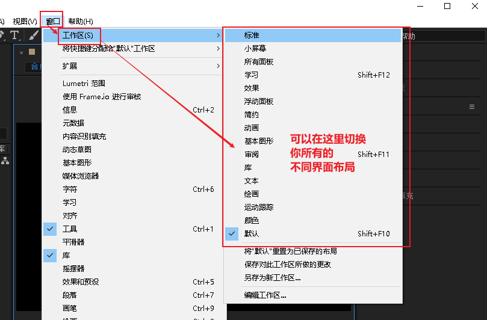

'''

