= ae 动画
:toc: left
:toclevels: 3
:sectnums:
//:stylesheet: myAdocCss.css

'''

== 添加关键帧

image:img/0050.png[,]

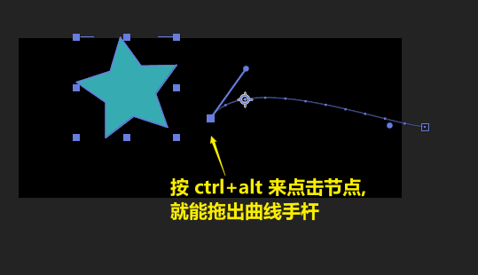

== 在关键帧处跳转, 快捷键是 J(跳到前面一个关键帧), k(跳到后面一个关键帧)

方法2: +
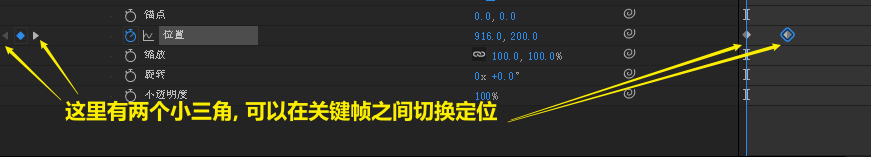

方法3: +
按 shift 来 拖动时间线 +
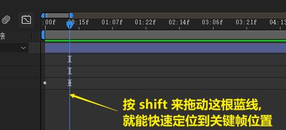

== ★ 添加完关键帧动画后的元素, 如何再整体移动它?

image:img/0105.jpg[,]

可以按住 shift 来拖动元素, 就是横平竖直的移动元素了

image:img/0106.jpg[,]

== 效果(如模糊等), 也可以设置关键帧

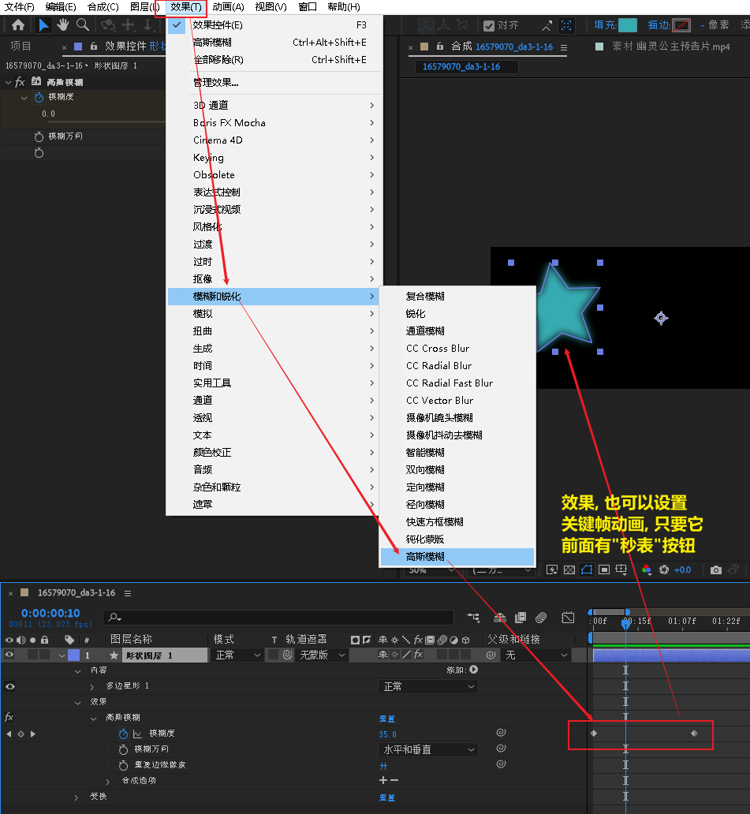

== ★ 按比例缩放"整体关键帧"时长 (即"加快"与"放慢"整体的动画速度)

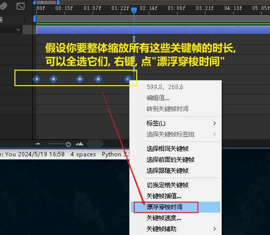

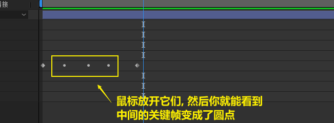

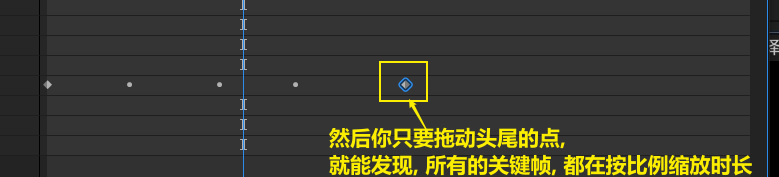

== 在位移上, 缓入缓出

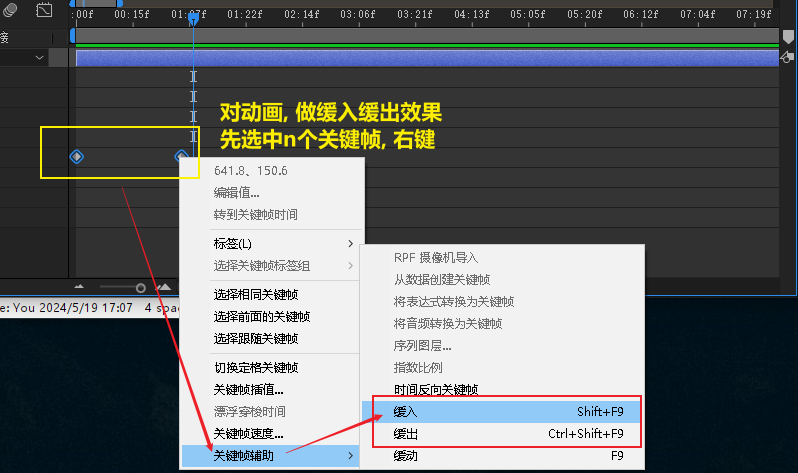

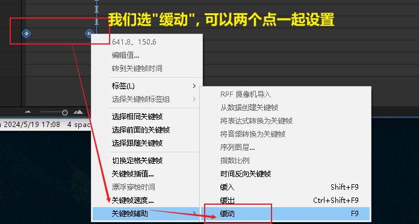

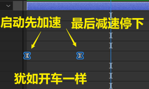

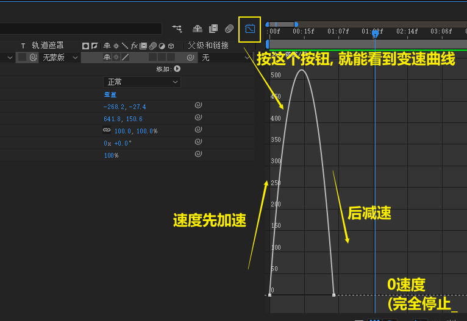

