= ae 图层
:toc: left
:toclevels: 3
:sectnums:
:stylesheet: myAdocCss.css

'''

== ★ 对时间线上的图层, 隐藏

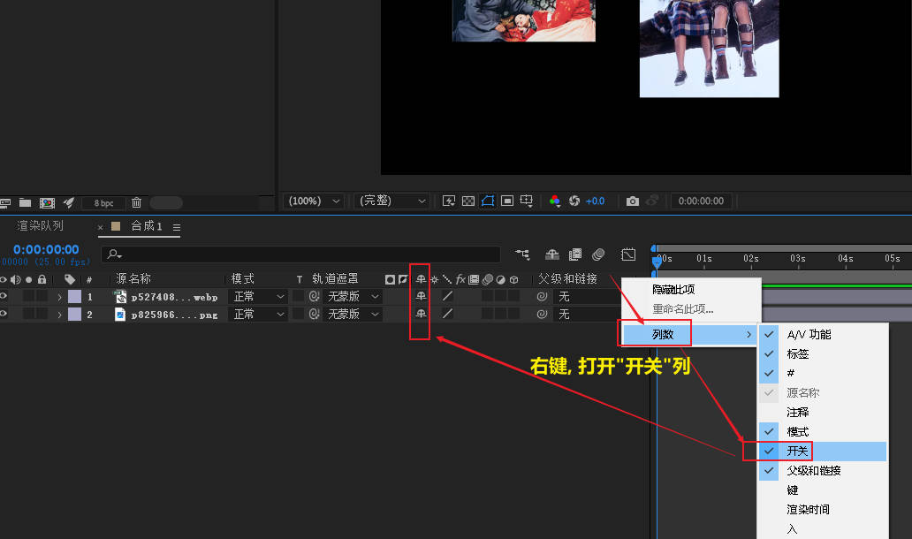

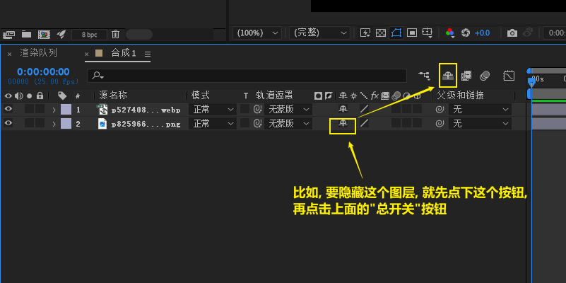

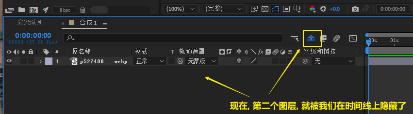

==  只看图层众多属性中的某一属性

====  只看"锚点"属性 :  A  (Anchor)

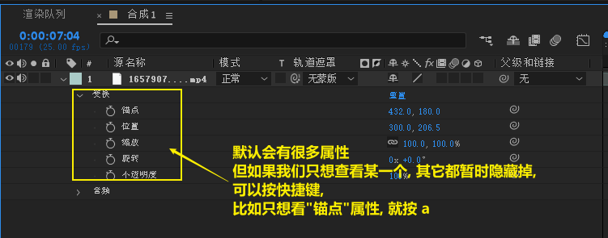

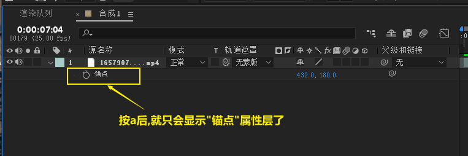

==== 只看"位置"属性 :  P  (position)

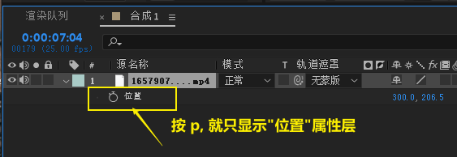

==== 只看"旋转"属性 : R (rotate)

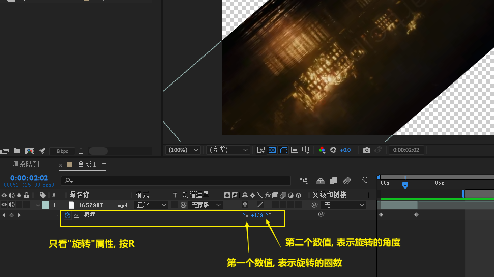

==== 只看"不透明度"属性 : T  (transparency)

==== 同时查看多个属性层 : shift + ...

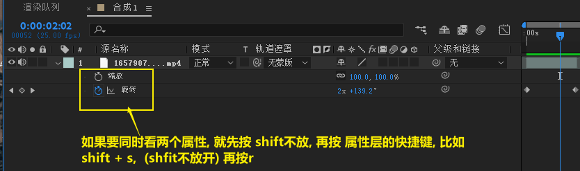

'''

==  对图层上的效果, 进行"打开"或"关闭"

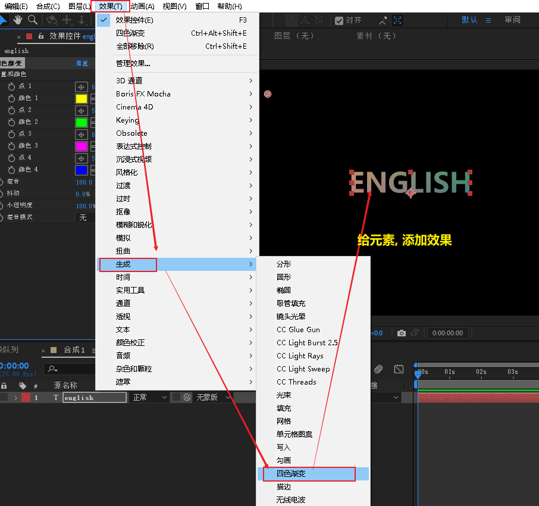

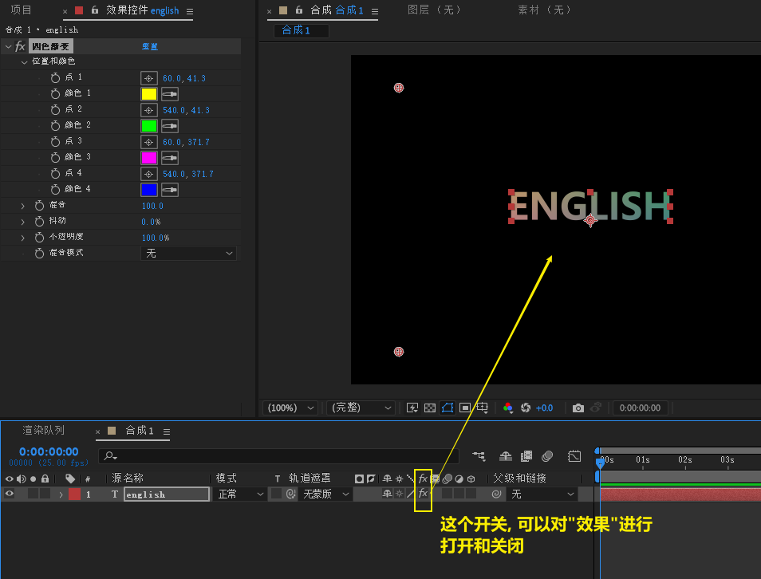

'''

== 图层的"父子关系"

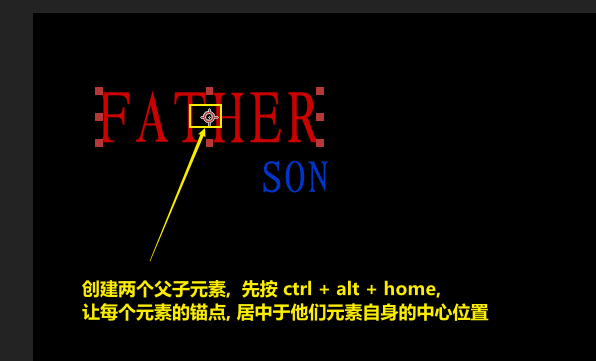

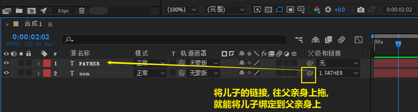

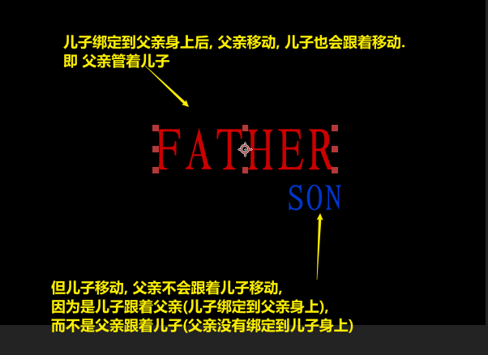

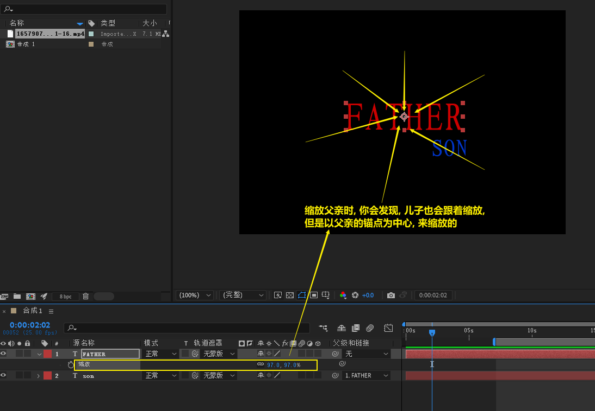

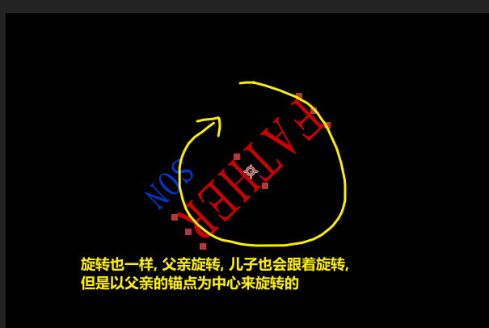

==== 让儿子的某一属性, 跟父亲的某一属性, 做相同运动

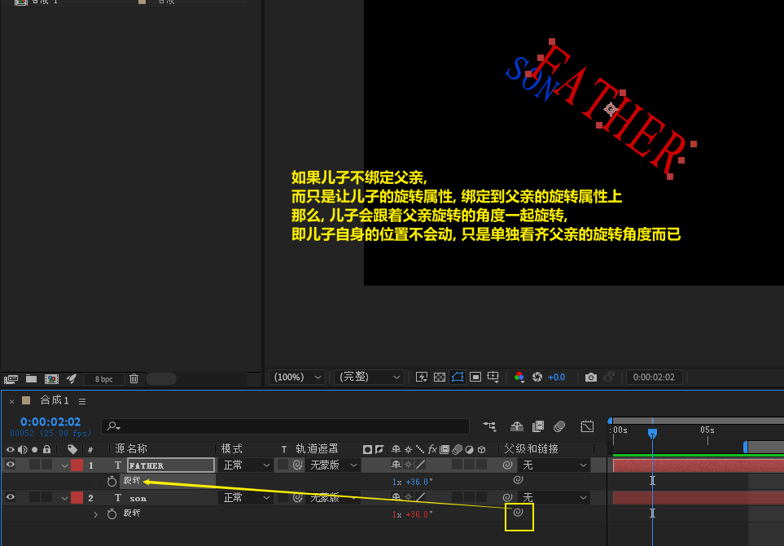

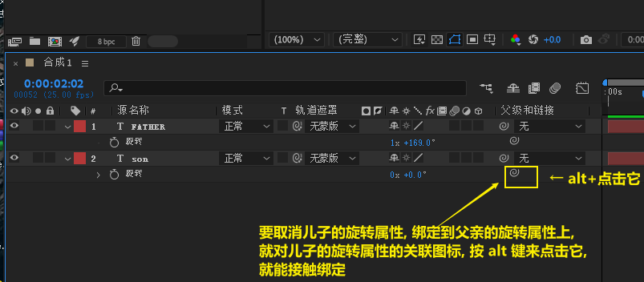

==== 还可以用父亲的旋转属性, 来控制儿子的透明度变化

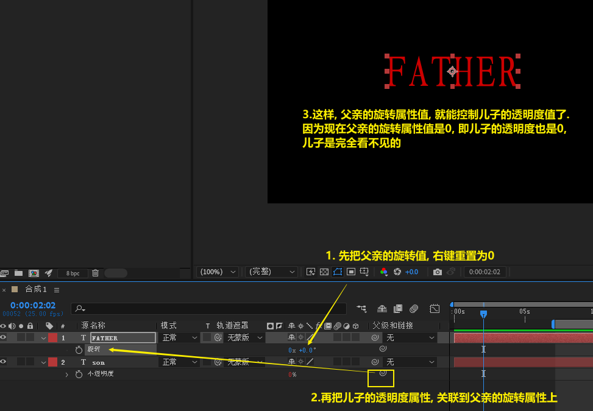

image:img/0142.png[,]

==== 让某些图层, 跟着另一个图层来同时变换 (相当于被"群组"了)

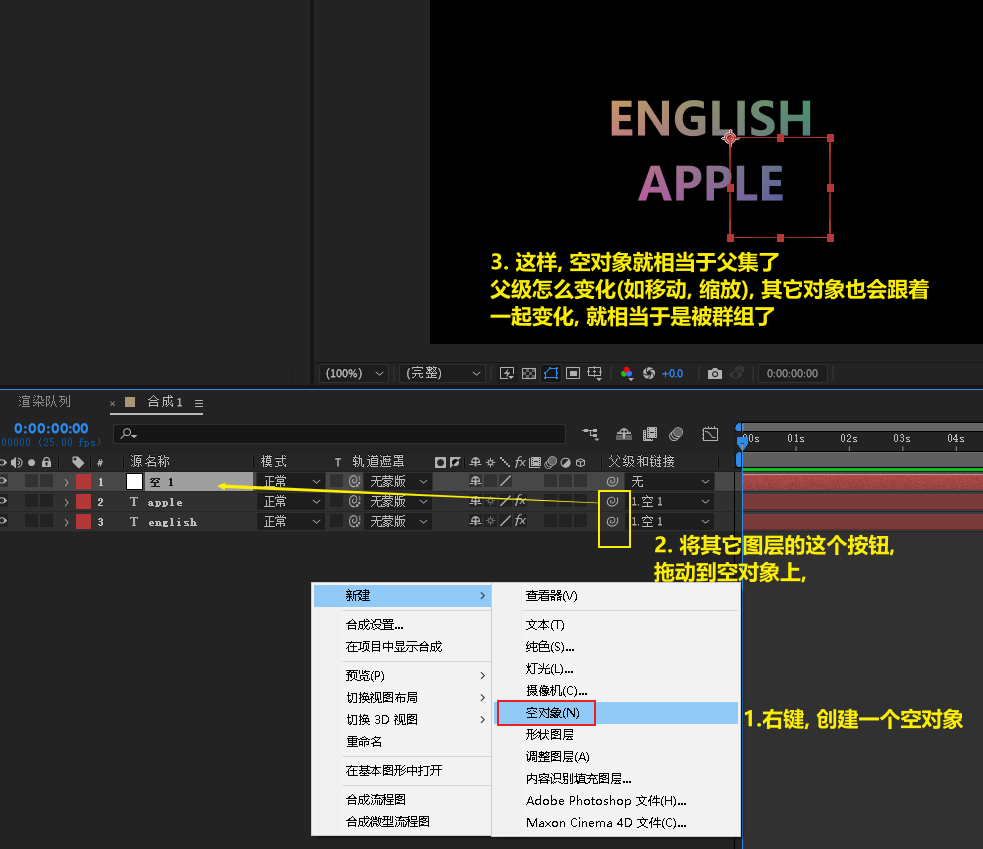

这个效果, 其实就相当于 ai 中的群组

==== 案例: 月亮, 地球, 太阳, 绕转效果

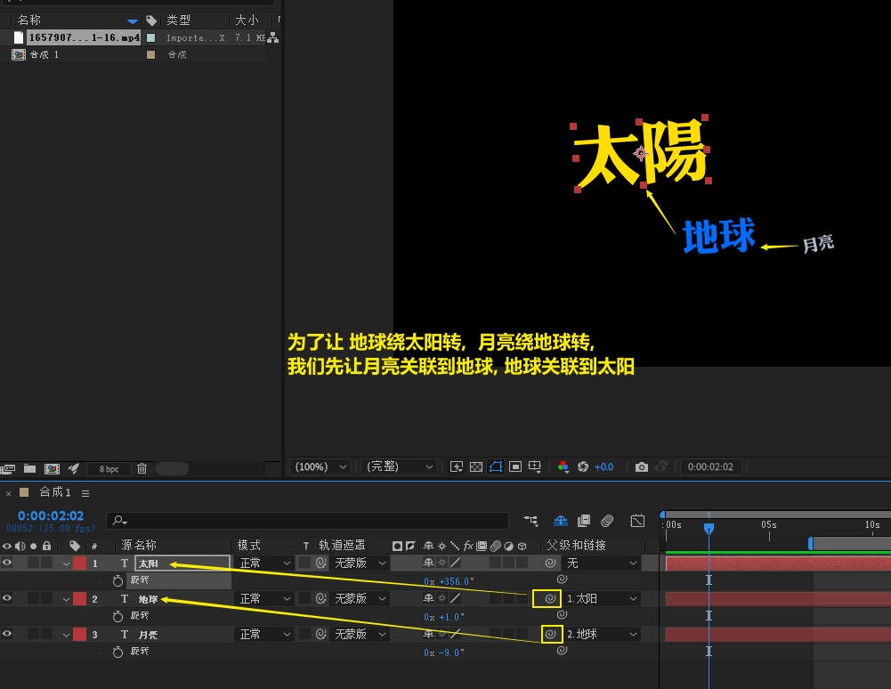

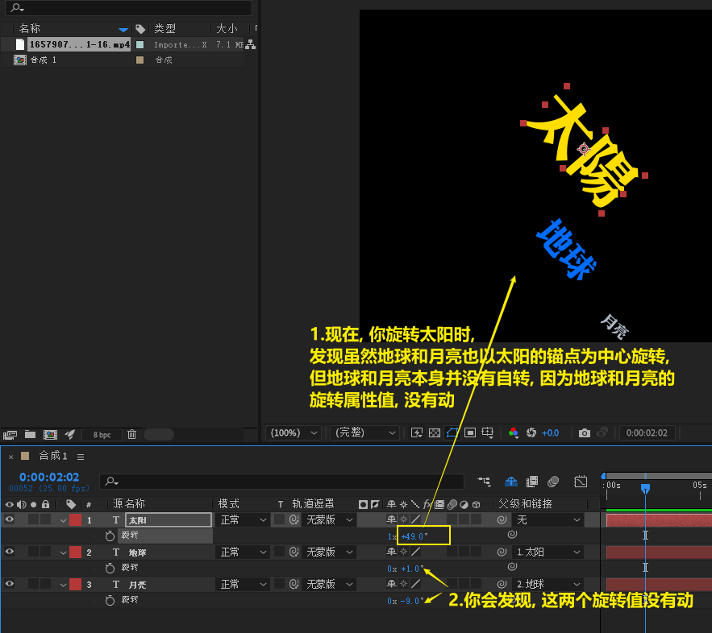

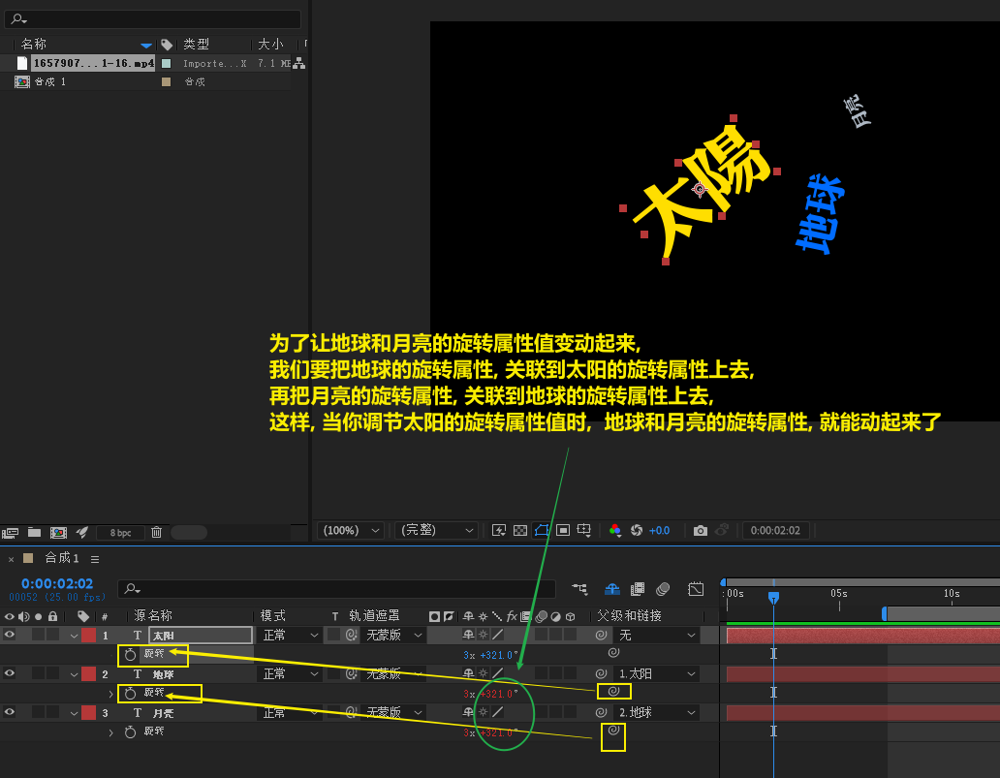
