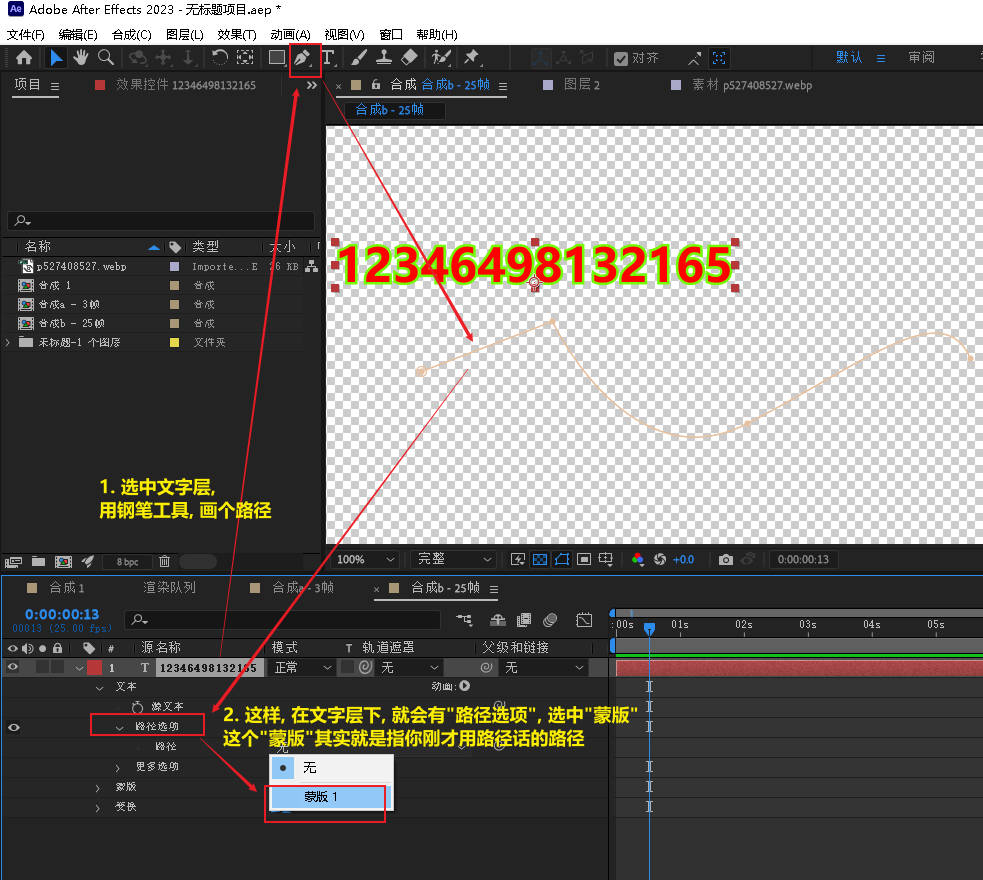
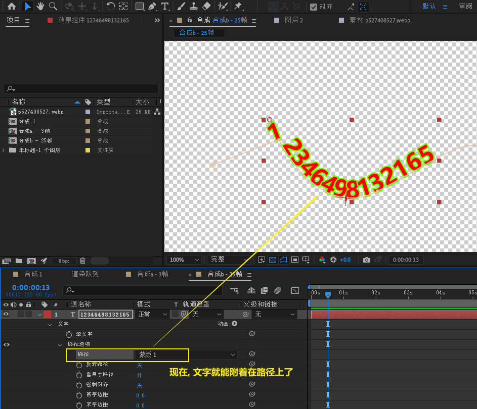
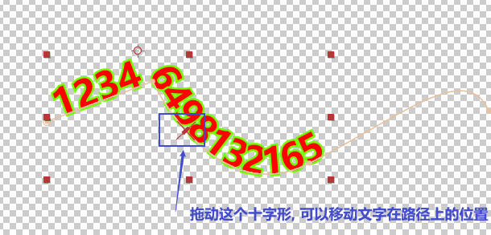
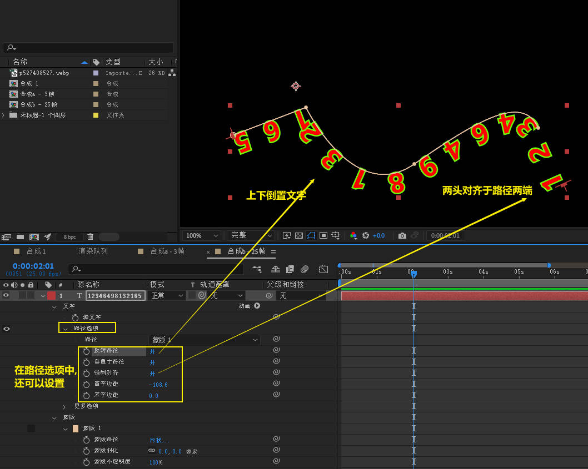
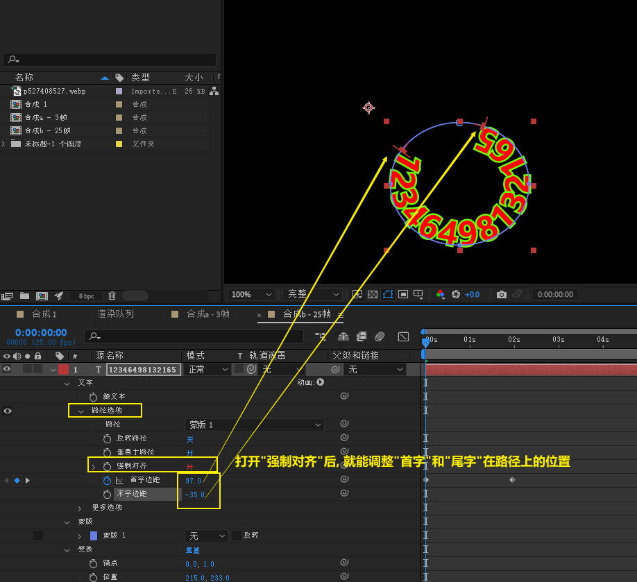
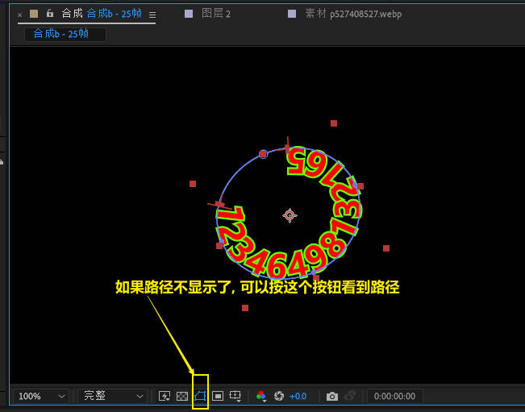
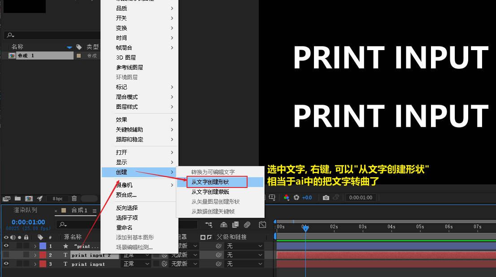
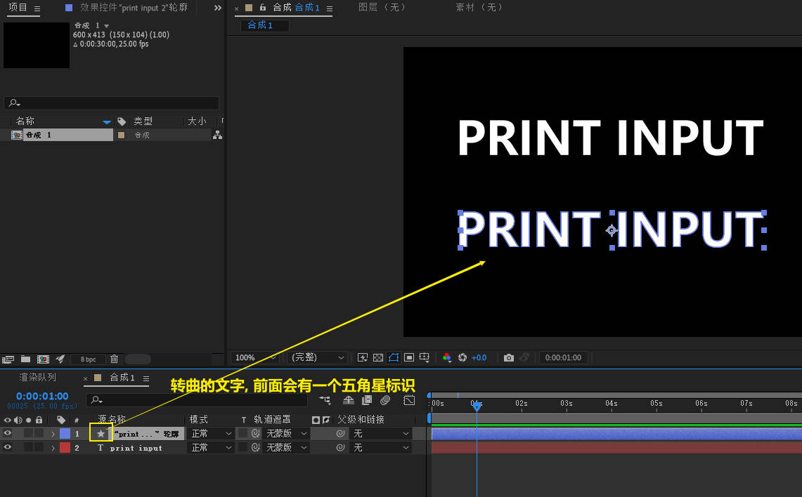
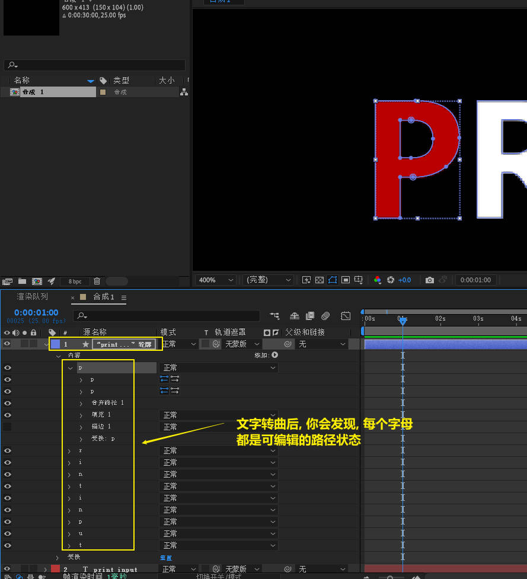

= ae 文本 & 字幕
:toc: left
:toclevels: 3
:sectnums:

'''

== 添加文字

image:img/0010.png[,]

也可以用下面的方法来添加文本层

image:img/0051.png[,]

== 文字附着在钢笔路径上

注意: 必须先选中你的文字层后, 再让钢笔画在你的这个文字层上!

'''

== 给文本添加效果

==== 给文本添加"蒸发"效果

image:img/0011.png[,]

image:img/0012.png[,]

image:img/0013.png[,]

image:img/0014.png[,]

image:img/0015.png[,]

'''

== 文字蒙版

image:img/0078.png[,]

image:img/0079.png[,]

image:img/0080.png[,]

'''

== 将文字转曲(转成路径)

转曲的文字, 原来的文字层不会丢失, 而是会复制出一个新的曲线层, 前面有五角星来标识.

