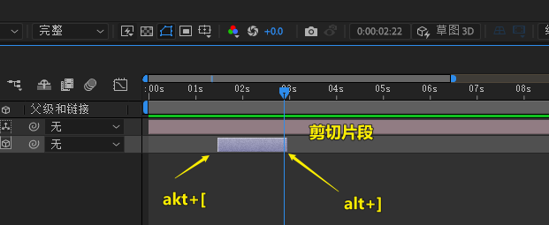
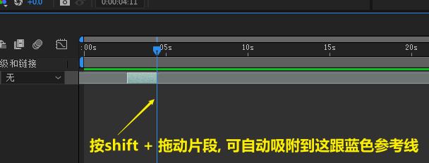
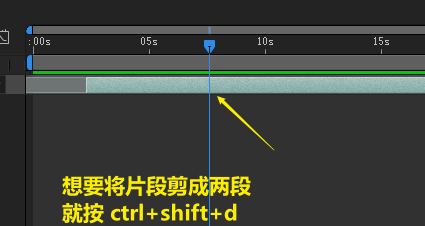
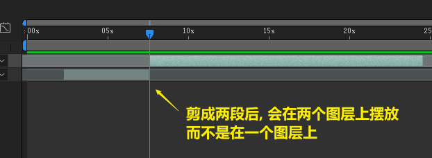
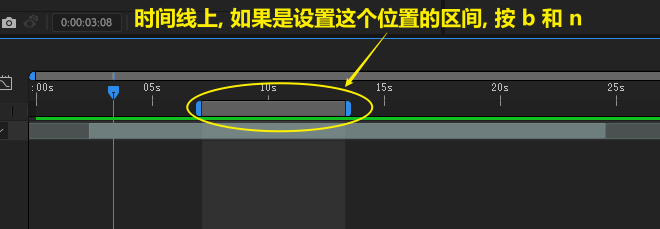

= ae 剪切片段
:toc: left
:toclevels: 3
:sectnums:
//:stylesheet: myAdocCss.css

'''

== 决定片段入点和出点 : alt + [ / ]

按shift 拖动参考线, 可以在移动片段时, 自动吸附到参考线位置处

== 将片段一刀两断 : ctrl + shift + d

== 设置工作区的入点和出点 : b 和 n

