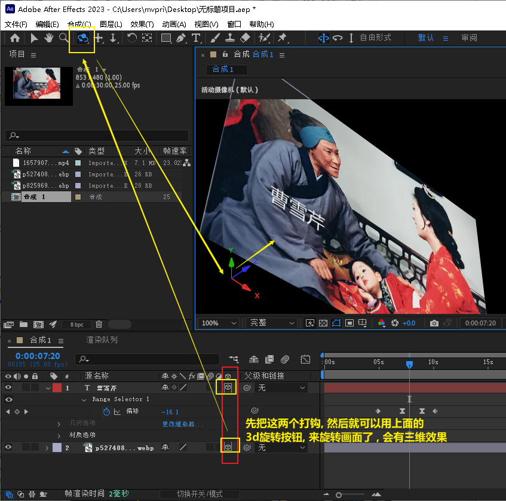
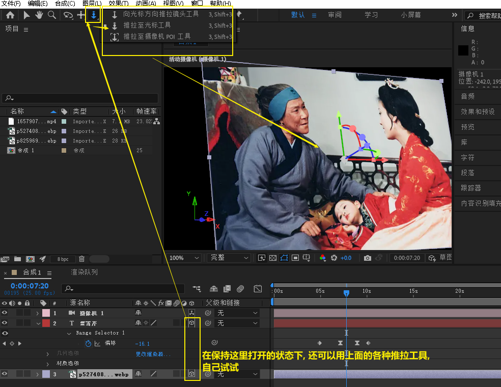
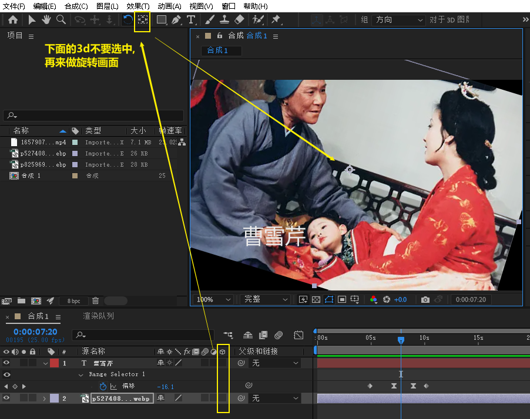
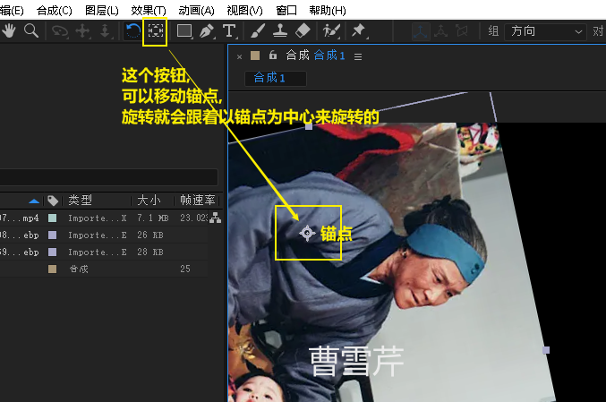
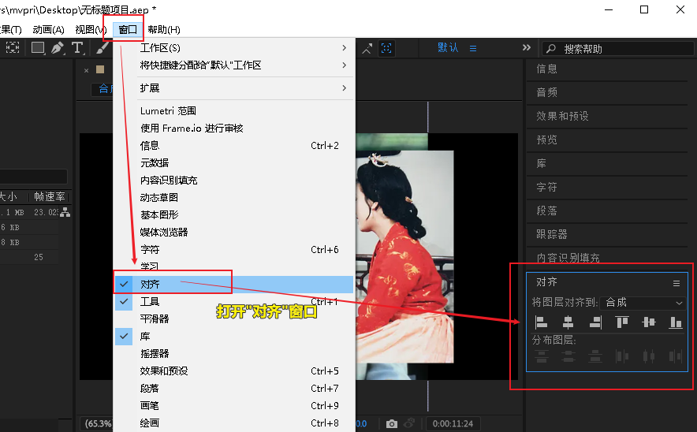
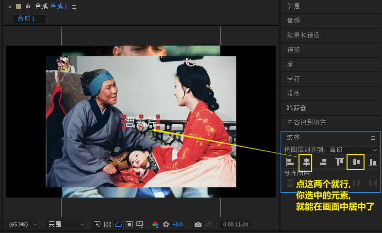
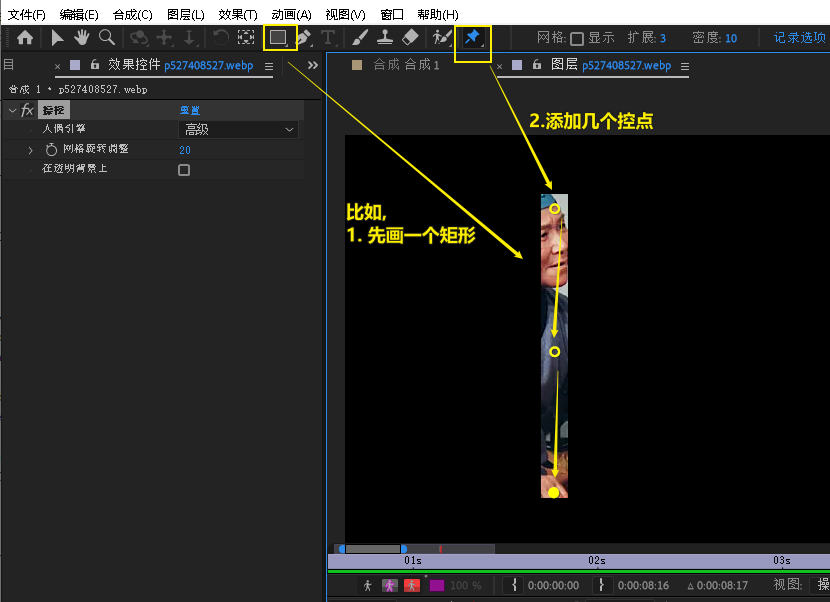
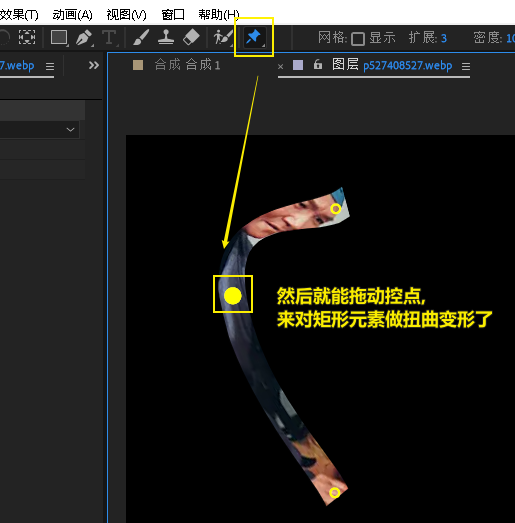

= ae 对画面做几何(变形)调整
:toc: left
:toclevels: 3
:sectnums:

'''

==== 将画面或文字, 做3d旋转

'''

==== 旋转画面

'''

==== 恢复画面到原始坐标位置 -- 重置即可

image:img/0042.png[,]

'''

==== 让元素在预览窗口中自动移动到"居中"位置

'''

==== 人偶位置控点

'''

