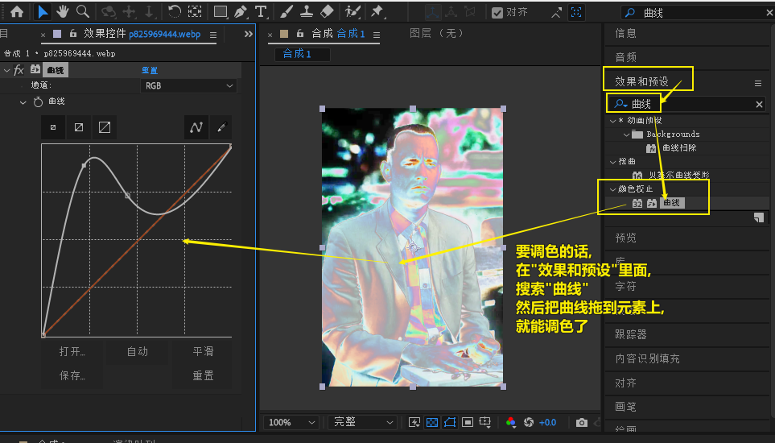
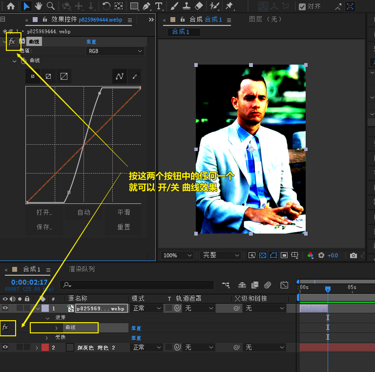
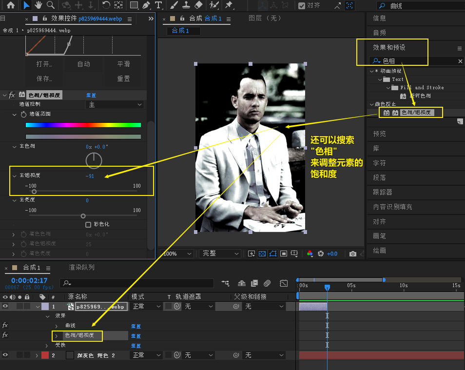
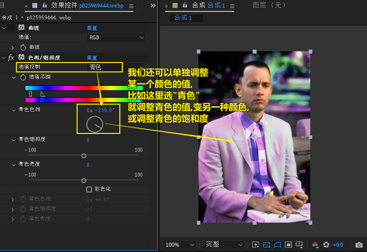
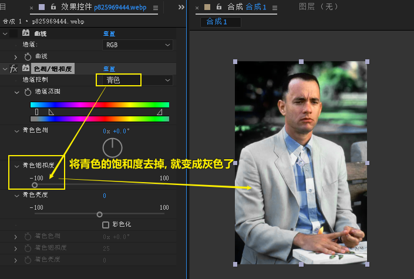
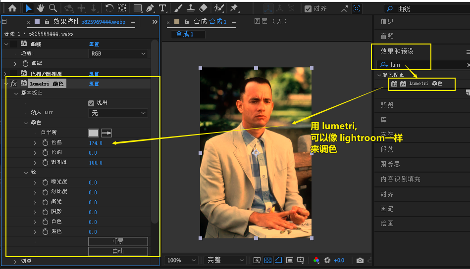
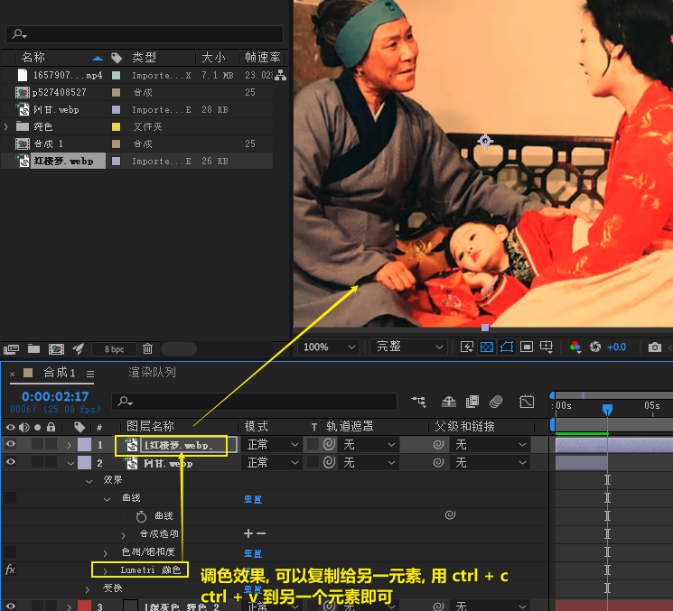

= ae 调色
:toc: left
:toclevels: 3
:sectnums:
// :stylesheet: myAdocCss.css

'''

== 用曲线来调色

== 调整色相/饱和度

'''

== 像 lightroom 一样来调色

在"效果和预设"中, 搜索 lum

'''

== 复制调色效果给另一个元素

选中一个元素中的效果, ctrl+c , 再选另一个元素, ctrl+v 即可.

'''

