= DaVinci 节点编辑器 & 调色
:toc:
:sectnums:

---

== *节点编辑器 (增/ 删/ 打包)*

==== 添加"串行节点" -> alt + s (serial)

==== 添加"并行节点" -> alt + p (parallel)

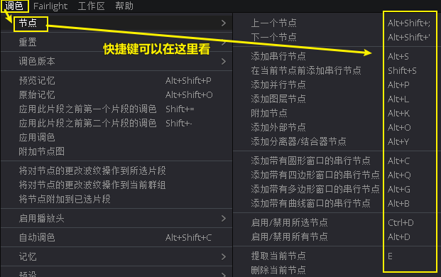

---

==== #关闭(禁用) /显示(开启) *选中的节点*# -> ctrl + d

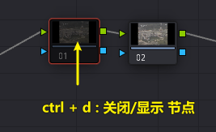

---

==== #关闭(禁用) /显示(开启) *所有节点*# -> alt + d

---

==== 创建/解散 复合节点

[cols="1a,2a"]
|===
|Header 1 |Header 2

|选中多个节点, 右键 -> 创建复合节点 (相当于做了"群组","打包")
|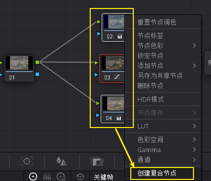

|将复合节点解散, 恢复成多个节点的状态, 就右键 -> 分解复合节点
|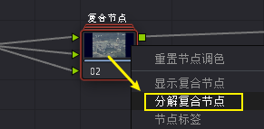

|显示复合节点, 则是保持"复合节点"(打包)的状态下, 进入打包的内部, 查看其子节点
|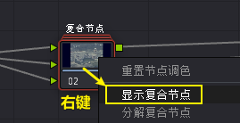

查看之后, 要退回上一级, 就右键 -> "退出复合节点"
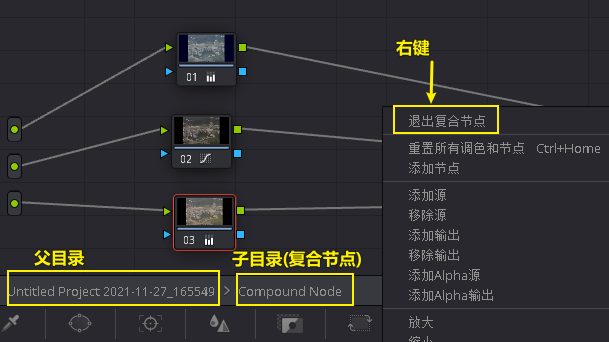
|===

---

==== 对"*单一节点*", 去除调色状态, 恢复成默认的颜色状态 -> 右键 : 重置(本)节点调色

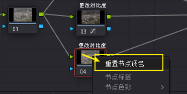

---

==== 删除你创建的"*所有节点*", 恢复成一开始的默认状态 -> ctrl + home

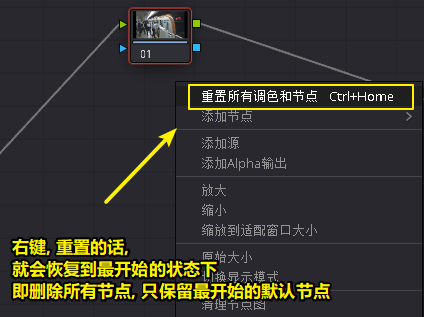

---

==== 给节点加上名字(标签) -> 右键 : 节点标签

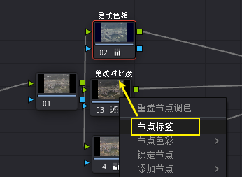

---

==  *节点编辑器 (复制属性)*

==== 要查看每个节点的调色结果 -> 要点击"突出显示"按钮 : shift + h

突出显示按钮, 能让你看到每个节点过程中的, 分别调色结果, 而不只是最终的合成效果.

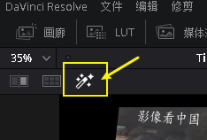

---

==== 把"a节点"的属性, 复制到"节点b"身上 -> 方法1: ctrl + c,  ctrl + v.  方法2: 按住alt + 拖动a 到b身上

- 方法1: ctrl+c, ctrl+v

- 方法2:

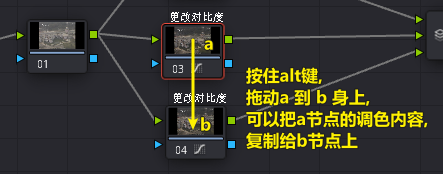

---

==== 将静帧的调色, 赋给另一个节点

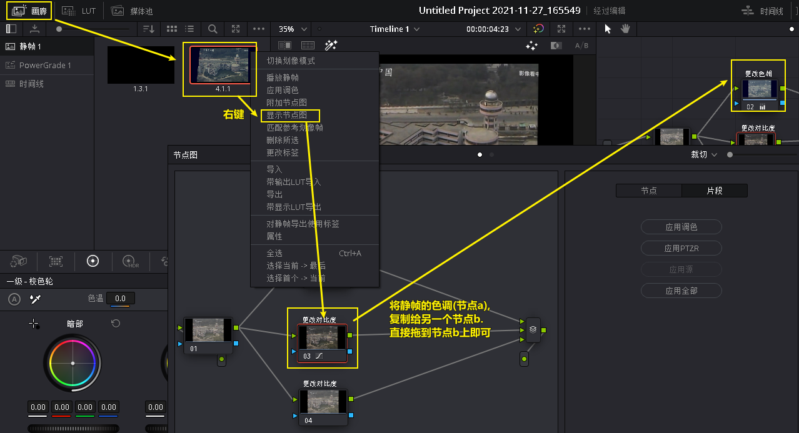

---

==== 交换两个节点的调色 -> 按ctrl + 拖动a节点 到 b节点上

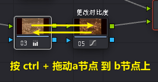

---

== *并行混合器*

==== 手动添加"并行混合器"

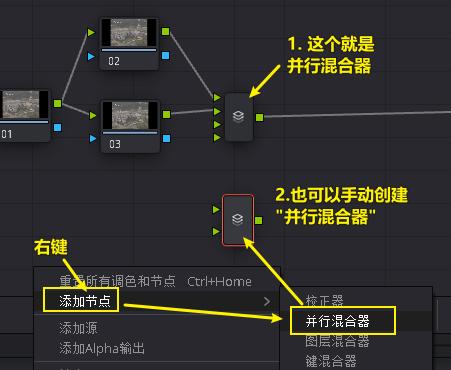

---

==== 给"并行混合器", 添加新的"接口"

手动创建的:"并行混合器", 默认只有两个接口. 为了让更多的节点连接进来, 你需要手动添加新接口.

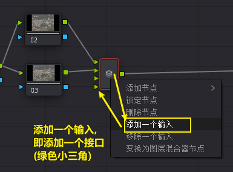

---

== *图层混合器*

[cols="1a,2a"]
|===
|Header 1 |Header 2

|先添加"图层节点" alt + L (layer)
|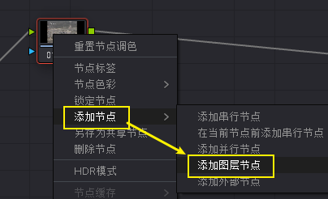

|Column 1, row 2
|Column 2, row 2
|===

"并行混合器节点" 和 "图层混合器节点", 可以互相转化

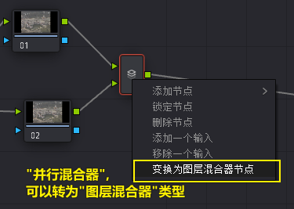

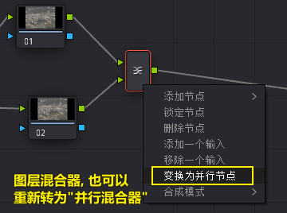

== ---------- ----------

---

== *lut 调色*

==== 导入你自己的 lut

在 文件 -> 项目设置 -> 色彩管理 -> 打开lut文件夹

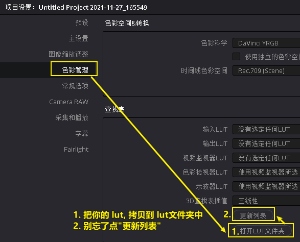

会打开 达芬奇存放 lut文件的目录 (C:\ProgramData\Blackmagic Design\DaVinci Resolve\Support\LUT), 把你的 lut文件夹 拷贝进去即可.  +
然后点击"更新列表"

现在, 就能在 lut窗口中, 找到你的lut了.

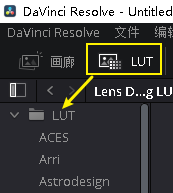

---

==== 降低 lut 的浓度

有时, 套用lut后, 颜色过浓, 我们可以在: 键 -> 键输出 -> 降低增益, 让它 lut效果 淡一些.

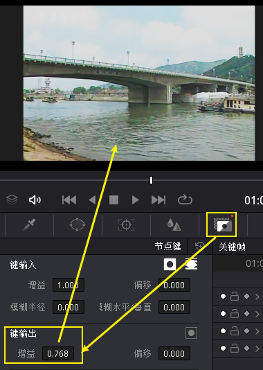

---

==== lut后, 色彩出现断层的问题解决

有时, 套用 lut后, 会发现有的色彩出现断层,  只要在 : 项目设置 -> 色彩管理中, 把 3d 查找表插值,  改成"四面体", 就能缓解这一问题.

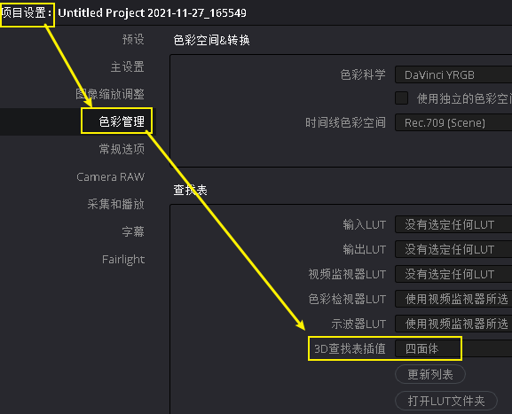

---

==== 给 lut 换张缩略图

右键 -> 将缩略图更新为当前时间轴上的帧, 可以给lut换缩略图 +
要再次恢复成默认的缩略图, 就 "重置缩略图"即可.

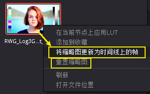

---

==== lut 调色, 有两种目的 : 1. 矫正, 2. 风格化

1. 矫正 :目的是把画面, 调整到一个合理的调色起始点
2. 风格化 : 给画面赋予某种色彩情感

---

== *调色*

==== #批量调色# -> 使用"调整片段"

把"调整片段"拖到新的轨道上, 它就能影响其所覆盖到的所有片段. 你对该"调整片段"进行调色, 就相当于批量调整了所有片段的颜色. +
("调整片段"的另一个功能, 就是我们用来给视频做"上下黑边")

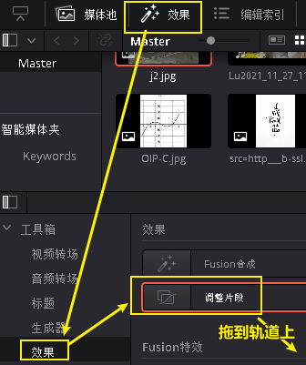

---

==== 自动调色 -> alt + shift + c

选中片段, 按 alt + shift + c

---

==== 选取特定颜色

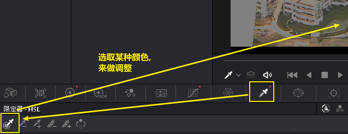

