= DaVinci 节点编辑器 & 调色
:toc:
:sectnums:

---

== *节点编辑器 (增/ 删/ 打包)*

==== 添加"串行节点" -> alt + s (serial)

==== 添加"并行节点" -> alt + p (parallel)

image:img/054.png[]

---

==== #关闭(禁用) /显示(开启) *选中的节点*# -> ctrl + d

image:img/055.png[]

---

==== #关闭(禁用) /显示(开启) *所有节点*# -> alt + d

---

==== 创建/解散 复合节点

[cols="1a,2a"]
|===
|Header 1 |Header 2

|选中多个节点, 右键 -> 创建复合节点 (相当于做了"群组","打包")
|

|将复合节点解散, 恢复成多个节点的状态, 就右键 -> 分解复合节点
|

|显示复合节点, 则是保持"复合节点"(打包)的状态下, 进入打包的内部, 查看其子节点
|image:img/059.png[]

查看之后, 要退回上一级, 就右键 -> "退出复合节点"
image:img/060.png[]
|===

---

==== 对"*单一节点*", 去除调色状态, 恢复成默认的颜色状态 -> 右键 : 重置(本)节点调色

---

==== 删除你创建的"*所有节点*", 恢复成一开始的默认状态 -> ctrl + home

image:img/061.png[]

---

==== 给节点加上名字(标签) -> 右键 : 节点标签

---

==  *节点编辑器 (复制属性)*

==== 要查看每个节点的调色结果 -> 要点击"突出显示"按钮 : shift + h

突出显示按钮, 能让你看到每个节点过程中的, 分别调色结果, 而不只是最终的合成效果.

---

==== 把"a节点"的属性, 复制到"节点b"身上 -> 方法1: ctrl + c,  ctrl + v.  方法2: 按住alt + 拖动a 到b身上

- 方法1: ctrl+c, ctrl+v

- 方法2:

---

==== 将静帧的调色, 赋给另一个节点

image:img/065.png[]

---

==== 交换两个节点的调色 -> 按ctrl + 拖动a节点 到 b节点上

image:img/066.png[]

---

== *并行混合器*

==== 手动添加"并行混合器"

---

==== 给"并行混合器", 添加新的"接口"

手动创建的:"并行混合器", 默认只有两个接口. 为了让更多的节点连接进来, 你需要手动添加新接口.

---

== *图层混合器*

[cols="1a,2a"]
|===
|Header 1 |Header 2

|先添加"图层节点" alt + L (layer)
|

|Column 1, row 2
|Column 2, row 2
|===

"并行混合器节点" 和 "图层混合器节点", 可以互相转化

image:img/071.png[]

image:img/072.png[]

== ---------- ----------

---

== *lut 调色*

==== 导入你自己的 lut

在 文件 -> 项目设置 -> 色彩管理 -> 打开lut文件夹

会打开 达芬奇存放 lut文件的目录 (C:\ProgramData\Blackmagic Design\DaVinci Resolve\Support\LUT), 把你的 lut文件夹 拷贝进去即可.  +
然后点击"更新列表"

现在, 就能在 lut窗口中, 找到你的lut了.

---

==== 降低 lut 的浓度

有时, 套用lut后, 颜色过浓, 我们可以在: 键 -> 键输出 -> 降低增益, 让它 lut效果 淡一些.

---

==== lut后, 色彩出现断层的问题解决

有时, 套用 lut后, 会发现有的色彩出现断层,  只要在 : 项目设置 -> 色彩管理中, 把 3d 查找表插值,  改成"四面体", 就能缓解这一问题.

---

==== 给 lut 换张缩略图

右键 -> 将缩略图更新为当前时间轴上的帧, 可以给lut换缩略图 +
要再次恢复成默认的缩略图, 就 "重置缩略图"即可.

---

==== lut 调色, 有两种目的 : 1. 矫正, 2. 风格化

1. 矫正 :目的是把画面, 调整到一个合理的调色起始点
2. 风格化 : 给画面赋予某种色彩情感

---

== *调色*

==== 调色分三步骤: 1.色相, 2.明度, 3. 饱和度

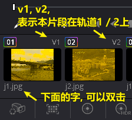

---

==== 一级调色(对画面整体进行调整), 和 二级调色(对画面局部进行调整)

- 一级调色: 是对画面**整体**, 进行颜色调整
- 二级调色: 是对画面的**局部**, 或特定颜色, 进行调整. 因此, 会经常用到 抠像, 蒙版, 跟踪, 来单独调整画面的一块区域.

---

==== 自动白平衡

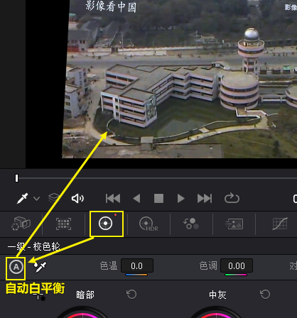

---

==== 自动调色 -> alt + shift + c

选中片段, 按 alt + shift + c

---

==== 选取特定颜色

---

==== #对比查看"原图"和"调色后图片"的区别# -> shift + d

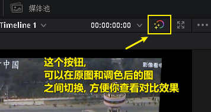

---

==== #将一个片段的调色, 赋给另一个片段身上 (方法1)# -> 选中"无", 鼠标中键点"有", 则"无"也"有"

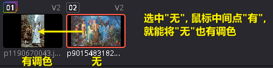

---

====  #将一个片段的调色, 赋给另一个片段身上 (方法2)# -> 使用"画廊"中的"记忆(调色方案)仓库"

[cols="1a,2a"]
|===
|Header 1 |Header 2

|"画廊"中, 有一个"记忆"按钮, 里面有24个收藏位置.  +
-> 可以把你调过色的a片段, 右键"静帧", 存储到"画廊"中. +
-> 再把静帧拖进到"记忆仓库"中. 相当于存储下了你的调色方案. +
-> 之后, 直接在"记忆"仓库中, 把某调色方案拖到 b视频上, 就能让b视频应用这种调色了.
|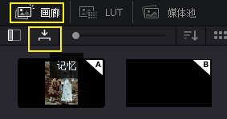

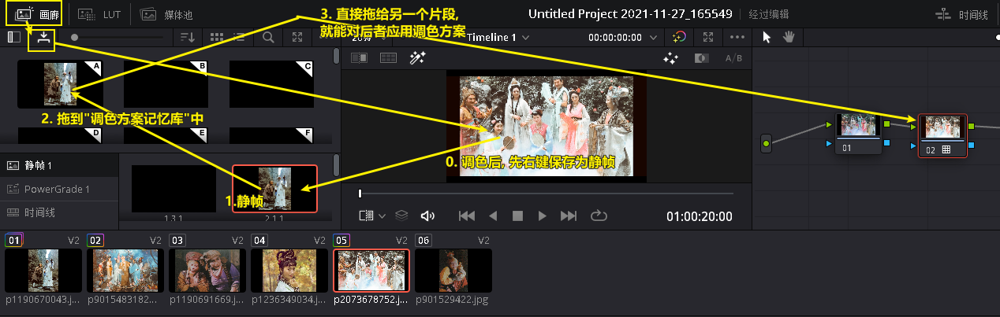

|可以直接选中调过色的片段, 按 alt + 1/2/3... 快速将该调色方案存储进"记忆仓库"的 格子1 /格子2 / 格子3... 中.
|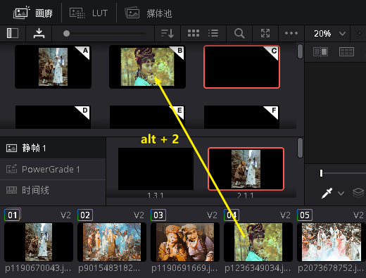

事实上, 该快捷键, 就在菜单里 :

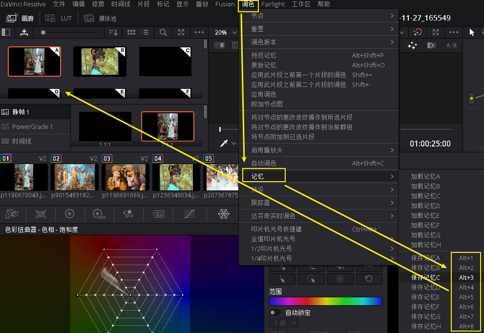
|===

---

==== 示波器 - 波形图

菜单 : 工作区 -> 示波器

[cols="1a,2a"]
|===
|Header 1 |Header 2

|打开 示波器
|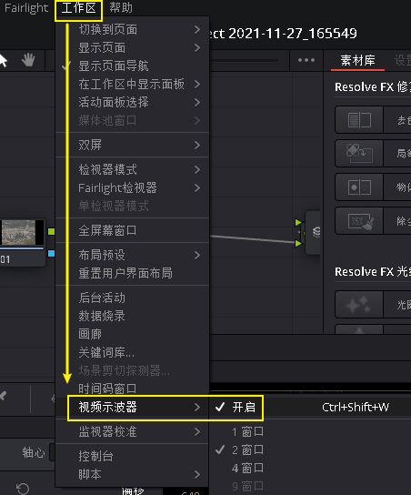

|我们只需打开两个子窗口即可: 1.波形图, 2.矢量图
|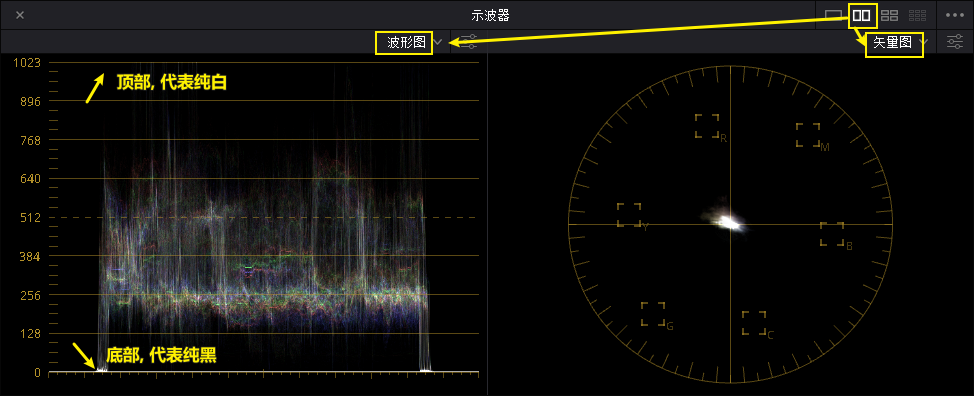

|波形图, 可以用来查看画面中"最亮"和"最暗"的程度
|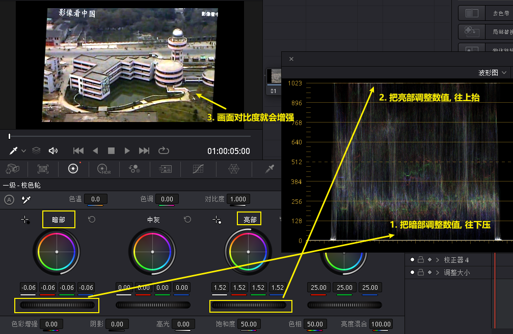
|===

---

==== 示波器 - 矢量图

[cols="1a,2a"]
|===
|Header 1 |Header 2

|矢量图, 可以查看视频颜色的倾向
|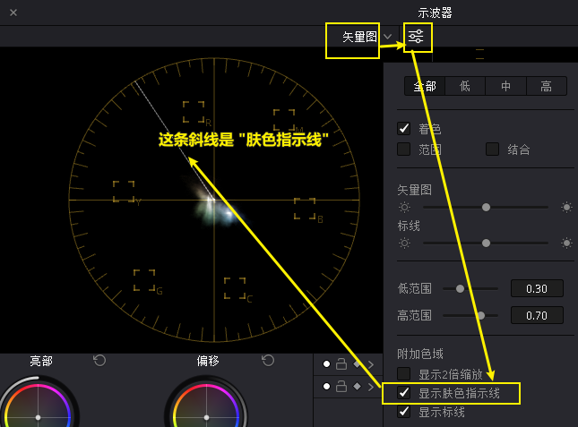

|===

---

== *批量调色*

==== #批量调色 (方法1)# -> 使用"调整片段"

把"调整片段"拖到新的轨道上, 它就能影响其所覆盖到的所有片段. 你对该"调整片段"进行调色, 就相当于批量调整了所有片段的颜色. +
("调整片段"的另一个功能, 就是我们用来给视频做"上下黑边")

---

==== 批量调色 (方法2) -> 使用"复合片段"

[cols="1a,2a"]
|===
|Header 1 |Header 2

|你要对多个片段同意调色, 就同时选中这多个片段, 右键 -> 新建复合片段 (相当于"打包" 或 "群组")
|复合片段, 会单独移到一个新轨道上.

image:img/080.png[]

|要进入复合片段内部, 可以对其右键 -> 在时间线上打开
|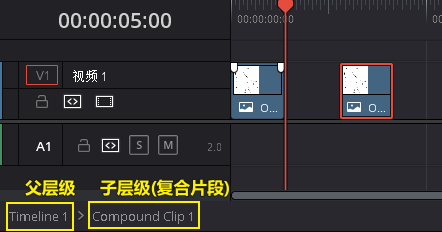

|要解散复合片段, 就右键 -> 原位解散复合片段
|
|===

---

==== 批量调色 (方法3) -> 建立群组

[cols="1a,2a"]
|===
|Header 1 |Header 2

|在调色模块界面, 选中多个片段, 右键 -> 添加到新群组
|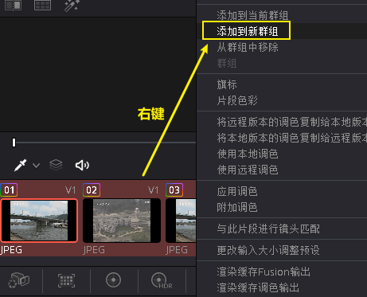

|你所新建的群组, 可以在这里查看到 : 右键 -> 群组
|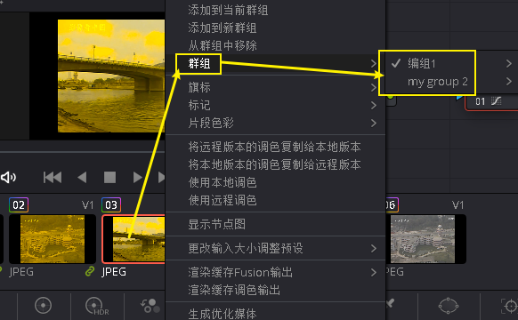

|将新片段, **添加到**已有群组 : 选中该片段, 右键 -> 添加到当前群组, 或新建新的群组.
|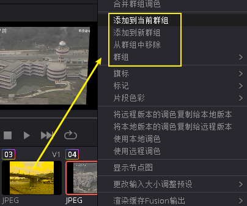

|使用"片段前群组" (或"片段后群组"), 就能对一个群组中的**所有片段**, 进行**批量调色**
|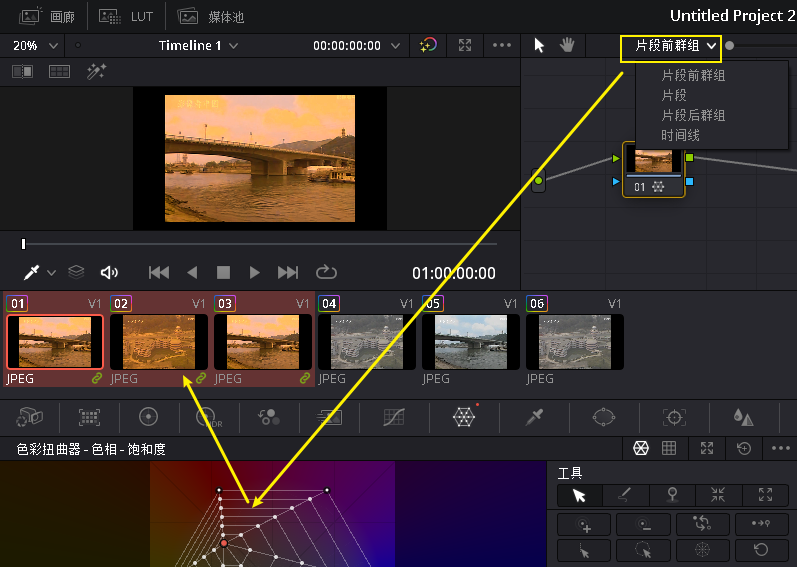

|如果只想对群组中的**某一片段, 单独调色**, 就使用"片段"
|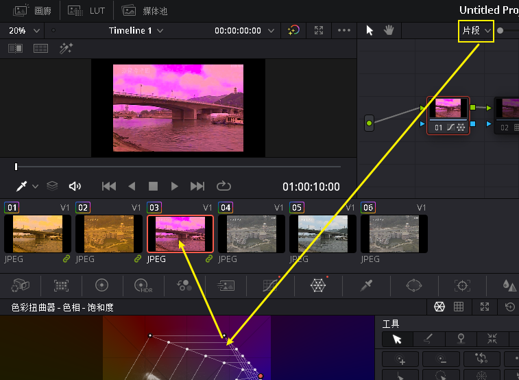
|===

---

== #*保存你不同的调色版本*#

[cols="1a,2a"]
|===
|Header 1 |Header 2

|将你目前的调色, 存储一个版本下来 : 对片段右键 -> 本地版本 -> 创建新版本
|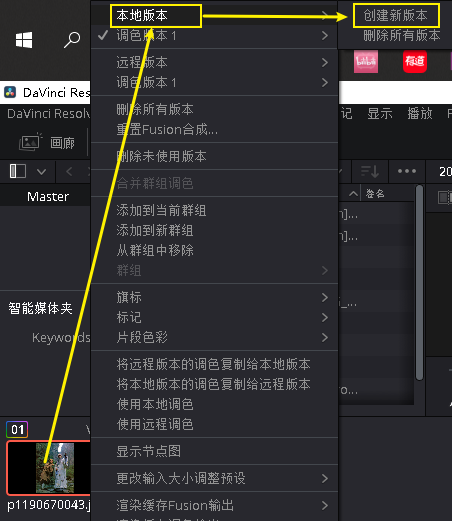

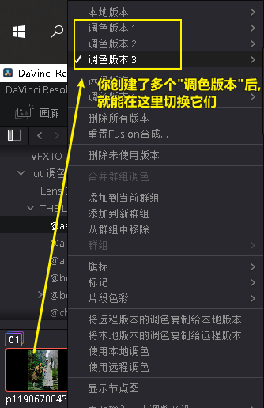

|查看所有调色版本, 并进入任何一个版本中
|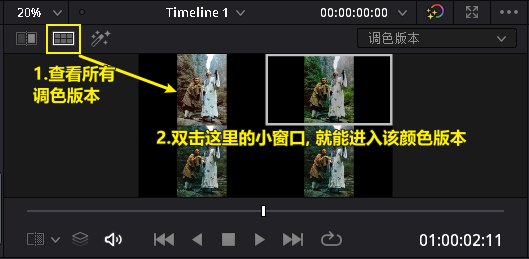
|===

---
