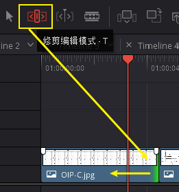
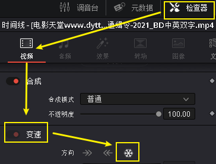
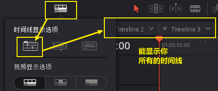
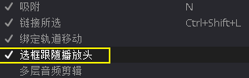
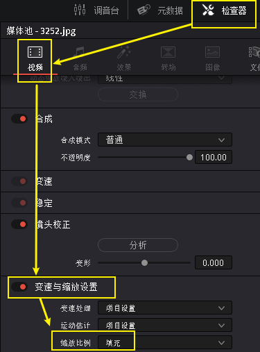
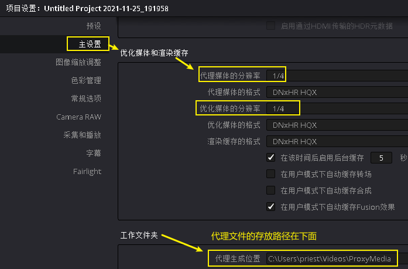
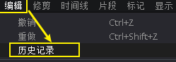

= DaVinci 视频 常用功能
:toc:
:sectnums:

---

== 片段编辑

==== 入点 I, 出点 O

==== 删除入点, 出点, 按 alt + i,  alt + o

---

==== ★ 重新找到原始素材上的"入点, 出点"位置 -> F 键

将已"入点, 出点"后的子片段, 重新定位它在原始长片段上的"入点, 出点"位置::
在轨道上选中子片段, 按 F 键

---

==== ★ 暂时关闭时间线上的某片段 (变灰) -> 按 D 键

==== 一次性删除所有 "用 快捷键D 关闭的片段"

菜单: 时间线 -> 清理视频轨道 -> 收起未使用片段  +
image:img/006.png[]

但该方法只对变灰的"视频部分"有效, 对相应的"音频部分"无效, 不会被删除

---

==== 复制片段 -> alt + 拖动素材

---

==== ★ 编辑前面素材的长短时, 让后面素材自动紧随其后, 而不中间留空

激活此"修剪编辑模式"后, 当你选中前面的素材, 将其变短或拉长, 后面的素材会紧贴这前面素材的长短而移动, 而不会中间留空.

---

==== ★ 让视频变成"静帧"

在轨道上, 选中某片段, 在时间轴位置处, 点击"变速"中的雪花图标, 则该时间轴之后的片段长度, 会全部变成"静帧".

---

== ---------- ----------

---

== 时间线

====  缩放"时间线" -> alt + 鼠标中键

轨道时间线的缩放 :

- alt + 滚动"鼠标中键"
- ctrl + 加号/减号

---

==== 在轨道上方, 显示多条时间线

创建时间线::
在媒体池的空白处, 右键 -> 时间线 -> 新建时间线

在轨道上方, 显示多条时间线::

---

==== 自动激活"当前时间线"位置处的素材片段

轨道上, 时间线拖到哪里, 就自动激活该位置处的片段素材:

菜单 : 时间线 -> 选框跟随播放头

---

== ---------- ----------

---

== 调色, 片段效果

==== 自动调色 -> alt + shift + c

选中片段, 按 alt + shift + c

---

==== 将 a片段的特效, 应用到b片段上 -> alt + v (粘贴属性)

选中a片段, ctrl+c;  再选中b片段, alt + v

---

==== 将尺寸不一的素材, 按比例缩放, 让其宽度(x轴)自动匹配到 和你的视频分辨率宽度一样

在媒体池中, 选中你的素材, 双击它, 在屏幕右边的检查器 -> 视频 -> 变速与缩放设置 -> 将 "缩放比例"改成 "填充" 即可.

---

== ---------- ----------

---

== 优化性能

==== 设置"代理文件"的分辨率

项目设置 -> 主设置 -> 优化媒体和渲染缓存 -> 代理媒体的分辨率

---

== ---------- ----------

---

== 操作效率 设置

==== 打开"历史记录"

菜单: 编辑 -> 历史记录 -> 打开历史窗口 +

注意: 历史记录窗口, 仅仅支持"轨道编辑"界面, 而不支持"调色"界面

---

== ---------- ----------

---

== 编码, 解码

==== 使支持 iphone 4k 视频 -> 安装 HEVC 解码器

安装地址: +
https://www.free-codecs.com/download/hevc_video_extension.htm

---
