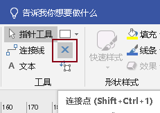
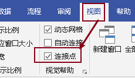
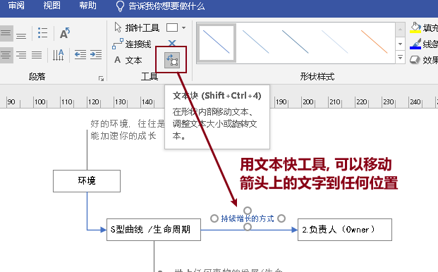

= visio 使用技巧
:toc:
:sectnums:

---

== 各元素

==== 恢复成"选择模式" -> CTRL+1

==== 绘制文本框 -> CTRL+2

==== 绘制连线 -> CTRL+3

---

== 画面

==== 平移画面 -> ctrl + alt + 鼠标右键

==== 缩放画面 -> ctrl + 鼠标滚轮

---

== 元素

==== 移动元素时, 锁定只在水平或垂直方向上移动 -> 按住shift + 移动物体

==== 微移一个像素 -> Shift+箭头键

---

== 文字

==== 缩放文字 Ctrl+Shift+,  和 Ctrl+Shift+.

---

== 箭头

==== 对元素增加连接点 ->  ctrl + 鼠标点击形状边框的某位置

先点击"连接点"工具, 然后按 ctrl,  再在元素的边框上用鼠标添加新的连接点.

确保下面的先打钩

---

==== 将箭头处的文字, 移到箭头上方

给箭头添加文字, 默认会在左边, 可以用"文本快工具"来将文字移到箭头上方.

---

