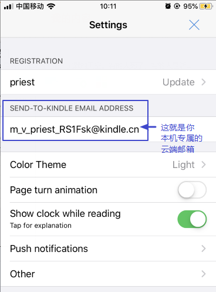
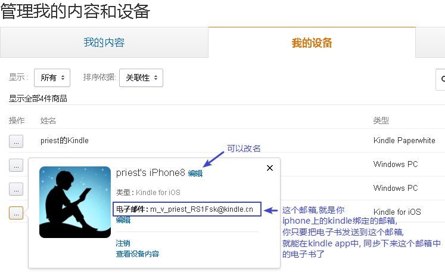
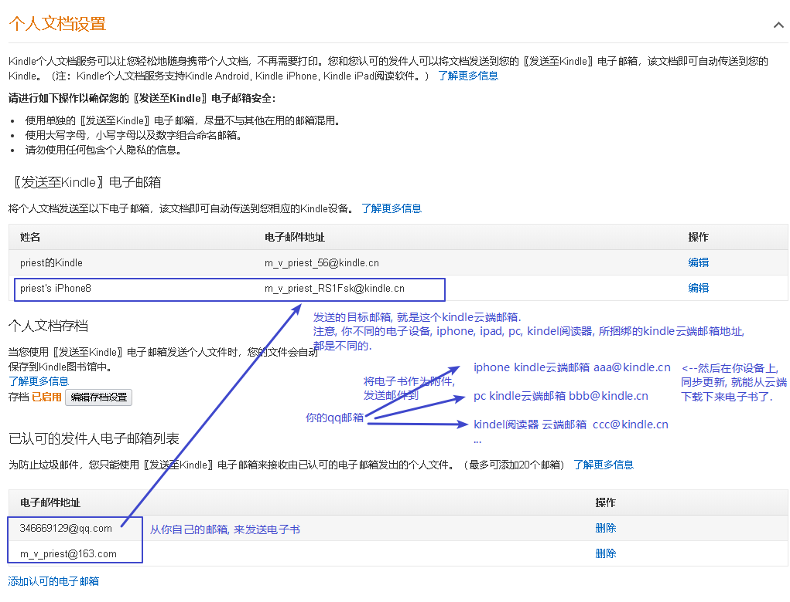
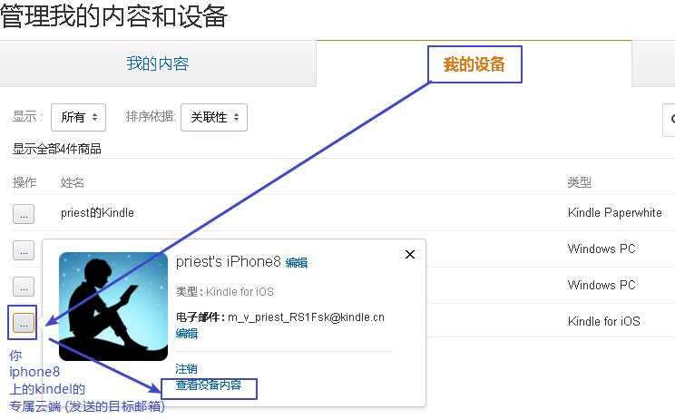
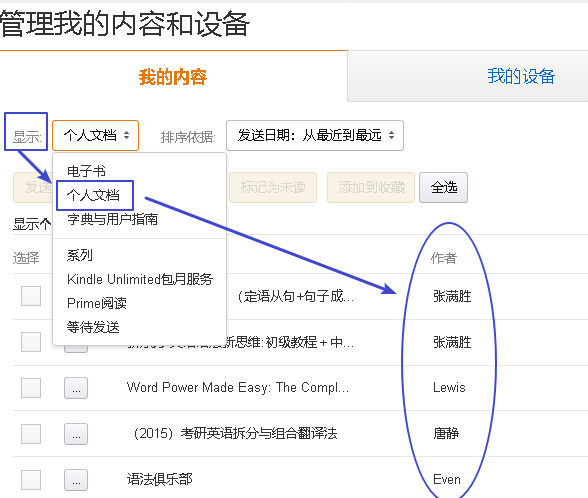

= kindle 操作
:toc:

---

== 上传mobi电子书到kindle云端

先查看你本机(比如iphone8)所绑定的kindle云端邮箱, 到底是哪个? +

1.进入kindel的"管理我的内容和设备"页面, 找到你iPhone上的kindle app, 绑定的是哪一个kindle邮箱.  +
将来, 你的mobi电子书想要上传到云端, 就是发送到这个邮箱的. 你想把云端上的电子书同步到手机app中, 也是从这个邮箱下载的. +

https://www.amazon.cn/hz/mycd/myx#/home/devices/1

2.再进入这个页面(kindel的"设置"), 点击"个人文档设置" +

https://www.amazon.cn/hz/mycd/myx#/home/settings/payment

3.查看你上传到某一设备专属邮箱(即云端)的电子书

依然在"管理我的内容和设备"->"我的设备"页面, 找到你当前手机(比如iphone8)专属的云端邮箱, 点击"查看设备内容": +

https://www.amazon.cn/hz/mycd/myx#/home/devices/1

点击显示"个人文档", (如果刚刚上传到云端的电子书没显示全, 就刷新页面), 就能看到你上传到本iphone8特定云端邮箱中的所有电子书了. +

---

== iphone版的kindle, 支持自定义辞典!!! 大好

直接把辞典mobi, 拷贝到kindle文件夹中就行了! 和电子书mobi放一起, 就能在kindle app中更换辞典了. 很智能!

这样的话, 我们可以直接把mobi辞典, 上传到kindle云端邮箱保存. 方便以后随时同步下来.

---

== kindle 辞典资源

https://bookfere.com/dict

---

== 自制 Kindle 辞典

