= ppt技巧
:toc:

---

== python ppt库

https://python-pptx.readthedocs.io/en/latest/

---

== Office Open XML (OOXML)

OOXML 是所有的Office 2007的默认文档格式(docx, xlsm等)的文件，都是一个zip压缩文件(不再是之前的二进制文件)，其中包含的是多个xml文件, 和媒体资源文件等(比如Word中插入的图片)。

OOXML标准，就是定义如何用这些xml文件来表示Office文件。

---

== 快捷键

==== 重复上一步的操作 -> f4

通过F4可以重复上一个动作。 +
例如：将一个文字设置为黑体，然后再选择其他文字，再按F4其他文字也变成了黑体。

---

==== 格式刷, 复制粘贴文字格式 -> Ctrl+Shift+C/V

Ctrl+Shift+C/V=格式刷

比如鼠标选中A文字， 按下Ctrl+Shift+C，选中B文字按下Ctrl+Shift+V，可把A文字格式复制到B文字.

---

== 排版

==== 多个图形对齐时, 显示智能参考线

"视图"菜单 -> 子模块:显示 -> 右下角小图标点出来 -> 形状对齐时显示智能向导

就能在多个图形对齐时, 显示对齐参考线

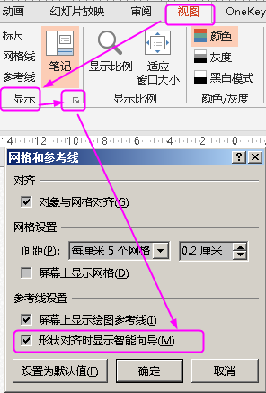

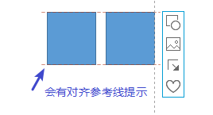

---

==== 将所有图片, 变成统一宽度

OneKey 插件 -> 尺寸递进 -> 相同大小

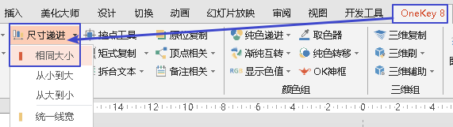

---

==== 拼图

iSlide插件 -> 设计排版

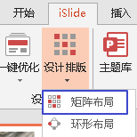

---

== 母版

==== 快速进入幻灯片母版界面

按住shift键单击powerpoint窗口右下角的『普通视图』按钮，就可以进入幻灯片母版界面。

---

== 图层

双击一张图, "格式"菜单 -> 选择窗格,  即可看到图层

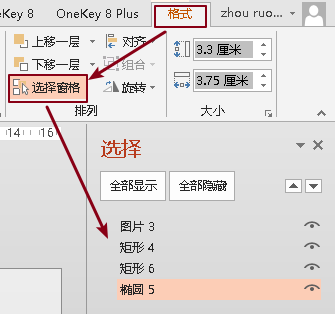

---

== 导入素材

==== 将 ai 导入ppt

Ctrl+Alt+V(选择性粘贴) 为"增强型图元文件".  +
再取消组合（Ctrl+Shift+G）两次, 即可进行自由编辑。

---

== 导出素材

==== 导出ppt里的所有图片

将ppt扩展名改为rar, 解压即可. 进入里面的 media 文件夹, 里面即是图片.

---

==== 强制导出300dpi分辨率的图片

1.进入注册表 regedit (在"运行"中, 输入regedit) -> 进入该目录:
....
HKEY_CURRENT_USER\Software\Microsoft\Office\XX.0\PowerPoint\Options
....

其中XX值, 对应你的 PowerPoint 版本:

- 11 : 是2003版
- 12 : 是2007版
- 14 : 是2010版
- 15 : 是2013版
- 16 : 是2016版

2.在右侧空白处右击鼠标，选择“新建”下面的“DWORD (32位)值(D)”，便会自动创建一个文件（新值#1） -> 将其改名为 ExportBitmapResolution

3.双击打开, 选择十进制，输入值 300. (PowerPoint 可以导出的最大分辨率为 307dpi, 所以你最大也只能输入307)

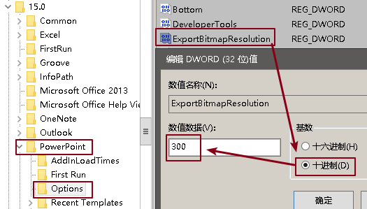

4. 对ppt, "导出" -> "更改文件类型" -> "另存为" -> 比如jpg -> 单击保存, "仅当前幻灯片".

注意: 不要直接对ppt中的图片右键另存, 这种方式无法导出成300dpi.

---

==== 将ppt导出成为视频

"文件"菜单 -> 导出 -> 创建视频 -> 创建视频

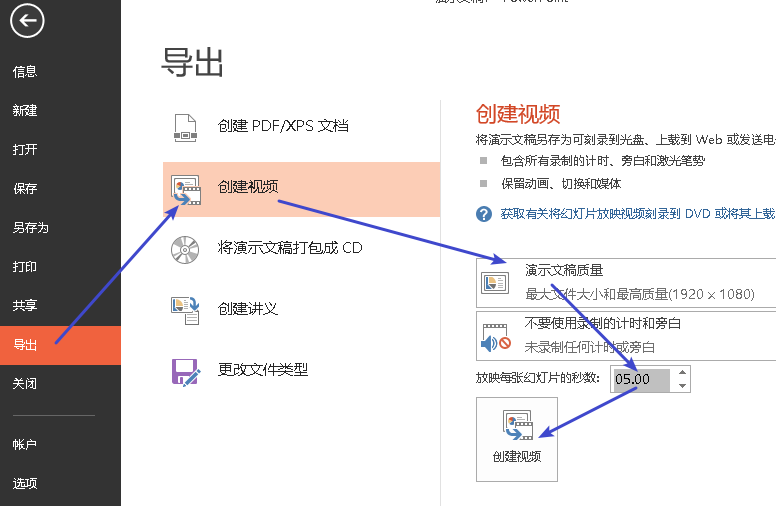

---

== 文本/段落

==== 乱数假文

|===
|输入 |呈现

|=lorem(2,3)
|Lorem ipsum…

|=rand(1,1)
|The quick brown fox jumps over the lazy dog
|===

括号内的数字, 代表行数和列数.

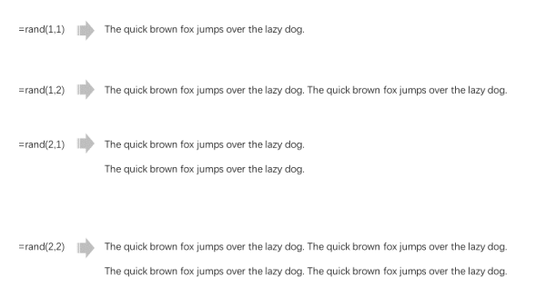

---

==== 中文段落翻译成英文

"审阅"菜单 -> 翻译 -> 翻译所选文字

注意: 直接翻译选中的文字.  会替换掉原中文, 所以先复制一层再翻译.

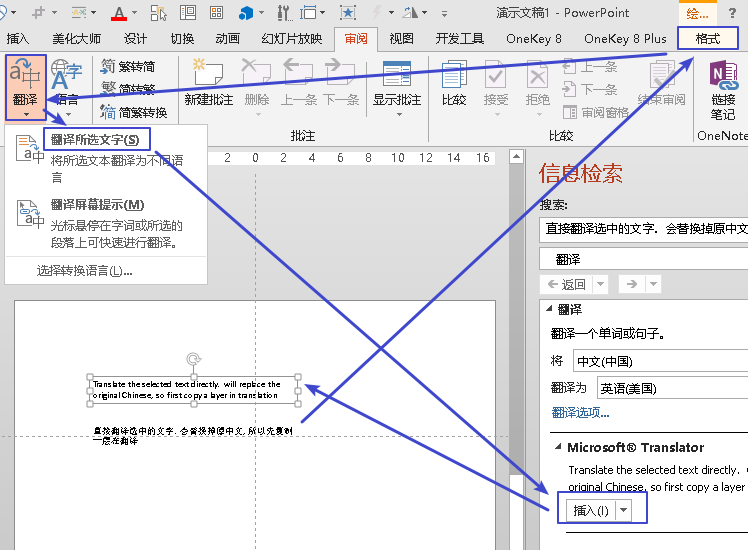

---

==== 按比例缩小群组的文本

将群组的文本 -> 右键"设置形状格式" -> "文本选项" -> "文本框" -> 溢出时缩排文字”.

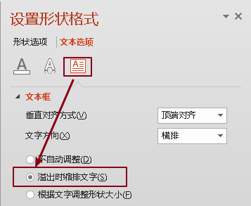

注意, 这个功能, 只能实现"按比例缩小"文本, 不能"按比例放大"文本.

---

==== 批量修改字体大小

1.把ppt后缀名改成zip, 解压缩. 进入 \ppt\slides 目录

2.把所有xml文件用 notepad++ 打开, 找到 "sz=几百" 这一字段, 这就是字号大小. 直接修改这些数字即可.
....
sz="900" //就是9号字
//800, 就是8号字;
//2500,就是25号字;
....

3.然后, 回到"你的ppt名字\"目录, 直接选中下面所有这些零散的文件, 右键压缩成zip, (压缩方式选择"存储"), 再改回pptx后缀即可.

---

==== 批量修改行距

方法同"批量修改文字"

....
<a:spcPct val="300000"/>
//这个就是行距. 300000 就是3.0的行距。 如果要改成1.0的行距，就把数字改成100000
....

---

==== 批量修改段落前后的距离

方法同"批量修改文字"
....
<a:spcPts val="12300"/></a:spcBef>
//段前距离, 注意到最后三个字母是Before

<a:spcPts val="32100"/></a:spcAft>
//段后距离, 注意到最后三个字母是After
....

12300 就是123磅。  注意， 这个数值改成 0似乎有问题，就改成100吧。

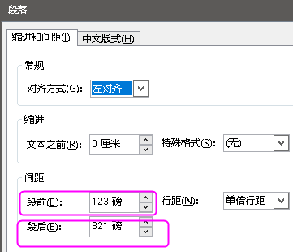

---

==== 特殊字体

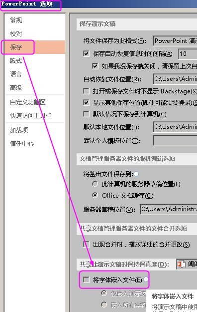

---

== 图片

==== 使插入图片时不变形

对图形, 右键 -> "填充" -> "图片", 可以在形状中插入图片

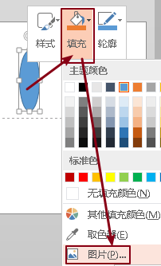

但是, 默认肯定会图片变形.

解决方法是: 双击图片, "格式"菜单 -> "剪裁" -> "填充"

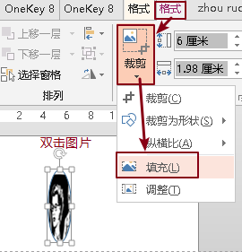

就能恢复原图比例, 进行缩放

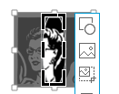

---

==== 图片透明度

图片无法直接设置透明度. 必须使用"形状"来操作:

1. 先点击图片,然后ctrl+c 复制到剪贴板中
2. 画一个和照片一样大小的矩形
3. 选中矩形, 双击, 在窗口右侧, 会显示"设置图片格式"
然后选中 "图片或纹理填充", --> 来自"剪贴板"
下面就有"透明度"的选项了.

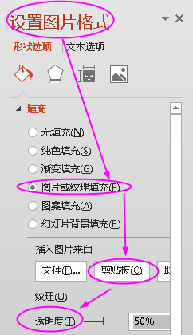

---

==== 删除图片效果

选中图片 -> “格式”菜单 -> 最左侧“重设图片按钮”

重设后，图片原有所有样式即可清除。

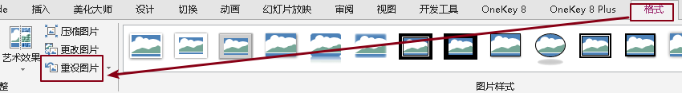

---

==== 将图片蒙版进各种形状

用"格式"菜单 -> "剪裁为形状"

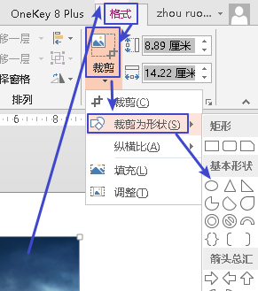

但"形状"会跟着图像的宽高来, 即, "形状"会变形

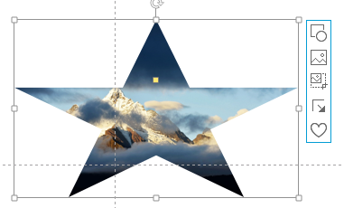

如何解决这个问题? 把剪裁的"纵横比", 重新设为 1:1 即可.

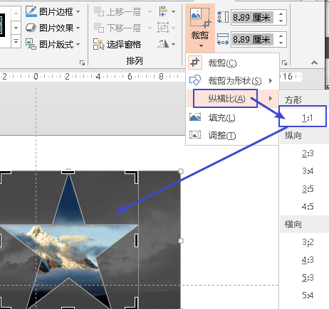

---

==== 将图片蒙版进文字中

要想把图片蒙版进文字, 必须把文字层置于图片的底层

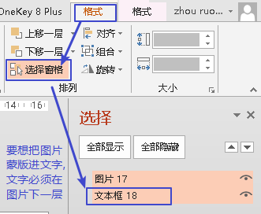

然后, 同时选中文字和图片, -> (绘图工具) "格式" -> 合并形状 -> 相交

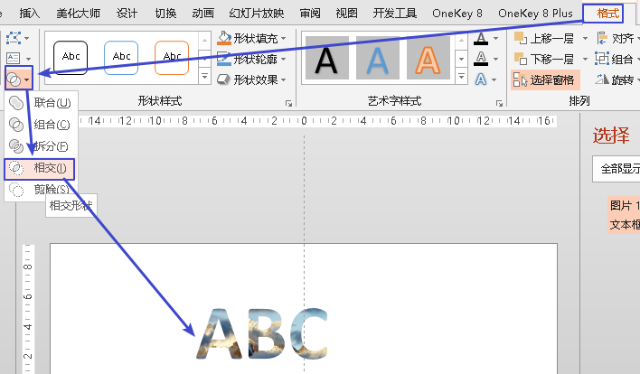

要调整蒙版的位置, 可以双击图片, 用"剪裁" -> "填充" 或"调整", 都可以.

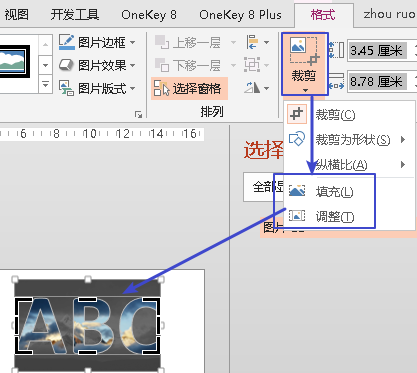

---

== 图形

==== 创建一个与页面相同大小的矩形

oneKey插件 -> 插入形状 -> 全屏矩形

image:./img_ppt/ppt_23.png[]

---

==== 创建一个与图片相同大小的矩形

oneKey插件 -> 插入形状

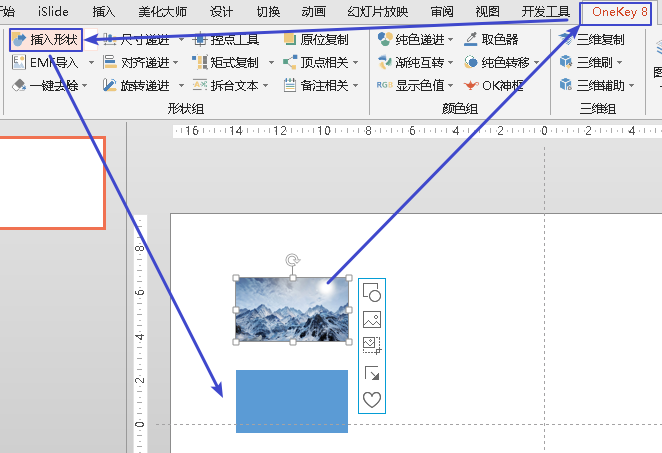

---

==== 让边框粗细超过6磅

双击图形, 在"设置形状格式" -> 线条 -> 宽度

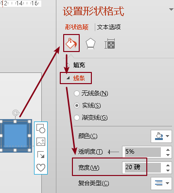

---

== 播放与交互

==== 播放快捷键

|===
|幻灯片放映 |快捷键

|从头播放
|F5

|当前页播放
|Shift + F5

|播放中暂停, 让其黑屏
|B=幻灯片黑屏，再按ESC恢复

|播放中暂停, 让白黑屏
|W=幻灯片白屏，再按W恢复

|===

---

==== 循环播放ppt

让ppt对所有页面进行循环播放, 永不停止: +
菜单"幻灯片放映" -> "设置幻灯片放映" -> 在放映类型里选"在展台浏览", 这样, 放映选项中就会自动勾选中"循环播放" -> 右边的"放映幻灯片", 你可以选"全部", 确定即可.

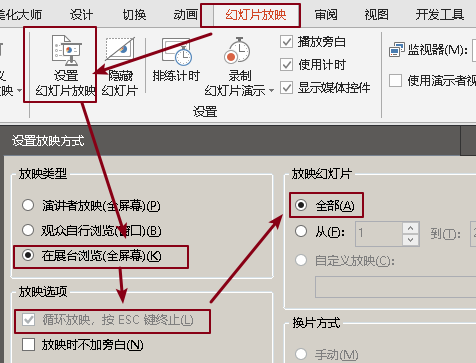

然后, 还要设置每页的时间间隔: +

先同时选中所有页面, "切换"菜单 -> 选一个切换特效 -> 持续时间(用来设置"切换特效"持续的时间) -> 设置自动换片时间(即多少秒就翻一页)

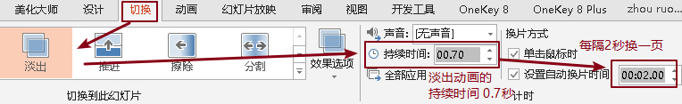

---

==== 点击图片, 再触发某动画

比如, 你要实现

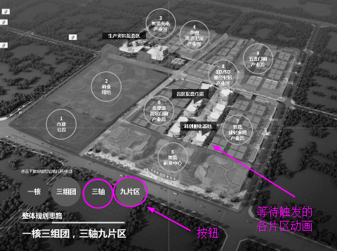

1.打开"显示所有窗格内容", 能看到所有的层

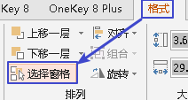

2.给按钮图片, 和已经设置了动画的元素(可群组), 进行变量命名.

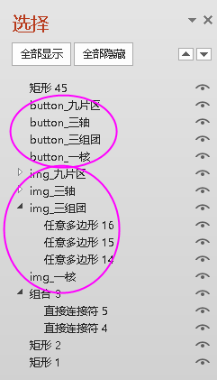

3.选中每一个已经设置了的动画元素(本例为 img_名字开头的变量), 点击"动画"菜单 -> "触发" -> 单击 -> 你要触发动画的按钮button

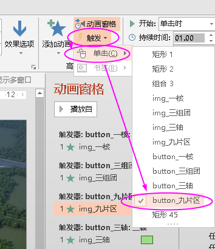

4.在"动画窗格"中, 选中已经设置动画效果的元素(本例为img_名字开头的变量), 点击"效果选项"

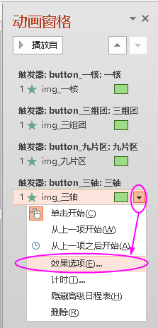

5.在"效果"窗口中, 设置"动画播放后: 下次单击后隐藏". 这样, 点击一次button按钮,就能触发img的动画, 再点击一次, 就能关闭img的动画.

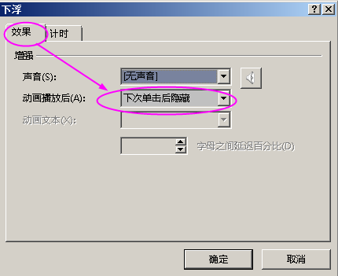

---

==== 让背景音频在某页结束

1. 选中“音频”
2. 在“动画”选项中选择“动画窗格”
3. 选择音频文件中的“效果选项”
4. “停止播放”在第几页！

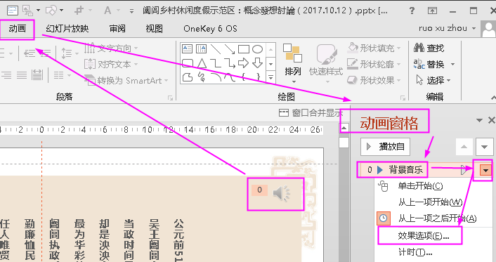

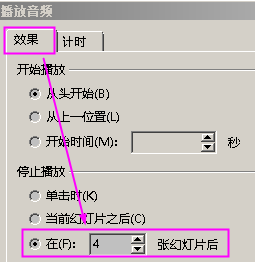

---

==== 给页面加名字,方便超链接定位

"视图"菜单 -> 大纲视图

就可以给页面起名字. 所起的名字会作为文本框出现在页面上, 可以在图层中关掉眼睛, 它在页面上就不会显示出来了.

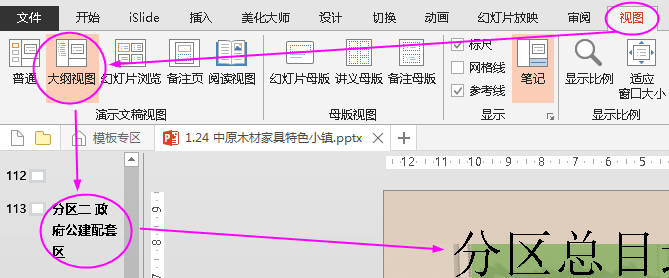

---

==== 幻灯片分组(PPT的分节)

在普通视图选中一张页面, 右键 -> "新增节". 就能在该页前面插入一个分段符.

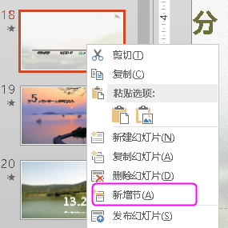

---

== 其他问题

==== 无法"组合"的问题

1. 注意: "文本占位符"(比如标题)是无法被组合的, 请检查你的文本框是否有"文本占位符"的类型!

2. 把图片摆好，按住ctrl将所有图片都选中，不要放开ctrl，将图片移到其他位置，你会发现图片被复制了，而新出现的图片是可以组合的，把之前不能组合的图片删掉就好.

---

